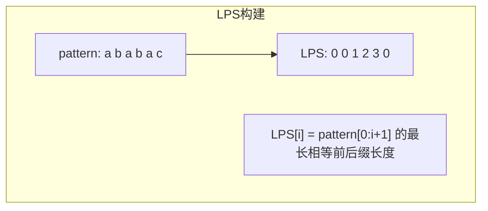
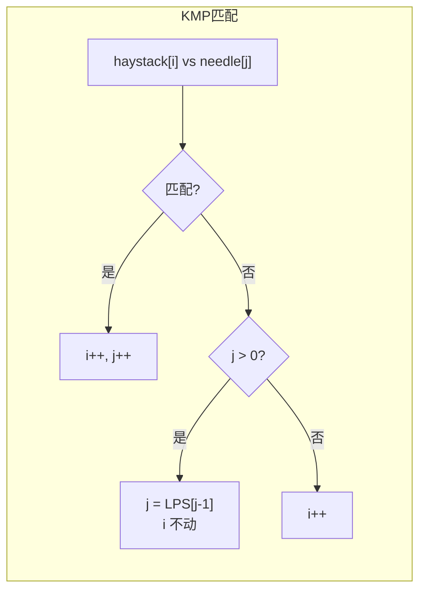

---

title: "找出字符串中第一个匹配项的下标"

difficulty: 中等

category: 字符串

tags:

  - leetcode

  - 字符串

created: "2026-07-21"

---

# 28. 找出字符串中第一个匹配项的下标（Implement strStr）

> 难度：中等 | 主题：字符串——KMP 算法

## 题目

给定两个字符串 `haystack` 和 `needle`，在 `haystack` 字符串中找出 `needle` 字符串出现的第一个位置（下标从 0 开始）。如果不存在，则返回 -1。

**示例：**

```text

haystack = "hello", needle = "ll" → 2

haystack = "aaaaa", needle = "bba" → -1

```

---

## 思路
### 先讲个故事：抄歌词的偷懒技巧

你在抄一首歌的歌词（haystack），突然发现副歌部分（needle）和之前某段一模一样。你不会从头重新抄——你会利用"已经抄过一样"这个信息，直接跳过已匹配的部分。

这就是 KMP 的核心：**匹配失败时，不回退主串指针，只回退模式串指针到一个"聪明的位置"**。

---

### 引导式推导：从暴力到 KMP

**第 1 层：暴力 O(m×n)**

逐个位置尝试匹配，不匹配就两个指针都回退。

**第 2 层：KMP O(m+n)**

预处理 pattern 的 LPS 数组（最长公共前后缀长度），匹配时利用 LPS 跳过已匹配的前缀。





**为什么主串指针不回退？** 因为 LPS 告诉我们：模式串可以跳到某个位置，使得跳过的部分和已匹配的部分完全一样。主串不需要重新比较。

---

## 代码

```python

def strStr(self, haystack, needle):

    if not needle:

        return 0

    def build_lps(pattern):

        m = len(pattern)

        lps = [0] * m

        length = 0

        i = 1

        while i < m:

            if pattern[i] == pattern[length]:

                length += 1

                lps[i] = length

                i += 1

            else:

                if length > 0:

                    length = lps[length - 1]

                else:

                    lps[i] = 0

                    i += 1

        return lps

    lps = build_lps(needle)

    n, m = len(haystack), len(needle)

    i = j = 0

    while i < n:

        if haystack[i] == needle[j]:

            i += 1

            j += 1

            if j == m:

                return i - j

        else:

            if j > 0:

                j = lps[j - 1]

            else:

                i += 1

    return -1

```

---

## 复杂度

| 指标 | 值 | 解释 |

|------|----|------|

| 时间 | O(n + m) | 构建 LPS O(m)，匹配 O(n) |

| 空间 | O(m) | LPS 数组长度等于模式串长度 |

---

## 实战考量
### 频率分析

> **经典算法题**，约 25% 常考，尤其是后端/基础架构岗位。KMP 是字符串匹配的标准算法。

### 延伸思考

**Q：LPS 数组能不能优化空间？**

A：不能，必须存，但可以只用 O(m)。

**Q：如果字符集很大（如 Unicode）？**

A：适用，KMP 与字符集大小无关。

**Q：找出所有匹配位置？**

A：找到第一个后，继续让 `j = lps[j-1]` 继续匹配。

**Q：多次查询不同模式串？**

A：对每个模式串单独建 LPS，或用 AC 自动机（多模式匹配）。

### 易错点

- LPS 构建时的回退逻辑：`length = lps[length - 1]`

- `j == m` 后返回 `i - j`，不是 `i - m + 1`

- 匹配失败时主串指针 `i` 不回退

---

## 生活类比

> **抄歌词 → KMP 滑动**

>

> 你不需要每次失败都从头开始。利用"已经匹配的部分"，让模式串滑动到正确位置。

> 就像拼图：你知道某几块已经对上了，下次直接从那几块后面继续拼。

>

> **KMP 的本质：记住你已经知道的，别重复劳动。**

---

## 相关题目

| 题目 | 关系 |

|------|------|

| 14最长公共前缀 | 字符串比较 |

| [[438找到字符串中所有字母异位词]] | 滑动窗口匹配 |

| 796旋转字符串 | 字符串匹配变体 |

---

→ 返回题单：[[LeetCode学习路线图#二、字符串]]

## 速记卡（面试闪卡）

**Q1：一句话讲清「28. 找出字符串中第一个匹配项的下标（Implement strStr）」到底是什么？**

A：在两个字符串中找出子串首次出现的下标，找不到返回 -1，用 KMP 高效匹配。

**Q2：题目：抄歌词找副歌（string match / needle in haystack） —— 怎么理解？**

A：你抄歌词时发现副歌和前面某段一样，不会从头重抄——直接利用"已抄过"的信息跳过去。这就是在 haystack 里找 needle 首次位置：暴力 O(m×n)，KMP 能更快。

**Q3：思路：LPS 最长公共前后缀（KMP / longest prefix suffix） —— 怎么理解？**

A：先给模式串建 LPS 数组（每个前缀的最长相等前后缀长度）。匹配失败时主串指针 i 不回退，只把模式串指针 j 滑到 LPS[j-1]。像拼图：已知对上的几块，下次从那之后续拼。

**Q4：代码：双指针建表（two pointers + LPS） —— 怎么理解？**

A：build_lps 用双指针，`length = lps[length-1]` 回退；匹配时 `haystack[i]==needle[j]` 同进，否则 j>0 就 j=lps[j-1]、i 不动。找到时返回 `i-j`。LPS 空间 O(m)，不可省。

**Q5：复杂度与实战（O(n+m) time） —— 怎么理解？**

A：时间 O(n+m)（建 LPS O(m)、匹配 O(n)），空间 O(m)。易错：`j==m` 后返回 `i-j` 不是 `i-m+1`；主串指针永不回退。约 25% 常考，后端岗最爱。

**Q6：核心速记主线有哪些？**

- 题目：haystack 中找 needle 首次下标，无则 -1

- 思路：KMP 预建 LPS，匹配失败主串不回退（longest prefix suffix）

- 代码：双指针建 LPS，j 滑到 LPS[j-1]；返回 i-j

- 复杂度：时间 O(n+m)、空间 O(m)

- 实战：返回 i-j 别错，主串指针勿退

**口诀**

A：副歌重现莫重抄，

LPS 前后记牢靠；

主串指针稳坐好，

一滑即中效率高。

## 相关链接

- [[笔记/Leetcode笔记/02_字符串/151反转字符串中的单词|反转字符串中的单词]]

- [[笔记/Leetcode笔记/02_字符串/344反转字符串|反转字符串]]

- [[笔记/Leetcode笔记/02_字符串/43字符串相乘|字符串相乘]]

- [[笔记/Leetcode笔记/02_字符串/8字符串转换整数atoi|字符串转换整数atoi]]

- [[笔记/Leetcode笔记/02_字符串/415字符串相加|字符串相加]]

