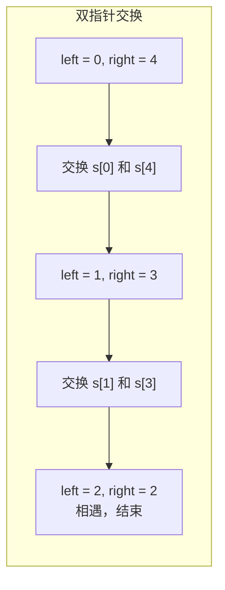

---

title: "反转字符串"

difficulty: 简单

category: 字符串

tags:

  - leetcode

  - 字符串

created: "2026-07-21"

---

# 344. 反转字符串（Reverse String）

> 难度：简单 | 主题：字符串——双指针

## 题目

编写一个函数，将输入的字符串反转过来。输入字符串以字符数组的形式给出，要求**原地修改**。

**示例：**

```text

["h","e","l","l","o"] → ["o","l","l","e","h"]

```

---

## 思路
### 先讲个故事：镜子前的你

你站在镜子前，左手拿着 A，右手拿着 B。你把左手伸到右边、右手伸到左边——A 和 B 就交换了。然后你往中间走一步，继续交换，直到你走到镜子中间。

反转字符串就是这个过程：**两个指针从两端向中间走，每步交换**。

---

### 引导式推导：从递归到双指针

**第 1 层：递归**

反转 `s[0..n-1]` = 交换 `s[0]` 和 `s[n-1]`，然后递归反转 `s[1..n-2]`。

**第 2 层：双指针（推荐）**

一个指针从头，一个从尾，两两交换，向中间靠拢。



**为什么 left < right 而不是 <=？** 中间的元素反转后还是它自己，不需要交换。

---

## 代码

```python

def reverseString(self, s):

    left = 0

    right = len(s) - 1

    while left < right:

        s[left], s[right] = s[right], s[left]

        left += 1

        right -= 1

```

---

## 复杂度

| 指标 | 值 | 解释 |

|------|----|------|

| 时间 | O(n) | 遍历一半的元素，交换 n/2 次 |

| 空间 | O(1) | 只用了两个指针变量，原地交换 |

---

## 实战考量
### 频率分析

> **热身题**，约 20% 开头可能出这题热身，考察基本编码能力。

### 延伸思考

**Q：不用额外变量怎么交换？**

A：Python 元组解包 `a, b = b, a`；其他语言用异或 `a ^= b; b ^= a; a ^= b`。

**Q：递归怎么写？时间空间复杂度？**

A：时间 O(n)，空间 O(n)（递归栈），不如双指针。

**Q：反转字符串中的元音字母怎么做？**

A：[[345反转字符串中的元音字母]]，只反转元音，不是全部反转。

### 易错点

- 循环条件 `left < right`，不是 `<=`

- Python 中字符串不可变，题目给的是字符数组 `list`

- 忘记 `left += 1` 或 `right -= 1` 会死循环

---

## 生活类比

> **镜子反射 → 双指针交换**

>

> 左手和右手各拿一个东西，伸到对面交换。然后往中间走一步，继续交换。

> 走到中间相遇时，所有东西都反转了。

>

> **对称交换，逐步收敛——这是最朴素的算法之美。**

---

## 相关题目

| 题目 | 关系 |

|------|------|

| [[345反转字符串中的元音字母]] | 同类双指针反转 |

| 151反转字符串中的单词 | 单词级别反转 |

| 189旋转数组 | 分段反转技巧 |

---

→ 返回题单：[[LeetCode学习路线图#二、字符串]]

## 速记卡（面试闪卡）

**Q1：一句话讲清「344. 反转字符串（Reverse String）」到底是什么？**

A：反转字符串用双指针从两端向中间两两交换，原地 O(1) 完成。

**Q2：一、题目与原地约束 —— 怎么理解？**

A：像要求不另拿盘子就翻牌：输入是字符数组、必须原地修改，不能开新数组——这就逼出双指针交换法。英文：In-place Reverse。

**Q3：二、思路：镜子前交换双手 —— 怎么理解？**

A：像镜子前左手拿 A、右手拿 B，伸到对面交换再往中间走一步，直到相遇——双指针每步换一对、逐步收敛。英文：Two Pointers。

**Q4：三、代码与为什么 left < right —— 怎么理解？**

A：像过中线就多余：中间元素反转还是自己，所以循环用 `<` 不用 `<=`；Python 用元组解包 `a,b=b,a` 一行交换，连临时变量都不用。英文：Swap / Convergence。

**Q5：四、复杂度与延伸 —— 怎么理解？**

A：像热身最简单的体操：时间 O(n) 交换 n/2 次、空间 O(1) 只两个指针；递归也能写但占 O(n) 栈不如双指针，元音反转是其变体。英文：O(n) Time / O(1) Space。

**Q6：核心速记主线有哪些？**

- 核心：双指针从两端向中间，每步交换一对

- 原地：只交换不新建数组，空间 O(1)

- 边界：while 用 < 不用 <=（中间元素不动）

- 变体：反转元音、反转单词、旋转数组都靠分段反转

**口诀**

A：反转字符两端走，

双针交换向中收；

原地 O(1) 不占兜，

一遍写对稳拿手。

## 相关链接

- [[笔记/Leetcode笔记/02_字符串/151反转字符串中的单词|反转字符串中的单词]]

- [[笔记/Leetcode笔记/02_字符串/43字符串相乘|字符串相乘]]

- [[笔记/Leetcode笔记/02_字符串/415字符串相加|字符串相加]]

- [[笔记/Leetcode笔记/02_字符串/8字符串转换整数atoi|字符串转换整数atoi]]

- [[笔记/Leetcode笔记/02_字符串/28找出字符串中第一个匹配项的下标|找出字符串中第一个匹配项的下标]]

