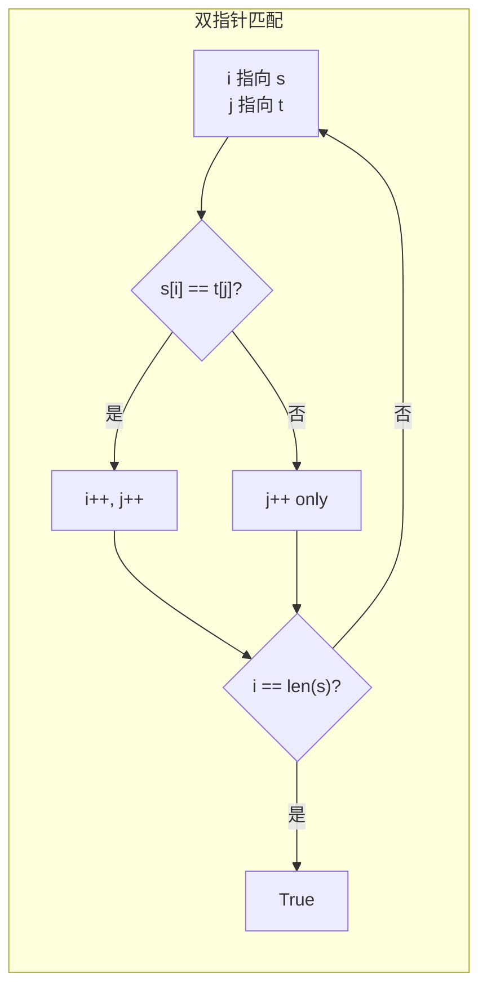

# 392. 判断子序列（Is Subsequence）

> 难度：简单 | 主题：字符串——双指针贪心

## 题目

给定字符串 `s` 和 `t`，判断 `s` 是否为 `t` 的子序列。子序列不要求连续，但要求相对顺序一致。

**示例：**
```text
s = "abc", t = "ahbgdc" → True（'a'、'b'、'c' 按顺序出现）
s = "axc", t = "ahbgdc" → False
```

---

## 思路

### 先讲个故事：朋友圈的点赞记录

你翻看一个人的朋友圈，想找他有没有在特定几天发过帖。你手里有一串日期清单（s），朋友圈是时间线（t）。

你不会乱翻——你按时间线从头扫，每看到一个匹配的日期就打个勾。如果所有日期都勾完了，说明这人确实在那些天发过帖。

这就是双指针贪心：**s 的每个字符都要在 t 中按顺序找到匹配**。

---

### 引导式推导：从暴力到双指针

**第 1 层：暴力 O(n×m)**

对 s 的每个字符，在 t 中从头找匹配。

**第 2 层：双指针 O(n)**

`i` 指向 s，`j` 指向 t。如果 `s[i] == t[j]`，`i++`；无论是否匹配，`j++`。最后看 `i` 是否走完了 s。



**为什么贪心成立？** s 的每个字符只需要在 t 中找到**第一个**匹配即可。越早匹配，留给后面字符的空间越大。

---

## 代码

```python
def isSubsequence(self, s, t):
    i = 0
    j = 0

    while i < len(s) and j < len(t):
        if s[i] == t[j]:
            i += 1
        j += 1

    return i == len(s)
```

---

## 复杂度

| 指标 | 值 | 解释 |
|------|----|------|
| 时间 | O(n) | n 是 t 的长度，每个字符最多访问一次 |
| 空间 | O(1) | 只用了两个指针 |

---

## 实战考量

### 频率分析

> **简单但高频**，约 20% 考察双指针基本功。很多场景用到子序列判断（如日志匹配）。

### 延伸思考

**Q：如果有很多个 s 需要判断呢？**
A：预处理 t，对每个字符记录它后面每个字符的下一个位置（二分查找优化到 O(m log n)）。

**Q：如果 t 是数据流（只能读一次）呢？**
A：只能在线贪心匹配，无法预处理。

**Q：最长公共子序列怎么做？**
A：动态规划，二维 DP（1143最长公共子序列）。

### 易错点

- `j` 每次都要前进，`i` 只在匹配时前进
- 返回值是 `i == len(s)` 不是 `j == len(t)`
- 空串是任何串的子序列

---

## 生活类比

> **朋友圈点赞记录 → 贪心匹配**
>
> 你按时间线从头扫，每看到一个匹配的日期就打个勾。
> 不需要回头找——如果这个日期错过了，后面的更不可能匹配上。
>
> **贪心的本质：按顺序，不回头。**

---

## 相关题目

| 题目 | 关系 |
|------|------|
| 1143最长公共子序列 | LCS 基础，DP 版 |
| 72编辑距离 | 字符串编辑系列 |
| 521最长特殊子序列 | 子序列变体 |

---

→ 返回题单：[[LeetCode学习清单#二、字符串]]
