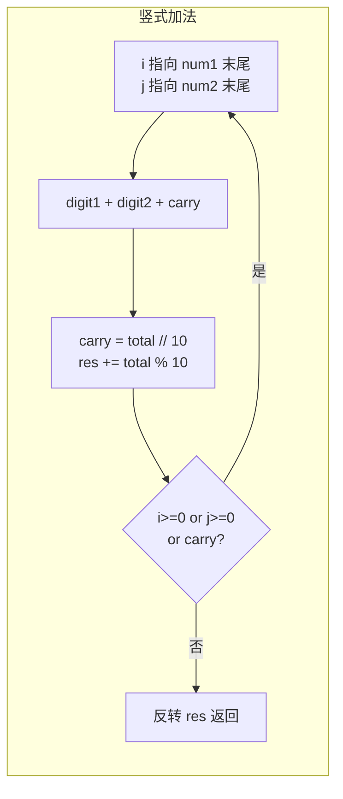

---

title: "字符串相加"

difficulty: 简单

category: 字符串

tags:

  - leetcode

  - 字符串

created: "2026-07-21"

---

# 415. 字符串相加（Add Strings）

> 难度：简单 | 主题：字符串——模拟竖式加法

## 题目

给定两个非负整数 `num1` 和 `num2` 的字符串形式，返回它们的和（字符串形式）。**不能使用内置大整数转换**。

**示例：**

```text

num1 = "11", num2 = "123" → "134"

num1 = "456", num2 = "77" → "533"

```

---

## 思路
### 先讲个故事：小学生的竖式算术

你还记得小学怎么算加法吗？在纸上画一条竖线，两个数字上下对齐，从个位开始逐位相加。满 10 进 1。

字符串相加就是**用代码模拟这个竖式过程**。唯一的区别是：代码从字符串末尾开始（因为个位在最后），结果也是逆序构建的。

---

### 引导式推导：从直觉到模板

**核心步骤**：

1. 两个指针分别指向两个字符串的末尾（个位）

2. 每次取当前位的数字（越界则补 0），加上进位

3. `total // 10` 是新的进位，`total % 10` 是当前位结果

4. 循环直到两个指针都越界且进位为 0

5. 结果列表逆序拼接返回



**为什么用 `ord(ch) - ord('0')`？** ASCII 码中 '0'~'9' 是连续的，`ord('5') - ord('0') = 5`，这是底层字符转数字的标准写法。

---

## 代码

```python

def addStrings(self, num1: str, num2: str) -> str:

    i, j = len(num1) - 1, len(num2) - 1

    carry = 0

    res = []

    while i >= 0 or j >= 0 or carry:

        digit1 = ord(num1[i]) - ord('0') if i >= 0 else 0

        digit2 = ord(num2[j]) - ord('0') if j >= 0 else 0

        total = digit1 + digit2 + carry

        carry = total // 10

        res.append(str(total % 10))

        i -= 1

        j -= 1

    return ''.join(res[::-1])

```

---

## 复杂度

| 指标 | 值 | 解释 |
|------|----|------|
| 时间 | O(max(m,n)) | m、n 是两个字符串的长度，每位处理一次 |
| 空间 | O(max(m,n)) | 结果字符串长度，最多比最长输入多 1 位 |

---

## 实战考量
### 频率分析

> **字符串基础题**，约 20% 考察，是字符串相乘（[[43字符串相乘]]）的基础。

### 延伸思考

**Q：ord(ch) - ord('0') 是什么原理？**

A：ASCII 码中 '0'~'9' 是连续的，`ord('5') - ord('0') = 5`。

**Q：如果是其他进制（二进制、十六进制）？**

A：把 `10` 换成 `base` 参数：`carry = total // base`，`res.append(total % base)`。

**Q：Python 能直接 int 相加吗？**

A：能，但不会让你这么写——考察的是逐位处理的能力。

### 易错点

- 循环条件必须包含 `carry`（如 "99" + "1" = "100"）

- 结果列表 `res` 是低位在前，返回前必须 `[::-1]` 反转

- `ord('0')` 写成 `int('0')` 结果一样但逻辑不对

---

## 生活类比

> **小学竖式算术 → 逐位模拟**

>

> 从个位开始，一位一位地加。满 10 进 1，不满就写下来。

> 最后把结果倒过来——因为你是从个位开始写的。

>

> **模拟就是：把人脑的计算过程，翻译成代码的循环。**

---

## 相关题目

| 题目 | 关系 |
|------|------|
| [[43字符串相乘]] | 乘法进阶版 |
| 2两数相加 | 链表版大数加法 |
| 67二进制求和 | 二进制版加法 |

---

→ 返回题单：[[LeetCode学习路线图#二、字符串]]

## 速记卡（面试闪卡）

**Q1：一句话讲清「415. 字符串相加（Add Strings）」到底是什么？**

A：字符串相加用代码模拟小学竖式，逐位加、满十进一。

**Q2：一、题目要求 —— 怎么理解？ —— 怎么理解？**

A：像不让用计算器的加法：给两个数字字符串，返回和字符串，且不能用内置大整数转换，得自己一位位算。英语：Add Strings / big integer addition。

**Q3：二、竖式模拟 —— 怎么理解？ —— 怎么理解？**

A：像小学生竖式：两指针从个位（串尾）出发，逐位相加加进位，total//10 是新进位、%10 是当前位，凑够再反转。英语：vertical addition（竖式加法）。

**Q4：三、代码要点 —— 怎么理解？ —— 怎么理解？**

A：像记账本：while i>=0 or j>=0 or carry 才停，ord(ch)-ord('0') 把字符变数字（ASCII 连续），结果低位在前最后 [::-1]。英语：ord() ASCII conversion。

**Q5：四、复杂度与易错点 —— 怎么理解？ —— 怎么理解？**

A：像数位数：时间 O(max(m,n)) 每位一次，空间 O(max(m,n)) 结果最多多一位；易错在漏掉 carry 条件、忘反转。换进制把 10 改成 base 即可。英语：O(max(m,n))。

**Q6：核心速记主线有哪些？**

- 模拟竖式：从个位起逐位加、满十进一

- 循环条件含 carry，防"99+1=100"漏位

- ord(ch)-ord('0') 转数字，结果[::-1]反转

- 时间O(max(m,n))空间O(max(m,n))

**口诀**

A：字符串相加模拟竖，个位起算满十进；

carry 莫漏循环里，ord 转数要记清。

低位先存后反转，时间随长空间同；

一遍写对稳拿分，竖式套路最轻松。

## 相关链接

- [[笔记/Leetcode笔记/02_字符串/43字符串相乘|字符串相乘]]

- [[笔记/Leetcode笔记/02_字符串/344反转字符串|反转字符串]]

- [[笔记/Leetcode笔记/02_字符串/8字符串转换整数atoi|字符串转换整数atoi]]

- [[笔记/Leetcode笔记/02_字符串/151反转字符串中的单词|反转字符串中的单词]]

- [[笔记/Leetcode笔记/02_字符串/28找出字符串中第一个匹配项的下标|找出字符串中第一个匹配项的下标]]

