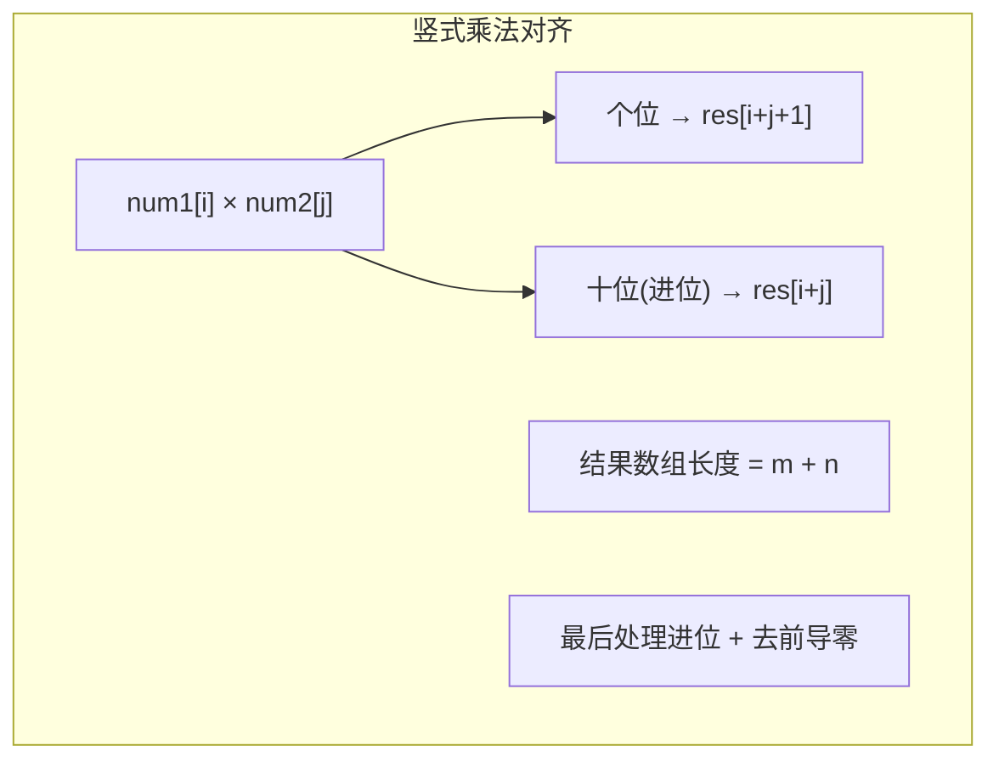

---

title: "字符串相乘"

difficulty: 中等

category: 字符串

tags:

  - leetcode

  - 字符串

created: "2026-07-21"

---

# 43. 字符串相乘（Multiply Strings）

> 难度：中等 | 主题：字符串——模拟竖式乘法

## 题目

给定两个以字符串形式表示的非负整数 `num1` 和 `num2`，返回它们的乘积（字符串形式）。**不能使用内置大整数转换**。

**示例：**

```text

num1 = "2", num2 = "3" → "6"

num1 = "123", num2 = "456" → "56088"

```

---

## 思路
### 先讲个故事：小学生的竖式乘法

还记得小学怎么算乘法吗？`123 × 456`，把 456 拆成 6、50、400，分别和 123 相乘，然后错位相加。

字符串相乘就是**用代码模拟这个竖式过程**。核心洞察：`num1[i]` 和 `num2[j]` 的乘积，其个位落在结果数组的 `i+j+1` 位置，十位（进位）落在 `i+j` 位置。

---

### 引导式推导：从加法到乘法

**第 1 步：回顾加法模板（[[415字符串相加]]）**

从末尾逐位相加，处理进位。

**第 2 步：扩展到乘法**



**为什么 i+j+1 是低位？** 把 `num1[i]` 看作 `10^(m-1-i)` 位，`num2[j]` 看作 `10^(n-1-j)` 位，乘积在 `10^(m+n-2-i-j)` 位。映射到长度为 `m+n` 的数组，索引为 `i+j+1`。

---

## 代码

```python

def multiply(self, num1: str, num2: str) -> str:

    if num1 == "0" or num2 == "0":

        return "0"

    m, n = len(num1), len(num2)

    res = [0] * (m + n)

    for i in range(m - 1, -1, -1):

        digit1 = ord(num1[i]) - ord('0')

        for j in range(n - 1, -1, -1):

            digit2 = ord(num2[j]) - ord('0')

            total = digit1 * digit2 + res[i + j + 1]

            res[i + j + 1] = total % 10

            res[i + j] += total // 10

    start = 0

    while start < len(res) and res[start] == 0:

        start += 1

    return ''.join(str(d) for d in res[start:])

```

---

## 复杂度

| 指标 | 值 | 解释 |

|------|----|------|

| 时间 | O(m × n) | 双重循环 |

| 空间 | O(m + n) | 结果数组长度 |

---

## 实战考量
### 频率分析

> **字符串乘法题**，约 15% 考察，是加法模板（[[415字符串相加]]）的进阶。

### 延伸思考

**Q：为什么 res[i+j+1] 存个位，res[i+j] 存进位？**

A：竖式乘法中，`num1` 的第 `i` 位和 `num2` 的第 `j` 位相乘，结果在 `10^(m+n-2-i-j)` 位。`m+n` 长的数组从右到左对应 0 到 m+n-1 位，`i+j+1` 刚好对应这个位置。

**Q：为什么 res 数组长度是 m+n？**

A：两个 m 位和 n 位的数相乘，最多 m+n 位。例如 99×99 = 9801（2+2=4 位）。

**Q：res[i+j] 为什么用 +=？**

A：因为该位置可能已经有之前某次乘法的进位，需要累加。

**Q：Karatsuba 算法了解吗？**

A：分治乘法，O(n^1.585)。一般不需要，但主动提能加分。

### 易错点

- `res[i+j]` 用 `+=` 不是 `=`

- `res[i+j+1]` 用 `=` 不是 `+=`（`total` 已包含原值）

- 必须去掉前导零

- 任一数为 "0" 时直接返回 "0"

---

## 生活类比

> **小学竖式乘法 → 错位相加**

>

> 每一位的乘积都有自己的位置（`i+j+1`），进位累加到高位（`i+j`）。

> 最后统一处理进位，去掉前导零。

>

> **乘法的本质：多次加法 + 错位对齐。**

---

## 相关题目

| 题目 | 关系 |

|------|------|

| [[415字符串相加]] | 加法基础版，先掌握再学乘法 |

| 67二进制求和 | 二进制版加法 |

| 2两数相加 | 链表版大数运算 |

---

→ 返回题单：[[LeetCode学习路线图#二、字符串]]

## 速记卡（面试闪卡）

**Q1：一句话讲清「43. 字符串相乘（Multiply Strings）」到底是什么？**

A：《字符串相乘》是用代码模拟竖式乘法，把两个大整数字符串乘出结果字符串。

**Q2：题目 —— 怎么理解？**

A：像不能用计算器的乘法题：给两个非负整数字符串，返回乘积字符串，禁止内置大整数转换；题目（Problem）考你手算过程。

**Q3：思路 —— 怎么理解？**

A：像小学竖式：123×456 拆成 6、50、400 分别乘再错位相加；核心洞察 `num1[i]×num2[j]` 个位落 res[i+j+1]、进位落 res[i+j]。

**Q4：代码 —— 怎么理解？**

A：建长度 m+n 的结果数组，双重循环填 i+j+1（个位）与 i+j（进位），最后去前导零；代码（Code）注意 `+=` 累加进位。

**Q5：复杂度 —— 怎么理解？**

A：像两重循环扫一遍：时间 O(m×n) 双重循环，空间 O(m+n) 结果数组；复杂度（Complexity）随两数位数 m、n 线性乘积。

**Q6：核心速记主线有哪些？**

- 题目：两数字符串相乘，禁内置大整数

- 思路：模拟竖式，i+j+1 落个位、i+j 落进位

- 代码：m+n 长数组填值，去前导零

- 复杂度：时间 O(m×n)，空间 O(m+n)

**口诀**

A：字符串相乘，

竖式错位加；

个位i加j加一，

进位累加它。

## 相关链接

- [[笔记/Leetcode笔记/02_字符串/415字符串相加|字符串相加]]

- [[笔记/Leetcode笔记/02_字符串/344反转字符串|反转字符串]]

- [[笔记/Leetcode笔记/02_字符串/8字符串转换整数atoi|字符串转换整数atoi]]

- [[笔记/Leetcode笔记/02_字符串/151反转字符串中的单词|反转字符串中的单词]]

- [[笔记/Leetcode笔记/02_字符串/28找出字符串中第一个匹配项的下标|找出字符串中第一个匹配项的下标]]

