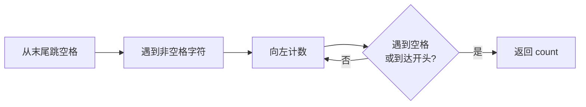

---

title: "最后一个单词的长度"

difficulty: 简单

category: 字符串

tags:

  - leetcode

  - 字符串

created: "2026-07-21"

---

# 58. 最后一个单词的长度（Length of Last Word）

> 难度：简单 | 主题：字符串

## 题目

给定一个由若干单词和空格组成的字符串 `s`，返回字符串中最后一个单词的长度。单词是由非空格字符组成的最大子字符串。

**示例**

```text

输入：s = "Hello World"

输出：5

输入：s = "   fly me   to   the moon  "

输出：4

输入：s = "luffy is still joyboy"

输出：6

```

---

## 思路
### 先讲个故事：倒着数的便利贴

你桌上贴了一排便利贴，写满了今天的待办事项。老板问你"最后一个待办有多长？"你不需要从头数——直接从最右边开始，跳过空白，然后数到遇到空白或墙壁就停了。

**从后往前数，先跳空格，再数字符。**

### 引导式推导：两步走

**第 1 步：从末尾跳过所有尾部空格**

```text

"Hello World  "

  ^^^^ 从这里开始，跳过两个空格，i 停在 'd' 位置

```

**第 2 步：从第一个非空格字符开始计数，直到遇到空格或开头**

```text

'W','o','r','l','d' → 遇到空格 → count = 5 ✓

```

### 为什么不用 split？

`split()` 一行搞定，但会创建整个字符串数组，空间 O(n)。实践中应该先写 O(1) 空间解法，再提 split 作为 Python 简写。



---

## 代码

```python

def lengthOfLastWord(self, s: str) -> int:

    # 步骤 1：从最后一个字符开始，跳过所有尾部空格

    i = len(s) - 1

    while i >= 0 and s[i] == ' ':

        i -= 1

    # 步骤 2：从第一个非空格字符开始，计数直到遇到空格或开头

    count = 0

    while i >= 0 and s[i] != ' ':

        count += 1

        i -= 1

    return count

```

## 复杂度

| 指标 | 值 | 解释 |
|------|----|------|
| 时间 | O(n) | 最坏情况遍历整个字符串（如全是空格或只有一个单词） |
| 空间 | O(1) | 只用了两个变量 `i` 和 `count` |

---

## 实战考量
### 频率分析

> **出现在**：简单题热身，约 20% 的会作为开场题。关键在于**能不能想到 O(1) 空间解法**，而不是直接写 split。

### 延伸思考

**Q：如果字符串全是空格呢？**

A：第一个 while 后 `i = -1`，第二个 while 条件不满足，返回 `count = 0`。

**Q：如果只有一个单词且没有空格呢？**

A：第一个 while 跳过（因为 `s[-1]` 不是空格），第二个 while 从末尾数到开头，返回整个字符串长度。

**Q：`split()` 和 `split(' ')` 的区别？**

A：`split()` 无参数时，任意连续空白字符都被当作一个分隔符，且自动去除首尾空格；`split(' ')` 以单个空格为分隔符，连续空格会产生空字符串。例如 `"a  b".split()` = `["a", "b"]`，`"a  b".split(' ')` = `["a", "", "b"]`。

**Q：还有什么其他解法？**

A：正则表达式 `re.findall(r'\w+', s)[-1]`；或者 `s.strip().split()[-1]`。但都不如双指针节省空间。

### 易错点

- 两个 while 的顺序不能颠倒：必须先跳过尾部空格，再计数

- 第一个 while 的条件是 `s[i] == ' '`（遇到空格继续），第二个是 `s[i] != ' '`（遇到非空格继续）

- 两个 while 都要检查 `i >= 0`，防止越界

---

## 生活类比

> **最后一个单词的长度 → 从便利贴最右边倒着数**

>

> 桌上贴了一排便利贴，你不需要从头找——直接从最右边开始，跳过空白，然后数到遇到空白或墙壁就停了。

>

> 一句话总结：**从后往前数，先跳空格，再数字符。**

---

## 相关题目

| 题目 | 关系 |
|------|------|
| 151反转字符串中的单词 | 字符串单词处理，本题的进阶版 |
| 14最长公共前缀 | 字符串基础操作 |
| 165比较版本号 | 同样是字符串遍历 |

---

→ 返回题单：[[LeetCode学习路线图#二、字符串]]

## 速记卡（面试闪卡）

**Q1：一句话讲清「58. 最后一个单词的长度（Length of Last Word）」到底是什么？**

A：给定一个字符串，返回它最后一个单词的长度。

**Q2：思路 —— 怎么理解？**

A：像从一摞便利贴最右往左数：先跳过空白，再数到空格或桌边就停。这就是 Two Pointers（双指针）倒序扫描。

**Q3：代码 —— 怎么理解？**

A：两段 while 跟思路一一对应：先让 i 从末尾跳过尾部空格，再向左计数到遇空格或开头。用 In-place（原地）双指针，比 split 建数组省空间。

**Q4：复杂度 —— 怎么理解？**

A：时间 O(n)（最坏扫完整个串），空间 O(1)（只用 i、count 两个变量）。面试要主动点出比 split 的 O(n) 空间更优。

**Q5：实战考量 —— 怎么理解？**

A：约 20% 当开场热身题，关键在想到 O(1) 空间解法；易错点是两个 while 顺序不能反、都要判 i>=0 防越界。

**Q6：核心速记主线有哪些？**

- 从末尾倒着数：先跳尾部空格，再向左计数到空格或开头

- 双 while 顺序固定：跳空格在前，数字符在后

- 时间 O(n)、空间 O(1)，优于 split 的 O(n) 空间

- 边界：全空格返回 0，单单词直接数到头

**口诀**

A：从后往前跳空格

遇空遇边就停歇

时间O(n)空间O(1)

双指针法最稳妥

## 相关链接

- [[笔记/Leetcode笔记/02_字符串/151反转字符串中的单词|反转字符串中的单词]]

- [[笔记/Leetcode笔记/02_字符串/8字符串转换整数atoi|字符串转换整数atoi]]

- [[笔记/Leetcode笔记/02_字符串/93复原IP地址|复原IP地址]]

- [[笔记/Leetcode笔记/02_字符串/28找出字符串中第一个匹配项的下标|找出字符串中第一个匹配项的下标]]

- [[笔记/Leetcode笔记/02_字符串/344反转字符串|反转字符串]]

