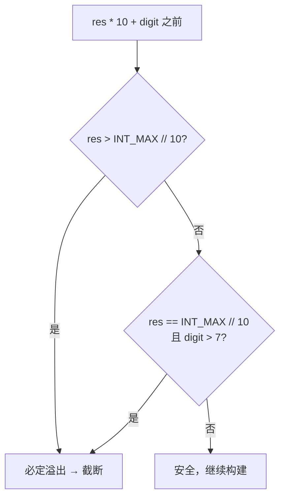

---

title: "字符串转换整数atoi"

difficulty: 中等

category: 字符串

tags:

  - leetcode

  - 字符串

created: "2026-07-21"

---

# 8. 字符串转换整数 (atoi)

> 难度：中等 | 主题：字符串、数学、状态机

## 题目

实现 `atoi` 函数，将字符串转换为 32 位有符号整数。规则如下：

1. 忽略前导空格

2. 检查下一个字符是 `+` 还是 `-`，确定符号（默认正号）

3. 读取连续的数字字符，直到遇到非数字字符或字符串结束

4. 如果整数超过 32 位有符号整数范围 `[-2^31, 2^31 - 1]`，则截断到边界值

5. 返回最终整数

**示例**

```text

输入：s = "42"       → 输出：42

输入：s = "   -42"   → 输出：-42

输入：s = "4193 with words" → 输出：4193

输入：s = "words and 987"   → 输出：0

输入：s = "-91283472332"    → 输出：-2147483648（溢出截断）

```

---

## 思路
### 先讲个故事：自动售货机的投币口

你站在一台自动售货机前，投币口只接受硬币。你先擦掉投币口上的灰尘（跳过空格），然后判断是正投入还是负投入（符号位），接着一个一个投硬币（读数字），如果投太多机器装不下了就截断到最大容量（溢出处理）。

**atoi = 擦灰（跳空格）→ 判断方向（符号位）→ 投硬币（读数字）→ 检查容量（溢出）**

### 引导式推导：四步走

**第 1 步：跳过前导空格**

```text

"   -42" → 从索引 0 跳过三个空格，i 停在 '-' 位置

```

**第 2 步：读取符号位**

```text

'-' → sign = -1, i += 1

'+' → sign = 1, i += 1

都不是 → sign = 1（默认正号）

```

**第 3 步：逐位读取数字并构建结果**

```text

res = 0

res = 0 * 10 + 4 = 4

res = 4 * 10 + 2 = 42

```

**第 4 步：溢出检查（关键！）**



- `INT_MAX = 2147483647`，`INT_MAX // 10 = 214748364`，`INT_MAX % 10 = 7`

- 如果 `res > 214748364`，则 `res * 10` 必定溢出

- 如果 `res == 214748364` 且 `digit > 7`，则 `res * 10 + digit > INT_MAX`

---

## 代码

```python

def myAtoi(self, s: str) -> int:

    INT_MAX = 2**31 - 1           # 2147483647

    INT_MIN = -2**31              # -2147483648

    i, n = 0, len(s)

    # 步骤 1：跳过前导空格

    while i < n and s[i] == ' ':

        i += 1

    # 边界情况：全是空格，返回 0

    if i == n:

        return 0

    # 步骤 2：读取符号位

    sign = 1

    if s[i] == '+' or s[i] == '-':

        sign = -1 if s[i] == '-' else 1

        i += 1

    # 步骤 3：读取数字并构建结果

    res = 0

    while i < n and s[i].isdigit():

        digit = ord(s[i]) - ord('0')

        # 步骤 4：溢出检查（必须在 res * 10 之前判断）

        if res > INT_MAX // 10 or (res == INT_MAX // 10 and digit > INT_MAX % 10):

            return INT_MAX if sign == 1 else INT_MIN

        res = res * 10 + digit

        i += 1

    return sign * res

```

## 复杂度

| 指标 | 值 | 解释 |
|------|----|------|
| 时间 | O(n) | 遍历字符串一次，每个字符最多处理一次 |
| 空间 | O(1) | 只用了常数个变量 |

---

## 实战考量
### 频率分析

> **出现在**：字符串处理经典题，约 35% 的同类题会考。重点在于**溢出检查的数学推导**——能不能在不实际溢出的前提下判断会溢出。

### 延伸思考

**Q：INT_MAX % 10 为什么是 7？**

A：因为 `INT_MAX = 2147483647`，最后一位是 7。如果故意说错了，要能纠正。

**Q：`res == INT_MAX // 10 and digit > 7` 这段逻辑能推导一下吗？**

A：`INT_MAX // 10 = 214748364`，此时 `res * 10 = 2147483640`，再加上 digit，如果 digit > 7，则 `2147483640 + digit > 2147483647 = INT_MAX`，溢出。

**Q：负溢出为什么返回 INT_MIN 而不是 -INT_MAX？**

A：因为 `-2147483648` 绝对值比 `INT_MAX` 大 1，它的绝对值 `2147483648` 超出 `INT_MAX`，所以触发了溢出检查并返回 `INT_MIN`。

**Q：状态机怎么实现？**

A：定义 4 个状态：start（初始）→ signed（遇到符号）→ in_number（正在读数字）→ end（结束）。每个状态根据当前字符决定下一个状态和操作。

### 易错点

- 溢出检查必须在 `res * 10 + digit` 之前，否则 `res * 10` 本身可能已经溢出

- 符号位只取第一个连续的 `+` 或 `-`

- 空字符串返回 0，全空格返回 0

- 如果第一个非空格字符不是数字也不是符号，循环体不执行，返回 0

---

## 生活类比

> **atoi → 自动售货机投币**

>

> 擦掉投币口的灰尘（跳空格），判断方向（符号位），一个一个投硬币（读数字），如果投太多机器装不下了就截断（溢出处理）。

>

> 一句话总结：**先擦灰，再判方向，投币时检查容量。**

---

## 相关题目

| 题目 | 关系 |
|------|------|
| 7整数反转 | 同样的溢出检查逻辑 |
| [[415字符串相加]] | 字符串转数字的基础操作 |
| [[43字符串相乘]] | 字符串乘法，也是逐位处理 |

---

→ 返回题单：[[LeetCode学习路线图#二、字符串]]

## 速记卡（面试闪卡）

**Q1：一句话讲清「8. 字符串转换整数 (atoi)」到底是什么？**

A：把字符串按规则转为 32 位有符号整数，处理空格、符号、数字与溢出截断。

**Q2：思路 —— 怎么理解？**

A：像自动售货机投币——先擦灰（跳前导空格）、再判方向（符号位）、投硬币（读数字）、检查容量（溢出截断）。四步：跳空格→读符号→逐位构建→溢出检查。本质是有限状态机。

**Q3：代码 —— 怎么理解？**

A：跳过空格，读 +/- 设 sign（默认 1），逐位 res=res*10+digit；溢出在乘之前判（res>INT_MAX//10 或 ==且 digit>7）即截断返回边界值。

**Q4：复杂度 —— 怎么理解？**

A：时间 O(n) 遍历一次字符串；空间 O(1) 只用常数个变量。

**Q5：实战考量 —— 怎么理解？**

A：重点在溢出数学推导（不实际溢出就能判断）；INT_MAX%10=7 要能当场推导；溢出检查必须在 res*10 之前；负溢出返 INT_MIN（绝对值比 INT_MAX 大 1）；状态机四态 start→signed→in_number→end。

**Q6：核心速记主线有哪些？**

- 四步：跳空格、读符号、读数字、溢出截断

- 溢出检查在 res*10 之前：res>INT_MAX//10 或 ==且 digit>7

- 时间 O(n) 空间 O(1)，符号只取首个 +/-

- INT_MIN 绝对值比 INT_MAX 大 1，负溢出返 INT_MIN

**口诀**

A：字符串转整数 atoi，先擦灰来再判向

投币逐位构结果，容量超限即截档

溢出先验乘之前，INT_MAX 余七记心上

时间 O(n) 空间一，状态机四态不慌

## 相关链接

- [[笔记/Leetcode笔记/02_字符串/344反转字符串|反转字符串]]

- [[笔记/Leetcode笔记/02_字符串/43字符串相乘|字符串相乘]]

- [[笔记/Leetcode笔记/02_字符串/415字符串相加|字符串相加]]

- [[笔记/Leetcode笔记/02_字符串/151反转字符串中的单词|反转字符串中的单词]]

- [[笔记/Leetcode笔记/02_字符串/28找出字符串中第一个匹配项的下标|找出字符串中第一个匹配项的下标]]

