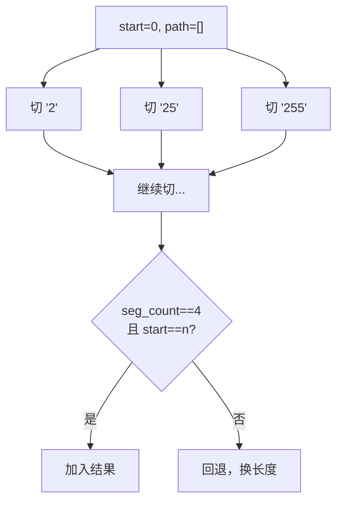

# 93. 复原 IP 地址（Restore IP Addresses）

> 难度：中等 | 主题：字符串、回溯

## 题目

给定一个只包含数字的字符串 `s`，返回所有可能的有效 IP 地址。有效 IP 地址由 4 个整数（0~255）组成，用 `.` 分隔，且不能有前导零（除非是 "0" 本身）。

**示例**

```text
输入：s = "25525511135"
输出：["255.255.11.135", "255.255.111.35"]

输入：s = "0000"
输出：["0.0.0.0"]

输入：s = "101023"
输出：["1.0.10.23", "1.0.102.3", "10.1.0.23", "10.10.2.3", "101.0.2.3"]
```

---

## 思路

### 先讲个故事：切蛋糕的四刀

想象你有一条长蛋糕（字符串），要切成恰好 4 段（IP 地址的 4 个部分）。每段长度 1~3 厘米，每段的值在 0~255 之间，而且不能有前导零（比如 "01" 就是非法的）。

你怎么切？从左到右，每刀试切 1、2、3 厘米，切满 4 刀且刚好用完蛋糕就成功了。切不下去就回退，换个长度再试。

**这就是回溯——试错 + 回退。**

### 引导式推导：回溯三要素

**要素 1：状态（当前切到哪了）**
- `start`：当前从字符串的哪个位置开始切
- `path`：已经切出的段，如 `["255", "255"]`
- `seg_count`：已切出几段（0~4）

**要素 2：选择（每刀切多长）**

每刀尝试切 1、2、3 个字符：

```text
s = "25525511135", start=0
  切1位: "2" ✓ → 递归
  切2位: "25" ✓ → 递归
  切3位: "255" ✓ → 递归
```

**要素 3：剪枝（提前放弃）**

- 剩余字符太多：即使每段都取 3 位也放不下 → 剪掉
- 剩余字符太少：即使每段都取 1 位也不够分 → 剪掉



### 为什么复杂度是 O(1)？

IP 地址固定 4 段，每段最多 3 位，总组合数不超过 3^4 = 81，常数级。

---

## 代码

```python
def restoreIpAddresses(self, s: str) -> list[str]:
    res = []
    n = len(s)

    def backtrack(start: int, path: list[str], seg_count: int):
        # 终止条件：切满了 4 段
        if seg_count == 4:
            if start == n:
                res.append('.'.join(path))
            return

        # 剪枝：剩余字符太多，即使每段 3 位也放不下
        if (4 - seg_count) * 3 < n - start:
            return
        # 剪枝：剩余字符太少，即使每段 1 位也不够分
        if 4 - seg_count > n - start:
            return

        # 尝试切 1~3 个字符作为当前段
        for length in range(1, 4):
            if start + length > n:
                break

            segment = s[start:start + length]

            # 合法性检查：前导零 或 超出范围
            if (segment[0] == '0' and len(segment) > 1) or int(segment) > 255:
                continue

            backtrack(start + length, path + [segment], seg_count + 1)

    backtrack(0, [], 0)
    return res
```

## 复杂度

| 指标 | 值 | 解释 |
|------|----|------|
| 时间 | O(1) | 最多 3^4 = 81 种组合，常数级 |
| 空间 | O(1) | 递归栈深度最多 4 层，结果列表也是常数大小 |

---

## 实战考量

### 频率分析

> **出现在**：回溯经典题，约 30% 的同类题会考。关键在于你**回溯框架的熟练度**，以及能不能想到剪枝优化。

### 延伸思考

**Q：为什么时间复杂度是 O(1)？**
A：IP 地址固定 4 段，每段 1~3 位，组合数上限 3^4 = 81，是常数。即使字符串长度 1000 位，组合数也不变（因为大部分会被剪掉）。

**Q：前导零检查怎么写？**
A：标准写法 `segment[0] == '0' and len(segment) > 1`。不能写成 `segment[0] == '0' and segment != '0'`（虽然等价），也不能写成 `int(segment[0]) == 0`（多此一举）。

**Q：剪枝条件怎么推导？**
A：剩余段数 `remaining = 4 - seg_count`，剩余字符数 `remaining_chars = n - start`。如果 `remaining * 3 < remaining_chars`（最多装不下），或 `remaining > remaining_chars`（最少不够分），都可以剪枝。

**Q：如果不用回溯，用三重循环？**
A：可以，固定 4 段用三重循环定位 3 个切割点，但回溯更通用，代码也更简洁。

### 易错点

- 前导零判断只写 `segment[0] == '0'` 而忘记 `len(segment) > 1`
- `int(segment) > 255` 写成 `>= 255`（漏了 255）
- 回溯时忘记 `start + length` 越界检查
- `path + [segment]` 创建新列表，不需要手动回溯（pop）

---

## 生活类比

> **复原 IP → 切蛋糕的四刀**
>
> 一条长蛋糕（字符串），要切成恰好 4 段。每段 1~3 厘米，值在 0~255 之间，不能有前导零。从左到右试切，切不下去就回退换个长度。
>
> 一句话总结：**试错 + 回退 = 回溯。**

---

## 相关题目

| 题目 | 关系 |
|------|------|
| 131分割回文串 | 同样的回溯切割字符串模板 |
| 17电话号码的字母组合 | 回溯框架的基础题 |
| 165比较版本号 | 字符串分割为多段后处理 |

---

→ 返回题单：[[LeetCode学习清单#二、字符串]]
