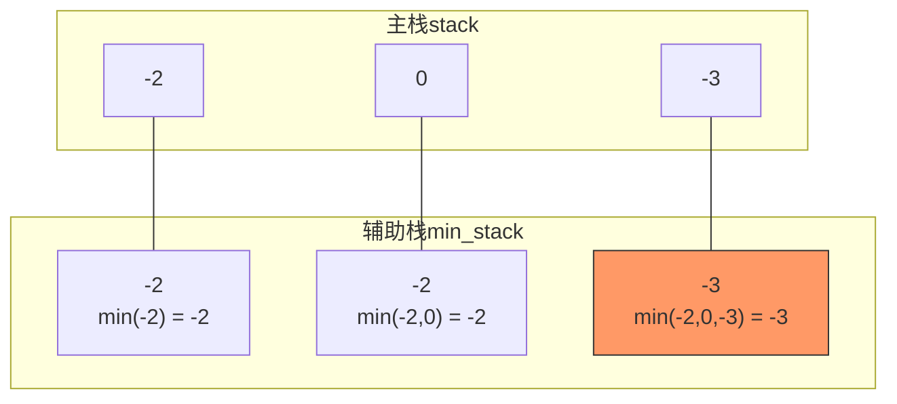

# 155. 最小栈（Min Stack）

> 难度：中等 | 主题：栈、设计

## 题目

设计一个支持 `push`、`pop`、`top` 操作，并能在常数时间内检索到最小元素的栈。

实现 `MinStack` 类：
- `MinStack()` 初始化堆栈对象
- `void push(int val)` 将元素压入堆栈
- `void pop()` 删除堆栈顶部的元素
- `int top()` 获取堆栈顶部的元素
- `int getMin()` 获取堆栈中的最小元素

**示例：**
```python
输入：["MinStack","push","push","push","getMin","pop","top","getMin"]
     [[],[-2],[0],[-3],[],[],[],[]]
输出：[null,null,null,null,-3,null,0,-2]
```

---

## 思路

### 先讲个故事：两张纸记账法

假设你是学生会的财务，管着一个"费用报销栈"——每笔支出压一张纸在桌上，最后放的在最上面。

突然主席问你："到现在为止，最小的一笔支出是多少？"

你不想每次数一遍所有的纸。所以你在旁边另拿一张纸，每次有新支出时，记下"到目前为止的最小值"——两张纸一起压上去。

主席问的时候你瞄一眼第二摞纸的最上面那张就行了。

这就是辅助栈的思想：**用额外空间换取 O(1) 的最小值查询**。

---

### 引导式推导：从需求到设计

**问题本质**：普通栈的 `getMin` 需要遍历所有元素 → O(n)。怎么做到 O(1)？

**思路 1：每次 push 时记录当前最小值**
- 主栈 `stack`：正常存所有元素
- 辅助栈 `min_stack`：存每个状态下的最小值，与主栈同步

**为什么辅助栈的栈顶等于当前最小值？**
因为每次 push 时，辅助栈入栈的是 `min(val, 当前最小值)`。这意味着：
- 辅助栈的栈顶始终是"从栈底到当前位置"的最小值
- 两个栈同进同出，高度永远一致

```text
push -2:  stack=[-2]       min_stack=[-2]
push  0:  stack=[-2,0]     min_stack=[-2,-2]   # min(0, -2) = -2
push -3:  stack=[-2,0,-3]  min_stack=[-2,-2,-3] # min(-3, -2) = -3
getMin → min_stack[-1] = -3 ✓
pop:      stack=[-2,0]     min_stack=[-2,-2]
getMin → min_stack[-1] = -2 ✓
```



---

### 优化方向

辅助栈可以更省空间：**只在 val ≤ 当前最小值时入栈**，出栈时判断 `pop` 的值是否等于最小值，是则辅助栈也 pop。

但实践中同步辅助栈法更直观，不易出错。

---

## 推荐写法

```python
class MinStack:
    def __init__(self):
        self.stack = []          # 主栈，正常存储所有元素
        self.min_stack = []      # 辅助栈，同步维护每个状态的最小值

    def push(self, val):
        self.stack.append(val)
        if not self.min_stack:   # 辅助栈为空，直接入栈
            self.min_stack.append(val)
        else:
            # 比较当前值与辅助栈栈顶，取较小值入辅助栈
            self.min_stack.append(min(val, self.min_stack[-1]))

    def pop(self):
        self.stack.pop()         # 两栈同步出栈
        self.min_stack.pop()

    def top(self):
        return self.stack[-1]    # 返回主栈栈顶

    def getMin(self):
        return self.min_stack[-1] # 辅助栈栈顶即最小值
```

---

## 复杂度

| 指标 | 值 | 解释 |
|------|----|------|
| 时间 | O(1) | push/pop/top/getMin 都是常数时间 |
| 空间 | O(n) | 辅助栈最多存 n 个元素 |

---

## 实战考量

### 频率分析

> **出现在**：字节/阿里/美团 一面设计题，META/TikTok OA 高频。约 25% 常会从这种"结构改造"题开始，看你**能不能想到用辅助数据结构维护额外信息**。

### 延伸思考

**Q：辅助栈能不能优化空间？**
A：可以。只在 `val <= 当前最小值` 时才入辅助栈；pop 时判断被 pop 的值是否等于当前最小值，是则同步 pop。但代码复杂度增加，实践中写同步法更安全。

**Q：如果要求 getMax 呢？**
A：再加一个 max_stack，完全一样的思路。两个辅助栈分别维护最小值和最大值。

**Q：如果要求 getMedian（中位数）呢？**
A：两个堆——大根堆存左半部分，小根堆存右半部分（LeetCode 295 题）。这和 getMin/getMax 是不同量级的问题。

**Q：如果实现一个队列，能在 O(1) 获取最小值呢？**
A：用单调双端队列（deque），维持队首最小。参考滑动窗口最大值那题的思路反过来。

### 易错点

- 辅助栈忘记同步出栈 → 最小值信息错乱
- 空栈时调用 pop/top/getMin 没处理边界
- 优化版中 `val <= min_stack[-1]` 的等号不能丢（多个相同最小值的情况）

---

## 生活类比

> **最小栈 → 两张纸记账法**
>
> 栈是摞起来的报销单。你在旁边另放一摞"到目前为止的最小值"。
> 每次塞新单子时，比一下旧最小值和新的，哪张小就把哪张记上去。
> 主席再问最小支出时——一秒都不用等，瞄一眼右边那摞最上面那张就行。
>
> **用辅助空间换时间，就是这么朴实无华。**

---

## 相关题目

| 题目 | 关系 |
|------|------|
| 232用栈实现队列 | 栈的变体应用，另一种设计模式 |
| 225用队列实现栈 | 对偶题目 |

---

→ 返回题单：[[LeetCode学习清单#三、栈与队列]]

## 速记卡（面试闪卡）

**Q1：一句话讲清「155. 最小栈（Min Stack）」到底是什么？**
A：设计一个支持 、、 操作，并能在常数时间内检索到最小元素的栈。
实现  类：
初始化堆栈对象
将元素压入堆栈
删除堆栈顶部的元素
获取堆栈顶部的元素
获取堆栈中的最小元素
**示例：**
---

**Q2：题目 —— 怎么理解？**
A：设计一个支持 、、 操作，并能在常数时间内检索到最小元素的栈。
实现  类：
初始化堆栈对象
将元素压入堆栈
删除堆栈顶部的元素
获取堆栈顶部的元素
获取堆栈中的最小元素
**示例：**
---

**Q3：思路 —— 怎么理解？**
A：假设你是学生会的财务，管着一个"费用报销栈"——每笔支出压一张纸在桌上，最后放的在最上面。
突然主席问你："到现在为止，最小的一笔支出是多少？"
你不想每次数一遍所有的纸。所以你在旁边另拿一张纸，每次有新支出时，记下"到目前为止的最小值"——两张纸一起压上去。
主席问的时候你瞄一眼第二摞纸的最上面那张就行了。
这就是辅助栈的思想：**用额外空间换取 O(1) 的最小值查询**。

**Q4：推荐写法 —— 怎么理解？**
A：---

**Q5：复杂度 —— 怎么理解？**
A：| 指标 | 值 | 解释 |
|------|----|------|
| 时间 | O(1) | push/pop/top/getMin 都是常数时间 |
| 空间 | O(n) | 辅助栈最多存 n 个元素 |
---

**Q6：核心速记主线有哪些？**
A：抓住这几根：题目、思路、推荐写法、复杂度、实战考量、生活类比。

