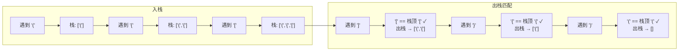

# 20. 有效括号（Valid Parentheses）

> 难度：简单 | 主题：栈、字符串

## 题目

给定一个只包含 `'('`、`')'`、`'{'`、`'}'`、`'['`、`']'` 的字符串，判断字符串是否有效。有效需满足：
1. 左括号必须用相同类型的右括号闭合
2. 左括号必须以正确的顺序闭合

**示例：**
```python
输入：s = "()[]{}"
输出：True

输入：s = "([)]"
输出：False
```

---

## 思路

### 先讲个故事：排队打饭的插队恶霸

想象食堂打饭窗口，学生们排成一队。突然来三个恶霸："我要插队，而且我必须站在我朋友后面。"

一号恶霸说："我站在最前面。我朋友站着说话不腰疼，说想插队的时候再叫我。" 这时二号来了："我也一样。"
然后三号来了："同上。"

这时一号的朋友来了："该我插了！" 他必须找到一号——也就是**最后一个**被提到的朋友。最晚来的朋友最先被叫到。

这就是**后进先出（LIFO）**，也就是栈的精髓。括号匹配也一样——**最后一个左括号必须最先被右括号匹配**。

---

### 引导式推导：从手动匹配到自动栈

**手动匹配思路：**

遍历字符串，遇到左括号就记下来，遇到右括号就看它能不能配对上**最近**那个左括号。

```text
"({[]})"
遇到 '(' → 记下
遇到 '{' → 记下  
遇到 '[' → 记下
遇到 ']' → 和最近记下的 '[' 匹配 ✓，擦掉 '['
遇到 '}' → 和最近记下的 '{' 匹配 ✓，擦掉 '{'
遇到 ')' → 和最近记下的 '(' 匹配 ✓，擦掉 '('
全部擦完 → 有效 ✓
```

**发现了吗？"最近记下"就是栈顶，"擦掉"就是出栈。**



**关键设计：用字典映射右括号到左括号**

```python
pairs = {')': '(', ']': '[', '}': '{'}
```

这样遇到右括号时，直接查字典就知道它该匹配谁，不用写三个 if-else。

---

### 边界三步走

三种导致 False 的场景，实践中要全部覆盖：

1. **栈空遇右括号** → 没有对应的左括号 → False
2. **栈顶不匹配** → 括号类型不对 → False
3. **遍历完栈非空** → 左括号多了 → False

**优化剪枝**：字符串长度为奇数 → 直接 False（不可能完全匹配）。

---

## 推荐写法

```python
def isValid(s):
    if len(s) % 2 == 1:        # 奇数长度直接排除
        return False

    pairs = {')': '(', ']': '[', '}': '{'}  # 右括号→左括号映射
    stack = []                 # 栈：存储未匹配的左括号

    for ch in s:
        if ch in pairs:        # 遇到右括号
            if not stack or stack[-1] != pairs[ch]:  # 栈空或不匹配
                return False
            stack.pop()        # 匹配成功，弹出栈顶左括号
        else:
            stack.append(ch)   # 左括号入栈

    return not stack           # 栈空说明全部匹配
```

---

## 复杂度

| 指标 | 值 | 解释 |
|------|----|------|
| 时间 | O(n) | 遍历字符串一次 |
| 空间 | O(n) | 最坏情况全是左括号，栈存 n 个 |

---

## 实战考量

### 频率分析

> **出现在**：约 80% 的公司会在一面出这道题做热身，字节/百度/美团都考。LeetCode 前 20 高频题，栈的"Hello World"。重点是**代码简洁度和边界完整性**。

### 延伸思考

**Q：如果括号类型很多（比如 10 种）呢？**
A：字典配对依然适用，扩展性 O(1)。只需要在字典里加新映射，核心逻辑零改动。

**Q：如果要求返回最长有效括号子串的长度呢？**
A：动态规划或栈记录下标（32 题，困难）。栈里存索引而不是括号本身，遇到匹配时计算长度。

**Q：最小添加次数使括号有效（921 题）？**
A：统计未匹配的左括号数（`need`）和右括号数（`右括号无左匹配`）。不需要栈，一个变量即可。

**Q：不用栈只用变量能判断吗？**
A：只有一种括号类型时可以（计数），但有多种类型时需要栈来维护顺序信息。

### 易错点

- 忘记判断栈空就访问栈顶
- 遍历完后忘记检查栈是否为空（有多余左括号）
- 字典 key 和 value 写反（左括号映射到右括号）

---

## 生活类比

> **有效括号 → 套娃开合**
>
> 每一个左括号就是打开一个套娃，右括号就是合上它。
> 打开的套娃必须最先合上——这就是栈。
> 如果你合上时发现套娃对不上号（括号类型不匹配）→ 无效。
> 如果到最后还有没合上的套娃 → 无效。
>
> **栈不是括号的特权——但凡有嵌套结构的地方，都是栈的舞台。**

---

## 相关题目

| 题目 | 关系 |
|------|------|
| [[394字符串解码]] | 栈 + 嵌套结构处理 |
| 22括号生成 | 括号类问题的另一面 |

---

→ 返回题单：[[LeetCode学习清单#三、栈与队列]]

## 速记卡（面试闪卡）

**Q1：一句话讲清「20. 有效括号（Valid Parentheses）」到底是什么？**
A：给定一个只包含 、、、、、 的字符串，判断字符串是否有效。有效需满足：
左括号必须用相同类型的右括号闭合
左括号必须以正确的顺序闭合
**示例：**
---

**Q2：题目 —— 怎么理解？**
A：给定一个只包含 、、、、、 的字符串，判断字符串是否有效。有效需满足：
左括号必须用相同类型的右括号闭合
左括号必须以正确的顺序闭合
**示例：**
---

**Q3：思路 —— 怎么理解？**
A：想象食堂打饭窗口，学生们排成一队。突然来三个恶霸："我要插队，而且我必须站在我朋友后面。"
一号恶霸说："我站在最前面。我朋友站着说话不腰疼，说想插队的时候再叫我。" 这时二号来了："我也一样。"
然后三号来了："同上。"
这时一号的朋友来了："该我插了！" 他必须找到一号——也就是**最后一个**被提到的朋友。最晚来的朋友最先被叫到。
这就是**后进先出（LIFO）**，也就是栈的精髓。

**Q4：推荐写法 —— 怎么理解？**
A：---

**Q5：复杂度 —— 怎么理解？**
A：| 指标 | 值 | 解释 |
|------|----|------|
| 时间 | O(n) | 遍历字符串一次 |
| 空间 | O(n) | 最坏情况全是左括号，栈存 n 个 |
---

**Q6：核心速记主线有哪些？**
A：抓住这几根：题目、思路、推荐写法、复杂度、实战考量、生活类比。

