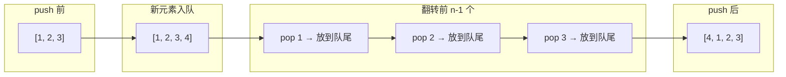

---

title: "用队列实现栈"

difficulty: 简单

category: 栈与队列

tags:

  - leetcode

  - 栈与队列

created: "2026-07-21"

---

# 225. 用队列实现栈（Implement Stack using Queues）

> 难度：简单 | 主题：栈、队列、设计

## 题目

请你仅使用两个队列实现一个后入先出（LIFO）的栈，并支持普通栈的全部四种操作：`push`、`top`、`pop` 和 `empty`。

**示例：**

```python

输入：["MyStack","push","push","top","pop","empty"] [[],[1],[2],[],[],[]]

输出：[null,null,null,2,2,false]

```

---

## 思路
### 先讲个故事：排队买奶茶，后来的先喝

想象一家奇葩奶茶店，排队规则是：**新来的直接站到最前面**。

你到的时候前面有 3 个人。你跟店员说我要买，店员对前面 3 个人说："你们全部到后面重新排队。" 于是你变成了第一个，后面的人按原来顺序排着。

这就像一个栈——**后来的先出去**。队列只能从队首出、队尾进，但我们可以通过在入队时"翻转"顺序来模拟栈。

---

### 引导式推导：一个队列就够了

**问题**：队列是先进先出（FIFO），栈是后进先出（LIFO）。怎么用 FIFO 模拟 LIFO？

**核心思想**：每次 push 新元素后，把队列前面的元素全部挪到后面。

**推导过程**：

```text

初始队列: []

push(1):

  入队 1 → [1]

  不需要翻转（只有 1 个元素）

push(2):

  入队 2 → [1, 2]

  翻转：弹出 1，重新入队 → [2, 1]  ← 队首是 2，模拟栈顶 ✓

top() → [2, 1] 的队首 = 2 ✓

push(3):

  入队 3 → [2, 1, 3]

  翻转前两个：弹出 2→队尾，弹出 1→队尾 → [3, 2, 1]  ← 队首是 3 ✓

```



**为什么 `range(len(self.queue) - 1)` 次？**

- `append(x)` 之后队列有 `n` 个元素

- 新元素在队尾

- 需要把前面的 `n-1` 个元素依次弹出并放到队尾

- 这样新元素就到了队首

---

## 代码（一个队列，推荐写法）

```python

from collections import deque

class MyStack:

    def __init__(self):

        self.queue = deque()     # 用 deque 实现队列，popleft() 是 O(1)

    def push(self, x):

        self.queue.append(x)     # 新元素先入队

        # 翻转前 n-1 个元素，让新元素到队首

        for _ in range(len(self.queue) - 1):

            self.queue.append(self.queue.popleft())

    def pop(self):

        return self.queue.popleft()  # 队首就是栈顶

    def top(self):

        return self.queue[0]          # 队首即栈顶

    def empty(self):

        return len(self.queue) == 0

```

---

## 复杂度

| 指标 | 值 | 解释 |

|------|----|------|

| push 时间 | O(n) | 需要翻转前 n-1 个元素 |

| pop/top/empty 时间 | O(1) | 队首就是栈顶 |

| 空间 | O(n) | 存 n 个元素 |

---

## 实战考量
### 频率分析

> **出现在**：较少单独考，常与 232用栈实现队列 成对出现，考察对 LIFO/FIFO 本质的理解。约 15% 的设计轮会从这种"互相模拟"题切入。

### 延伸思考

**Q：push 能不能做到 O(1)？**

A：可以。用两个队列，push 直接入队，pop 时把前 n-1 个倒腾到辅助队列，剩下那个就是要 pop 的栈顶。但这样 pop 就变成 O(n) 了。

**Q：一个队列法 vs 两个队列法，你怎么选？**

A：看使用场景。如果 push 频繁，选两个队列法（push O(1)）；如果 pop 频繁，选一个队列法（pop O(1)）。实践中先写一个队列法更简洁。

**Q：为什么 `range(len(self.queue) - 1)` 不是 `range(len(self.queue))`？**

A：新入队的元素已经在队尾了，翻转时不能把它也挪走——它的目标位置是队首。所以只需要翻转前 n-1 个。

**Q：用栈实现队列反过来怎么做？**

A：232用栈实现队列——两个栈，一个输入栈一个输出栈，pop 时反转。

### 易错点

- `range(len(self.queue) - 1)` 忘减 1

- 用 `pop()` 而不是 `popleft()`（Python 列表的 pop 是从尾部弹出）

- 用 list 而不是 deque（list 的 pop(0) 是 O(n)）

---

## 生活类比

> **用队列实现栈 → 奇葩奶茶店排队**

>

> 正常奶茶店：先来的先拿到 → 队列（FIFO）

> 奇葩奶茶店：新来的直接站到最前面，前面的人全部到后面重排 → 栈（LIFO）

>

> 每次来新客人，前面的人"集体往后转一圈"就是 `for _ in range(n-1)` 那行代码。

>

> **数据结构没有固定的样子——你能用它做什么，它就是什么。**

---

## 相关题目

| 题目 | 关系 |

|------|------|

| 232用栈实现队列 | 对偶题目 |

| 155最小栈 | 同为设计题 |

---

→ 返回题单：[[LeetCode学习路线图#三、栈与队列]]

## 速记卡（面试闪卡）

**Q1：一句话讲清「225. 用队列实现栈（Implement Stack using Queues）」到底是什么？**

A：用 FIFO 的队列模拟 LIFO 的栈：每次 push 后把前面元素翻到队尾，让新元素停在队首当栈顶。

**Q2：一、题目与约束 —— 怎么理解？**

A：奇葩奶茶店类比：新来的直接站最前面，前面的人「集体往后转一圈」重排——后来的先出去，正是栈（Stack，LIFO 后进先出）。题面要求仅用队列实现 push/top/pop/empty 四种操作，队列只能队尾进队首出。

**Q3：二、一个队列的翻转法 —— 怎么理解？**

A：push(x)：先 append(x) 入队尾，再 for _ in range(len-1) 把前面 n-1 个 popleft 重新 append 到队尾——新元素就到了队首。不能把新元素也翻走（它在队尾即目标位）。deque 的 popleft 是 O(1)，别用 list 的 pop(0)。

**Q4：三、复杂度与两队列法 —— 怎么理解？**

A：一个队列法：push O(n)（翻转 n-1 个）、pop/top/empty O(1)。两个队列法反过来：push 直接入队 O(1)，pop 时把前 n-1 个倒腾到辅助队列，剩下即栈顶——pop 变 O(n)。按 push/pop 谁频繁选写法。

**Q5：四、生活类比与易错点 —— 怎么理解？**

A：数据结构没有固定样子——能做什么就是什么。易错：range(len-1) 忘减 1；用 list.pop() 从尾弹（应是 popleft）；用 list 而非 deque（pop(0) 是 O(n)）；误以为需要两个队列（一个就够）。

**Q6：核心速记主线有哪些？**

- 队列模拟栈：push 后翻转前 n-1 个到队尾

- 一个队列法 push O(n)，pop/top/empty O(1)

- 两队列法 push O(1) 但 pop O(n)，按场景取舍

- 易错：range 忘减 1、用 pop 而非 popleft、用 list 非 deque

**口诀**

A：队列模拟栈，新客站队首；

前 n-1 翻尾，push 即 O(n)。

pop 看队首，top 同此理；

deque 莫用 list，减一记心头。

## 相关链接

- [[笔记/Leetcode笔记/03_栈与队列/232用栈实现队列|用栈实现队列]]

- [[笔记/Leetcode笔记/03_栈与队列/739每日温度|每日温度]]

- [[笔记/Leetcode笔记/03_栈与队列/155最小栈|最小栈]]

- [[笔记/Leetcode笔记/03_栈与队列/84柱状图中最大的矩形|柱状图中最大的矩形]]

- [[笔记/Leetcode笔记/03_栈与队列/394字符串解码|字符串解码]]

