---

title: "字符串解码"

difficulty: 中等

category: 栈与队列

tags:

  - leetcode

  - 栈与队列

created: "2026-07-21"

---

# 394. 字符串解码（Decode String）

> 难度：中等 | 主题：栈、字符串

## 题目

给定一个经过编码的字符串，返回它解码后的字符串。

编码规则：`k[encoded_string]`，方括号中的 `encoded_string` 重复 `k` 次。编码可以嵌套，如 `3[a2[c]]`。

**示例：**

```python

输入：s = "3[a]2[bc]"

输出："aaabcbc"

输入：s = "3[a2[c]]"

输出："accaccacc"

输入：s = "2[abc]3[cd]ef"

输出："abcabccdcdcdef"

```

---

## 思路
### 先讲个故事：俄罗斯套娃说明书

想象你在看一个俄罗斯套娃的制作说明书：

- `3[A]` = 做 3 个 A 大小的套娃

- `2[B3[C]]` = 先做 2 个 B 大小的套娃，每个 B 里面要放 3 个 C 大小的套娃

你打开一个套娃时，先把外面那层的信息记在脑子里，再处理里面那层。处理完里面后，把刚才记的信息拿出来拼上去。

这就是栈的精髓——**遇到 `[` 存档，遇到 `]` 恢复**。

---

### 引导式推导：从解析到模拟

**遍历规则：**

```text

3[a2[c]]

char='3'   → current_num = 3

char='['   → 存档：num_stack=[3], str_stack=[""], 重置 current_num=0, current_str=""

char='a'   → current_str = "a"

char='2'   → current_num = 2

char='['   → 存档：num_stack=[3,2], str_stack=["","a"], 重置 current_num=0, current_str=""

char='c'   → current_str = "c"

char=']'   → 恢复：弹出 num=2, prev="a" → current_str = "a" + "c"*2 = "acc"

char=']'   → 恢复：弹出 num=3, prev="" → current_str = "" + "acc"*3 = "accaccacc"

```



```mermaid

graph TD

    subgraph SGhnt9y["示例 3[“a2[c]“]"]

        A["遇到 '3'"] --> B["current_num=3"]

        B --> C["遇到 '['"]

        C --> D["存档 num=3, str=''<br/>清空 current"]

        D --> E["遇到 'a'"]

        E --> F["current_str='a'"]

        F --> G["遇到 '2'"]

        G --> H["current_num=2"]

        H --> I["遇到 '['"]

        I --> J["存档 num=2, str='a'<br/>清空 current"]

        J --> K["遇到 'c'"]

        K --> L["current_str='c'"]

        L --> M["遇到 ']'"]

        M --> N["弹出: num=2, prev='a'<br/>current = 'acc'"]

        N --> O["遇到 ']'"]

        O --> P["弹出: num=3, prev=''<br/>current = 'accaccacc'"]

    end

    style N fill:#f96,stroke:#333

    style P fill:#f96,stroke:#333

```

**为什么需要两个栈？**

- 数字栈：记录每个 `[` 前要重复多少次

- 字符串栈：记录进入当前 `[` 之前已经拼好的字符串

两个栈一一对应，同时出入。

**数字可能有多位**：`current_num = current_num * 10 + int(char)`。比如 `12[abc]`，先读到 '1' → 1，再读到 '2' → 1*10+2=12。

---

## 代码

```python

def decodeString(s: str) -> str:

    num_stack = []      # 数字栈：记录每层要重复的次数

    str_stack = []      # 字符串栈：记录进入每层之前已拼好的字符串

    current_num = 0     # 当前正在解析的数字

    current_str = ""    # 当前正在拼接的字符串

    for char in s:

        if char.isdigit():

            current_num = current_num * 10 + int(char)  # 多位数字累加

        elif char == '[':

            num_stack.append(current_num)   # 存档：数字入栈

            str_stack.append(current_str)   # 存档：已拼好的字符串入栈

            current_num = 0                 # 重置

            current_str = ""

        elif char == ']':

            repeat_times = num_stack.pop()  # 恢复：弹出重复次数

            prev_str = str_stack.pop()      # 恢复：弹出之前的字符串

            current_str = prev_str + current_str * repeat_times  # 拼接

        else:

            current_str += char             # 普通字符直接拼接

    return current_str

```

---

## 复杂度

| 指标 | 值 | 解释 |

|------|----|------|

| 时间 | O(输出长度) | 总输出字符数，n 是输入长度，max(k) 是最大重复次数 |

| 空间 | O(n) | 两个栈深度最多为嵌套层数，最坏 O(n) |

---

## 实战考量
### 频率分析

> **出现在**：字节/美团/阿里 二面中等题。LeetCode 热门第 120+，约 25% 的同类题会考这种"解析嵌套结构"的题目，考察**栈的存档/恢复思维**。

### 延伸思考

**Q：数字可能是多位的，怎么处理？**

A：不能遇到数字就直接入栈。用 `current_num = current_num * 10 + int(char)` 累加。读到 `[` 时才把完整的数字入栈。

**Q：不用栈，用递归怎么做？**

A：写一个递归函数，返回（解码后的字符串，下一个处理的索引）。遇到 `[` 递归处理内部，遇到 `]` 返回。本质是一样的——递归栈就是系统栈。

**Q：如果 s 很长，重复次数很大，字符串拼接性能问题？**

A：Python 字符串乘法和拼接会创建新对象。优化可以用 list 收集片段，最后 `''.join()`。实践中先写简洁版，再提优化。

**Q：如果编码规则扩展为支持 `k{encoded_string}` 呢？**

A：核心逻辑不变，只是 `[` → `{`，`]` → `}`。匹配规则改一下字典即可。

### 易错点

- 数字是多位的，直接 `int(char)` 入栈导致 `12` 被拆成 1 和 2

- 遇到 `]` 时先弹哪个栈？先弹数字栈拿到 repeat_times，再弹字符串栈拿到 prev_str

- 只有单个栈，试图把数字和字符串混存，类型混乱

- 嵌套场景下 `current_str` 的拼接顺序 `prev_str + current_str * repeat_times` 搞反

---

## 生活类比

> **字符串解码 → 套娃说明书**

>

> 你在读一个制造套娃的说明书：

> - 看到数字 + `[` = 打开一个套娃，在脑子里记下"要做几个"和"外面已经做了啥"

> - 看到 `]` = 合上套娃，把刚才记的内容翻出来，重复，拼上去

>

> **栈就是你的短期记忆——记下你打开了哪些层，合上时一层层恢复。**

---

## 相关题目

| 题目 | 关系 |

|------|------|

| 20有效括号 | 括号匹配 + 栈的基础应用 |

---

→ 返回题单：[[LeetCode学习路线图#三、栈与队列]]

## 速记卡（面试闪卡）

**Q1：一句话讲清「394. 字符串解码（Decode String）」到底是什么？**

A：把 '3[a2[c]]' 这种套娃式嵌套编码字符串，解开成 'accaccacc' 这样的重复拼接结果。

**Q2：嵌套编码怎么理解？ —— 怎么理解？**

A：像读俄罗斯套娃说明书：遇到 '[' 就把当前进度（重复次数+已拼字符串）存档进脑子，遇到 ']' 再翻出来重复拼上。这考的是栈的"存档/恢复"思维（stack-based save/restore）。

**Q3：为什么需要两个栈？ —— 怎么理解？**

A：数字栈记"这一层做几个"，字符串栈记"进层前外面已经拼了啥"，两个便签一一对应、同时出入。这是双栈模拟（two-stack simulation：num_stack 与 str_stack）。

**Q4：多位数字怎么办？ —— 怎么理解？**

A：像读"十二"不能拆成1和2，得把 '1''2' 累加成 12 再入栈：current_num = current_num*10 + int(char)，读到 '[' 才入栈。这是多位数字累加（multi-digit accumulation）。

**Q5：复杂度和实战怎么理解？ —— 怎么理解？**

A：字节/美团/阿里二面中等题，约25%同类题考"解析嵌套结构"，看的就是你脑子里那两个栈清不清楚。时间 O(输出长度)，空间 O(n)（栈深=嵌套层数）。

**Q6：核心速记主线有哪些？**

- 题目：解开 k[encoded_string] 嵌套编码串

- 核心：遇 '[' 存档、遇 ']' 恢复，栈当短期记忆

- 细节：数字可能多位要累加；先弹数字栈再弹字符串栈

- 实战：字节/美团/阿里二面，考栈的存档恢复思维

**口诀**

A：解码就像开套娃，

遇左括号先存档；

遇右括号再拼回，

两栈配合不出差。

## 相关链接

- [[笔记/Leetcode笔记/03_栈与队列/739每日温度|每日温度]]

- [[笔记/Leetcode笔记/03_栈与队列/84柱状图中最大的矩形|柱状图中最大的矩形]]

- [[笔记/Leetcode笔记/03_栈与队列/232用栈实现队列|用栈实现队列]]

- [[笔记/Leetcode笔记/03_栈与队列/225用队列实现栈|用队列实现栈]]

- [[笔记/Leetcode笔记/03_栈与队列/155最小栈|最小栈]]

