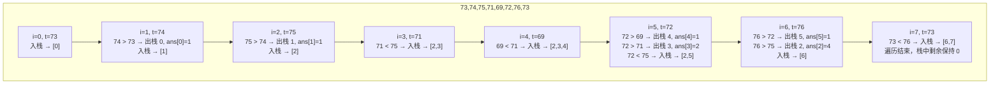

---

title: "每日温度"

difficulty: 中等

category: 栈与队列

tags:

  - leetcode

  - 栈与队列

created: "2026-07-21"

---

# 739. 每日温度（Daily Temperatures）

> 难度：中等 | 主题：栈、单调栈

## 题目

给定一个整数数组 `temperatures`，表示每天的温度，返回一个数组 `answer`，其中 `answer[i]` 是指对于第 `i` 天，下一个更高温度出现在几天后。如果气温在这之后都不会升高，请在该位置用 `0` 来代替。

**示例：**

```python

输入：temperatures = [73,74,75,71,69,72,76,73]

输出：[1,1,4,2,1,1,0,0]

```

---

## 思路
### 先讲个故事：排队等身高

体育课排队，老师突然说："每个人看看你后面，**第一个比你高的人**离你多远。"

小明 160cm，他回头一看：小刚 165cm → 后天数 = 1。小刚 165cm 回头：小红 170cm → 后天数 = 1。

大壮 190cm 回头：后面全比他矮 → 0。

每个人都在等"第一个比我高的人"。这就是**下一个更大元素**问题。

---

### 引导式推导：从暴力到单调栈

**暴力法**：对每天向后遍历找更高温度 → O(n²)

**优化思考**：能不能从左到右扫一遍，记录"还没找到更高温度"的日子？

**单调递减栈**：栈中存的是**还没找到下一个更高温度的天数下标**，且温度从栈底到栈顶单调递减。

```text

遍历到第 i 天，温度 t = temperatures[i]：

栈中元素：[j₁, j₂, j₃, ...] 对应的温度递减

意味着：t_j₁ > t_j₂ > t_j₃ > ...

如果 t > 栈顶温度 → 栈顶那天的"下一个更高温度"就是今天

                 → 出栈，计算天数差

                 → 继续检查新栈顶

否则 → 入栈（等后面更高的温度）

```



**核心洞察**：单调栈维护了一个"等待被解决"的队列。遇到更高的温度时，一次性解决所有比它冷的天气。

---

## 代码

```python

def dailyTemperatures(temperatures: List[int]) -> List[int]:

    n = len(temperatures)

    answer = [0] * n       # 默认值 0：后面没有更高的温度

    stack = []             # 单调递减栈，存下标

    for i in range(n):

        # 当前温度 > 栈顶温度 → 栈顶那天找到了答案

        while stack and temperatures[i] > temperatures[stack[-1]]:

            prev_day = stack.pop()          # 弹出等待的那天

            answer[prev_day] = i - prev_day # 天数差

        stack.append(i)                     # 当前天入栈，等待后面的高温

    return answer

```

---

## 复杂度

| 指标 | 值 | 解释 |
|------|----|------|
| 时间 | O(n) | 每个下标最多入栈一次、出栈一次 |
| 空间 | O(n) | 栈最多存 n 个下标 |

---

## 实战考量
### 频率分析

> **出现在**：字节/美团/腾讯 高频题，这道题常引出单调栈系列。约 20% 的中等难度会围绕"下一个更大元素"展开。

### 延伸思考

**Q：为什么栈里存的是下标，不是温度值？**

A：因为最后要计算天数差 `i - prev_day`，没有下标算不出来。只存温度值不知道位置。

**Q：当前温度 > 栈顶温度时用 while 还是 if？**

A：**while**。一个高温天可能一次性解决栈中多个低温天的"等待"。比如 [70, 60, 50, 80] 中 80 会解决前面三个。

**Q：如果问的不是"下一个更高"而是"上一个更高"呢？**

A：反向遍历数组，同样维护单调递减栈。区别是计算当前元素和栈顶的下标差。

**Q：如果问的是"下一个更高或相等"的温度呢？**

A：把 `>` 条件改成 `>=`。等号时也出栈。

**Q：单调栈和单调队列有什么区别？**

A：单调栈适合找"下一个更大/更小元素"（单方向），单调队列（双端）适合滑动窗口最值。本题是典型单调栈。

### 易错点

- 栈存的是下标不是值

- `while` 写成 `if`，导致只处理了栈顶一个元素

- 结果数组初始化为 0 而不是默认值

---

## 生活类比

> **单调栈 → 排队等身高**

>

> 每个人回头看后面有没有比自己高的人。比你矮的不用管——因为他们也在等更高的人。

> 当出现一个高个子时，所有在等他的人（比他矮的）一次性被解决。

>

> **单调栈就像"一次性清账"——新来的大个子把前面所有欠的债一次性还清。**

---

## 相关题目

| 题目 | 关系 |
|------|------|
| [[84柱状图中最大的矩形]] | 同为单调栈经典，但找"左右第一个更矮" |

---

→ 返回题单：[[LeetCode学习路线图#三、栈与队列]]

## 速记卡（面试闪卡）

**Q1：一句话讲清「739. 每日温度（Daily Temperatures）」到底是什么？**

A：每天往后看，找第一个更热的天离自己几天——这就是「下一个更大元素」，用单调递减栈一遍扫完。

**Q2：一、题目 —— 怎么理解？**

A：给你一排每日温度，要算第 i 天得等几天才碰上更高温度，永远不升就记 0。像体育课排队：老师问「你后面第一个比你高的人离多远」，这叫**下一个更大元素 (Next Greater Element)**。

**Q3：二、思路：单调递减栈 —— 怎么理解？**

A：栈里只留「还没找到更高温度」的下标，温度从底到顶递减。遇到高温天，while 循环把前面所有更冷的「债」一次性还清，记下天数差。这叫**单调栈 (Monotonic Stack)**，把 O(n²) 暴力压成 O(n)。

**Q4：三、代码实现要点 —— 怎么理解？**

A：一个「数字栈」存下标（不存温度，因为要算天数差 i-prev）。当前温度 > 栈顶就 while 出栈算差，否则入栈等后面。循环结束栈里剩下的天数差全是 0。**while 不是 if**——一个大个子能清掉前面多个等待者。

**Q5：四、复杂度与实战考量 —— 怎么理解？**

A：时间 O(n)：每个下标最多入栈、出栈各一次；空间 O(n) 是栈深度。它是字节/美团/腾讯高频题，引出整个单调栈系列，约 20% 中等题围绕「下一个更大元素」。**面试 (interview)** 常考延伸：上一个更高、≥ 相等怎么改。

**Q6：核心速记主线有哪些？**

- 题目：每 i 天找下一个更高温度，无则记 0

- 思路：单调递减栈存等待的下标，高温一次性清账

- 代码：栈存下标算天数差，用 while 不用 if

- 复杂度：时间 O(n)、空间 O(n)

- 实战：字节/美团/腾讯高频，引出单调栈系列

**口诀**

A：每日温度单调栈，

更冷入栈等热浪；

高温一出全清账，

一遍写对心不慌。

## 相关链接

- [[笔记/Leetcode笔记/03_栈与队列/84柱状图中最大的矩形|柱状图中最大的矩形]]

- [[笔记/Leetcode笔记/03_栈与队列/394字符串解码|字符串解码]]

- [[笔记/Leetcode笔记/03_栈与队列/225用队列实现栈|用队列实现栈]]

- [[笔记/Leetcode笔记/03_栈与队列/232用栈实现队列|用栈实现队列]]

- [[笔记/Leetcode笔记/03_栈与队列/155最小栈|最小栈]]

