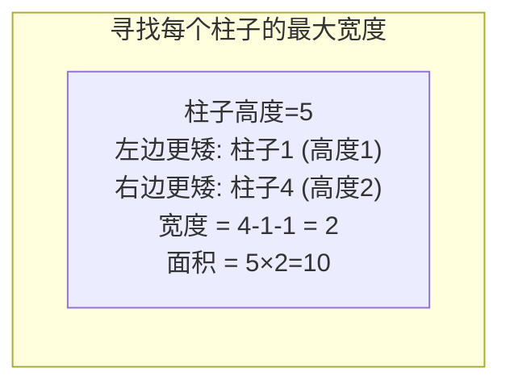

---

title: "柱状图中最大的矩形"

difficulty: 困难

category: 栈与队列

tags:

  - leetcode

  - 栈与队列

created: "2026-07-21"

---

# 84. 柱状图中最大的矩形（Largest Rectangle in Histogram）

> 难度：困难 | 主题：单调栈

## 题目

给定 `n` 个非负整数，表示柱状图中每个柱子的高度，每个柱子宽度为 1，求能勾勒出的最大矩形面积。

**示例：**

```python

输入：heights = [2,1,5,6,2,3]

输出：10

解释：最大的矩形为 5 和 6 那根柱子围成的区域，面积 = 5 * 2 = 10

```

---

## 思路
### 先讲个故事：下雨天抢车位

下大雨了，你把车停在两辆 SUV 中间。左边 SUV 很高，右边 SUV 也很高。

你要找一个车位——**左右两边都有比你高的车挡着，中间的空间就是你的**。

对每根柱子来说：找到它左边第一个比它矮的，右边第一个比它矮的——这之间的宽度就是它能形成的最大矩形宽度。

---

### 引导式推导：从暴力到单调栈

**暴力法**：对每根柱子，向左右扩展找第一个比它矮的 → O(n²)

**优化思路**：能不能一次遍历就找到每根柱子的"左右边界"？

**单调递增栈**：栈中柱子高度单调递增。当新柱子比栈顶矮时→栈顶的"右边第一个更矮"就是新柱子，"左边第一个更矮"就是栈中前一个元素。



**哨兵技巧**：在数组两端补 0：

- 左边补 0：确保所有柱子都有"左边第一个更矮"

- 右边补 0：遍历结束时强制清空栈

```text

heights = [2,1,5,6,2,3]

补 0 → [0,2,1,5,6,2,3,0]

i=1, h=2: 入栈 → [0,1]          （下标）

i=2, h=1: 1<2 → pop 1, h=2, w=2-0-1=1, area=2

          入栈 → [0,2]

i=3, h=5: 入栈 → [0,2,3]

i=4, h=6: 入栈 → [0,2,3,4]

i=5, h=2: 2<6 → pop 4, h=6, w=5-3-1=1, area=6

          2<5 → pop 3, h=5, w=5-2-1=2, area=10

          入栈 → [0,2,5]

i=6, h=3: 入栈 → [0,2,5,6]

i=7, h=0: 0<3 → pop 6, h=3, w=7-5-1=1, area=3

          0<2 → pop 5, h=2, w=7-2-1=4, area=8

          0<1 → pop 2, h=1, w=7-0-1=6, area=6

```

---

## 代码

```python

def largestRectangleArea(heights: List[int]) -> int:

    heights = [0] + heights + [0]  # 哨兵：两端补 0

    stack = []                     # 单调递增栈，存下标

    max_area = 0

    for i in range(len(heights)):

        while stack and heights[i] < heights[stack[-1]]:  # 当前柱子比栈顶矮

            h = heights[stack.pop()]      # 弹出栈顶柱子高度

            w = i - stack[-1] - 1         # 宽度 = 右边界 - 左边界 - 1

            max_area = max(max_area, h * w)

        stack.append(i)

    return max_area

```

---

## 复杂度

| 指标 | 值 | 解释 |
|------|----|------|
| 时间 | O(n) | 每个索引最多入栈一次、出栈一次 |
| 空间 | O(n) | 栈最多存 n 个索引 |

---

## 实战考量
### 频率分析

> **出现在**：字节/快手/腾讯 压轴题，困难题中的"宝藏"。约 15% 的高难度常会考到单调栈变形，本题是**单调栈天花板**。

### 延伸思考

**Q：为什么宽度公式是 `i - stack[-1] - 1`？**

A：`stack[-1]` 是左边第一个更矮的柱子位置，`i` 是右边第一个更矮的位置。两者都不属于矩形内部，所以宽度 = 右边界 - 左边界 - 1。

**Q：为什么要在数组两端补 0？**

A：左边补 0 保证所有柱子都有左边界；右边补 0 保证遍历结束时栈中所有柱子都被弹出计算面积。不用写额外的清空代码。

**Q：如果不允许补 0，怎么处理？**

A：遍历结束后单独清空栈：`while stack: heights[stack.pop()]` 并计算面积。但需要单独处理栈空的情况。补 0 更优雅。

**Q：栈里可以存高度而不是索引吗？**

A：不行。计算宽度需要索引差，存高度就拿不到位置信息。

**Q：如果要求最大矩形的具体位置呢？**

A：在弹出时记录 `left = stack[-1] + 1` 和 `right = i - 1`，在更新面积时同步保存这对边界。

### 易错点

- 宽度计算时没减 1

- 忘记补哨兵，导致栈中最后剩余元素没计算面积

- 栈空时没正确处理

- 混淆 `h = heights[stack.pop()]` 弹出后的新栈顶

---

## 生活类比

> **柱状图最大矩形 → 抢车位**

>

> 每根柱子就是一辆车，你要找的是——以这辆车的高度，左右两边第一辆比它矮的车之间的空间能停几辆车。

>

> 两端的 0 就是在停车场两端各放一辆玩具车（比任何车都矮），这样每辆车都能找到左右边界。

>

> **单调栈帮你在一次遍历中找到每根柱子"边界"。**

---

## 相关题目

| 题目 | 关系 |
|------|------|
| 739每日温度 | 同为单调栈经典，但找"下一个更高" |

---

→ 返回题单：[[LeetCode学习路线图#三、栈与队列]]

## 速记卡（面试闪卡）

**Q1：一句话讲清「84. 柱状图中最大的矩形（Largest Rectangle in Histogram）」到底是什么？**

A：柱状图最大矩形用单调栈一次遍历，给每根柱子找到左右第一个更矮的边界算面积。

**Q2：题目与本质 —— 怎么理解？**

A：给每根柱子宽 1，求能勾勒的最大矩形面积；本质是给每根柱子找左右第一个更矮的"围墙"定宽度（Largest Rectangle 最大矩形）。

**Q3：思路：抢车位 —— 怎么理解？**

A：像大雨天抢车位，左右更高的车之间的空位就是你的；暴力向两边扩 O(n²)，单调栈一次定边界（Monotonic Stack 单调栈）。

**Q4：代码与哨兵 —— 怎么理解？**

A：两端补 0 当哨兵，栈顶比当前矮就弹它算面积，宽 = i - 栈顶 - 1；补 0 优雅清空栈（Sentinel 哨兵）。

**Q5：复杂度与实战 —— 怎么理解？**

A：时间 O(n)、空间 O(n)，每索引最多进出栈一次；是字节/腾讯压轴、单调栈天花板题（Time/Space Complexity 复杂度）。

**Q6：核心速记主线有哪些？**

- 单调增栈，遇更矮才弹栈顶算面积

- 宽度 = 右边界 - 左边界 - 1

- 两端补 0 哨兵，强制清空栈

- 栈存下标不存高度，宽度靠位置差

**口诀**

A：柱状图里抢车位，左右矮车定边围；

单调栈中一次走，弹顶算面积不亏；

两端补零做哨兵，栈清干净不欠亏；

O(n) 一遍扫过去，最大矩形手中归。

## 相关链接

- [[笔记/Leetcode笔记/03_栈与队列/739每日温度|每日温度]]

- [[笔记/Leetcode笔记/03_栈与队列/394字符串解码|字符串解码]]

- [[笔记/Leetcode笔记/03_栈与队列/232用栈实现队列|用栈实现队列]]

- [[笔记/Leetcode笔记/03_栈与队列/225用队列实现栈|用队列实现栈]]

- [[笔记/Leetcode笔记/03_栈与队列/155最小栈|最小栈]]

