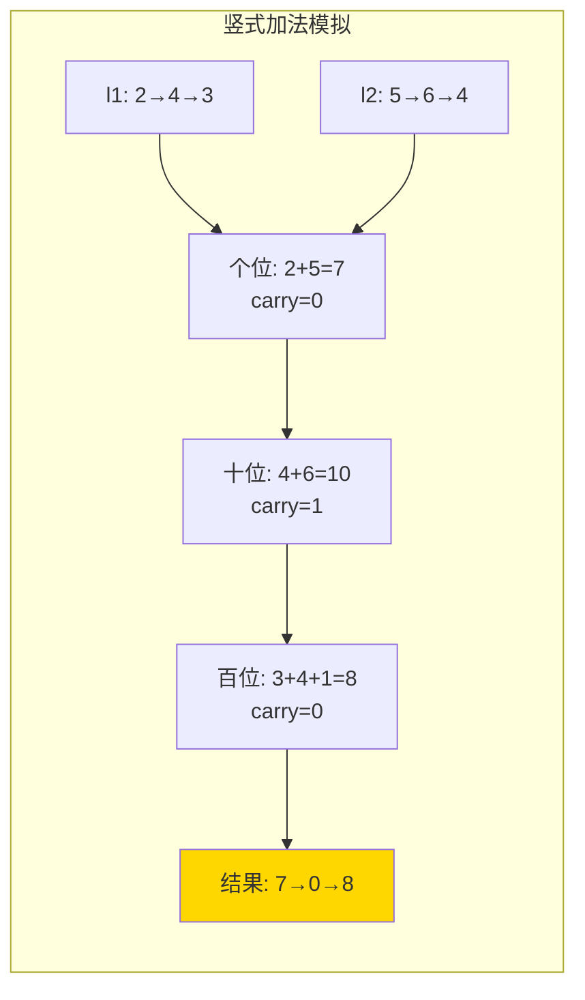

# 2. 两数相加（Add Two Numbers）

> 难度：中等 | 主题：链表、数学

## 题目

给你两个非空的链表，表示两个非负整数。它们每位数字都是按照**逆序**的方式存储的，并且每个节点只能存储**一位**数字。请你将两个数相加，并以相同形式返回一个表示和的链表。

**示例**
```text
输入：l1 = [2,4,3], l2 = [5,6,4]
输出：[7,0,8]
解释：342 + 465 = 807
```

---

## 思路

### 先讲个故事：超市找零

你和小伙伴各拿一叠钞票去买东西，每张钞票上只有一个数字。收银员说："个位对齐个位，十位对齐十位，逐位相加，满十进一。"

你手里的钞票是**倒着排**的——个位在最前面。但神奇的是：**倒着排正好方便从低位开始加**，不用先翻到尾页。

---

### 引导式推导：从竖式加法到代码

**竖式加法，你小学就会：**
```text
  3 4 2
+ 4 6 5
-------
  8 0 7
```

但计算机拿到的是**逆序链表**：
```text
l1: 2 → 4 → 3  (代表 342)
l2: 5 → 6 → 4  (代表 465)
```

从个位开始加：
- **第 1 位**：2 + 5 = 7，进位 0 → 结果节点 7
- **第 2 位**：4 + 6 = 10，进位 1 → 结果节点 0
- **第 3 位**：3 + 4 + 进位 1 = 8，进位 0 → 结果节点 8

结果链表：7 → 0 → 8（代表 807）

**关键思考**：两个链表长度可能不同。比如 99 + 1：
```text
l1: 9 → 9
l2: 1
```
第 1 位 9+1=10 → 0 进 1，第 2 位 9+0+1=10 → 0 进 1，最后多出 1 个进位节点。结果是 0 → 0 → 1。

这就是循环条件 `l1 or l2 or carry` 的由来——**只要还有人没加完，或者还有进位没处理，就得继续**。



| 解法 | 时间 | 空间 | 问题 |
|------|------|------|------|
| 转数字 | O(n) | O(n) | 大数溢出 |
| 竖式模拟 | O(max(m,n)) | O(max(m,n)) | 长补短要分支 |
| **竖式+dummy** | O(max(m,n)) | O(max(m,n)) | 统一处理，无溢出 |

转数字法有致命问题：链表可能超过 64 位整数范围。

---

## 代码

```python
def addTwoNumbers(self, l1, l2):
    dummy = ListNode(0)
    curr = dummy
    carry = 0

    while l1 or l2 or carry:
        val1 = l1.val if l1 else 0
        val2 = l2.val if l2 else 0

        total = val1 + val2 + carry
        carry = total // 10
        curr.next = ListNode(total % 10)
        curr = curr.next

        if l1:
            l1 = l1.next
        if l2:
            l2 = l2.next

    return dummy.next
```

---

## 复杂度

| 指标 | 值 | 解释 |
|------|----|------|
| 时间 | O(max(m, n)) | m, n 为两链表长度 |
| 空间 | O(max(m, n)) | 结果链表长度 ≤ max(m, n) + 1 |

---

## 实战考量

### 频率分析

> **出现在**：字节/阿里/美团 SDE 一面必考，约 40% 的 AI Agent 从链表入手，这题是"敲门砖"。重点看**边界处理**和**代码简洁度**。

### 延伸思考

**Q：数字是正序存储怎么办？**
A：用栈——把链表值压栈，弹栈相加。或先反转链表再用本解法。

**Q：链表非常长，内存放不下呢？**
A：分段读取 + 逐段计算。本质是数据切块 + 块间进位。

**Q：如果是其他进制呢？**
A：把 `10` 换成对应进制基数即可。

**Q：能处理负数吗？**
A：先比绝对值大小，大减小，符号由大的决定。需要实现链表版比较器和减法器。

### 易错点

- 循环条件漏了 `or carry`，最后进位丢失
- 链表走完后没补 0
- 返回 `dummy.next` 而不是 `dummy`

---

## 生活类比

> **两数相加 → 竖式加法 + 补 0**
>
> 两个收银员各拿一沓钞票，个位对齐个位逐张加。短的钞票后面"想象"全是 0。最后手里还捏着一张进位小票？那也得算进去。

---

## 相关题目

| 题目 | 关系 |
|------|------|
| [[415字符串相加]] | 同族：字符串版竖式加法 |
| 21合并两个有序链表 | 同族：链表双指针遍历 |

---

→ 返回题单：[[LeetCode学习清单#四、链表]]

## 速记卡（面试闪卡）

**Q1：一句话讲清「2. 两数相加（Add Two Numbers）」到底是什么？**
A：给你两个非空的链表，表示两个非负整数。它们每位数字都是按照**逆序**的方式存储的，并且每个节点只能存储**一位**数字。请你将两个数相加，并以相同形式返回一个表示和的链表。
**示例**
---

**Q2：题目 —— 怎么理解？**
A：给你两个非空的链表，表示两个非负整数。它们每位数字都是按照**逆序**的方式存储的，并且每个节点只能存储**一位**数字。请你将两个数相加，并以相同形式返回一个表示和的链表。
**示例**
---

**Q3：思路 —— 怎么理解？**
A：你和小伙伴各拿一叠钞票去买东西，每张钞票上只有一个数字。收银员说："个位对齐个位，十位对齐十位，逐位相加，满十进一。"
你手里的钞票是**倒着排**的——个位在最前面。但神奇的是：**倒着排正好方便从低位开始加**，不用先翻到尾页。

**Q4：代码 —— 怎么理解？**
A：---

**Q5：复杂度 —— 怎么理解？**
A：| 指标 | 值 | 解释 |
|------|----|------|
| 时间 | O(max(m, n)) | m, n 为两链表长度 |
| 空间 | O(max(m, n)) | 结果链表长度 ≤ max(m, n) + 1 |
---

**Q6：核心速记主线有哪些？**
A：抓住这几根：题目、思路、代码、复杂度、实战考量、生活类比。

