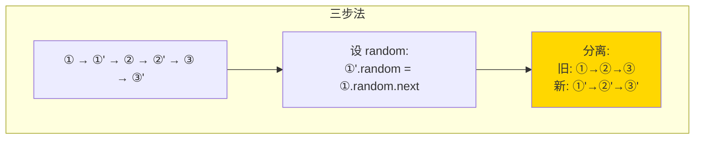

# 138. 复制带随机指针的链表（Copy List with Random Pointer）

> 难度：中等 | 主题：链表、哈希表

## 题目

给你一个长度为 `n` 的链表，每个节点包含一个额外随机指针 `random`，可指向链表中任意节点或空节点。构造这个链表的**深拷贝**。

**示例**
```text
输入：head = [[7,null],[13,0],[11,4],[10,2],[1,0]]
输出：[[7,null],[13,0],[11,4],[10,2],[1,0]]
```

---

## 思路

### 先讲个故事：复印一本带书签的书

你有一本旧书，书里有些页贴了**彩色书签**（random 指针），书签可能指向这本书的任意一页。你想复印一本一模一样的新书——**不仅内容一样，书签位置也完全对应**。

问题在于：复印机印新书时，页码还没确定。你没法直接说"书签指向第 13 页"，因为新书的页码还没决定。

---

### 引导式推导：从哈希表到原地拼接

**第 1 层：哈希表映射（直觉方案）**

先复印所有空白页（只复制值），同时在一张对照表上记下"老页码 → 新页码"。第二遍再根据对照表填上书签。

```python
第一遍：建映射
old → new 的哈希表
①→①' ②→②' ③→③'

第二遍：连指针
①'.next = ①.next 对应的新节点
①'.random = ①.random 对应的新节点
```

**第 2 层：原地拼接（O(1) 空间，更优）**

能不能省掉哈希表？可以——把新节点**插在旧节点后面**：
```text
原链表：① → ② → ③
拼接后：① → ①' → ② → ②' → ③ → ③'
```

这样旧节点和新节点就有了天然的对应关系：**旧节点的 `next` 就是它的拷贝**。

设置 random 时：`①'.random = ①.random.next`
分离链表时：把奇数位置（旧）和偶数位置（新）拆开。



| 解法 | 时间 | 空间 | 推荐 |
|------|------|------|----------|
| 哈希表 | O(n) | O(n) | ✅ 稳妥 |
| 原地拼接 | O(n) | O(1) | 进阶亮点 |

哈希表法更好写、不易错，推荐。原地拼接空间更优但易错。

---

## 代码

```python
def copyRandomList(self, head):
    if not head:
        return None

    old_to_new = {}

    curr = head
    while curr:
        old_to_new[curr] = Node(curr.val)
        curr = curr.next

    curr = head
    while curr:
        if curr.next:
            old_to_new[curr].next = old_to_new[curr.next]
        if curr.random:
            old_to_new[curr].random = old_to_new[curr.random]
        curr = curr.next

    return old_to_new[head]
```

---

## 复杂度

| 指标 | 值 | 解释 |
|------|----|------|
| 时间 | O(n) | 两次遍历 |
| 空间 | O(n) | 哈希表存 n 个映射 |

---

## 实战考量

### 频率分析

> **出现在**：字节/微软/Amazon 常考，约 30% 的 AI Agent 二面会出这题。考察**深拷贝**概念和**复杂引用关系**的处理。

### 延伸思考

**Q：能不能 O(1) 空间做？**
A：可以。三步走——① 每个原节点后插拷贝节点 ② 设 random：`①'.random = ①.random.next` ③ 分离两链表。但实践中哈希表法更稳妥，原地拼接容易写错。

**Q：如果链表有环呢？**
A：哈希表法不受影响。原地拼接法需要额外处理（先判环再拷贝）。

**Q：和克隆图（133 题）有什么区别？**
A：完全一样的思路。图的每个节点也有"邻居列表"，相当于多个 random 指针。

**Q：哈希表的 key 为什么用节点对象不用节点值？**
A：节点值可能重复（如多个节点的 val=1），用值做 key 会导致映射冲突。

### 易错点

- `random` 可能为 None，需判断
- 哈希表的 key 是节点对象（内存地址），不是值
- 返回的是新节点链表的头，不是旧节点

---

## 生活类比

> **深拷贝 → 照相 + 对照表**
>
> 哈希表法就像给老书每页拍照，同时在相册封底记下"第 3 页照片在第 3 格"。原地拼接法就像把新页插在老页后面——想看老页对应的新页？翻到它后面那页就行。

---

## 相关题目

| 题目 | 关系 |
|------|------|
| 133. 克隆图 | 同族：深拷贝 + DFS/BFS 复制结构 |

---

→ 返回题单：[[LeetCode学习清单#四、链表]]
