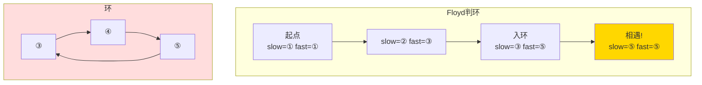

---

title: "环形链表"

difficulty: 简单

category: 链表

tags:

  - leetcode

  - 链表

created: "2026-07-21"

---

# 141. 环形链表（Linked List Cycle）

> 难度：简单 | 主题：链表、双指针

## 题目

给你一个链表的头节点 `head`，判断链表中是否有环。如果链表中有某个节点可以通过连续跟踪 `next` 指针再次到达，则链表中存在环。

**示例**

```text

输入：head = [3,2,0,-4], pos = 1

输出：true

解释：尾节点指向下标 1 的节点，形成环

```

---

## 思路
### 先讲个故事：操场跑步

你和朋友在操场上跑步。你跑得慢（1 圈/分钟），朋友跑得快（2 圈/分钟）。如果你们在同一条环形跑道上，**快的人最终会从后面追上慢的人**。如果跑道是直的，快的人只会越跑越远，永远不会回头。

这就是 Floyd 判圈算法的核心思想。

---

### 引导式推导：从哈希集到快慢指针

**第 1 层：哈希集（直觉）**

遍历链表，把每个节点引用记在集合里。如果走到一个已经在集合里的节点→有环。

```text

遍历 3→2→0→-4→2（发现 2 已在集合中）→ 有环！

```

简单直观，但空间 O(n)。

**第 2 层：快慢指针（Floyd 判圈，最优）**

慢指针每次走 1 步，快指针每次走 2 步。如果有环，快指针最终会追上慢指针。

**为什么一定会相遇？**

入环后，快指针每次比慢指针多走 1 步，距离每次缩小 1。环长是有限的，所以必相遇。

**为什么走 3 步不一定相遇？**

假设慢指针在位置 0，快指针在位置 1，环长 4。快指针走 3 步，慢指针走 1 步：

- 初始：slow=0, fast=1，距离 = 1

- 第 1 步：slow=1, fast=4→0，距离 = 3（变大了！）

距离可能跳过，不能保证整除关系。



| 解法 | 时间 | 空间 |

|------|------|------|

| **快慢指针** | O(n) | O(1) |

| 哈希表 | O(n) | O(n) |

---

## 代码

```python

def hasCycle(self, head):

    if not head or not head.next:

        return False

    slow = fast = head

    while fast and fast.next:

        slow = slow.next

        fast = fast.next.next

        if slow == fast:

            return True

    return False

```

---

## 复杂度

| 指标 | 值 | 解释 |

|------|----|------|

| 时间 | O(n) | 每个节点最多访问一次 |

| 空间 | O(1) | 就两个指针 |

---

## 实战考量
### 频率分析

> **出现在**：链表"开胃菜"，约 50% 的 AI Agent 面会从这题开始热身。重点不是代码——是你能不能**讲清楚为什么快慢指针一定会相遇**。

### 延伸思考

**Q：证明快慢指针一定会相遇？**

A：设入环时 slow 刚进环，fast 已领先 k 步。每轮追 1 步，环长 L 有限，最多 L 轮必追上。

**Q：快指针走 3 步慢指针走 1 步呢？**

A：不一定相遇。每轮距离变化不定（可能 +1，也可能 -3 等等），可能跳过。

**Q：怎么证明无环？**

A：快指针到达 `None`（或 `fast.next == None`），说明链表有终点，无环。

**Q：如果链表非常大（比如 10⁶ 节点）但有环，快慢指针会多快找到环？**

A：最多 2×(a+b) 步，其中 a 是入环前长度，b 是环长。线性时间。

### 易错点

- `while` 条件要检查 `fast and fast.next`，否则 `fast.next.next` 可能抛 None

- 空链表或单节点直接返回 False

- 返回布尔值，不是节点

---

## 生活类比

> **环形链表 → 操场跑步**

>

> 快慢指针就像一圈跑道上一快一慢两个跑者。直的跑道？快的人永远不回头。环形跑道？快的人总有一天从后面拍你肩膀。

---

## 相关题目

| 题目 | 关系 |

|------|------|

| 142环形链表II | 同族进阶：判环 → 找环入口 |

| 287寻找重复数 | 数组链表化 + 快慢指针找重复 |

| 202快乐数 | 快慢指针检数字循环 |

---

→ 返回题单：[[LeetCode学习路线图#四、链表]]

## 速记卡（面试闪卡）

**Q1：一句话讲清「141. 环形链表（Linked List Cycle）」到底是什么？**

A：快慢指针在环里必相遇：慢走1快走2，有环则追上，O(1) 空间判环。

**Q2：一、题目：链表里有没有圈 —— 怎么理解？**

A：像问一条路会不会走回自己：给链表头，判断能否顺着 next 无限绕圈（Linked List Cycle）。存在即返回 true。

**Q3：二、思路：操场追人 —— 怎么理解？**

A：像环形跑道上快慢两人：快的比慢的每圈多跑一步，距离逐次缩 1，环有限必追上（Floyd Cycle）。直道则越跑越远永不回头。

**Q4：三、代码：slow=fast=head —— 怎么理解？**

A：像两人同起跑线：slow 走 1 步、fast 走 2 步，while 判 fast 和 fast.next，相遇即 true（Two-pointer）。空表/单节点直接 false。

**Q5：四、复杂度与实战：开胃菜 —— 怎么理解？**

A：时间 O(n)、空间 O(1)。链表热身题约 50% 出现，重点不是代码，是讲清"为何必相遇"（Proof of meeting）。快走 3 步反而不一定遇。

**Q6：核心速记主线有哪些？**

- 思路：快慢指针，快每轮多走 1 步必相遇

- 证明：入环后距离每轮缩 1，环有限必追

- 代码：while fast and fast.next，相遇返回 true

- 复杂度：时间 O(n) 空间 O(1)

- 易错：fast.next.next 空指针；快走 3 步可能跳过

**口诀**

A：环形链表像跑道，

快慢指针绕圈跑；

有环迟早能追上，

无环直道各自跑。

## 相关链接

- [[笔记/Leetcode笔记/04_链表/142环形链表II|环形链表II]]

- [[笔记/Leetcode笔记/04_链表/160相交链表|相交链表]]

- [[笔记/Leetcode笔记/04_链表/143重排链表|重排链表]]

- [[笔记/Leetcode笔记/04_链表/234回文链表|回文链表]]

- [[笔记/Leetcode笔记/04_链表/86分隔链表|分隔链表]]

