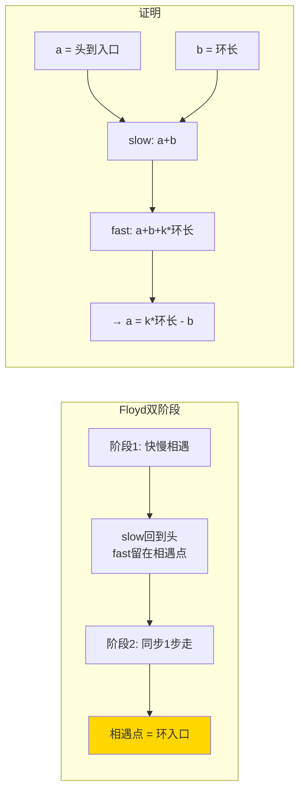

---

title: "环形链表II"

difficulty: 中等

category: 链表

tags:

  - leetcode

  - 链表

created: "2026-07-21"

---

# 142. 环形链表 II（Linked List Cycle II）

> 难度：中等 | 主题：链表、快慢指针

## 题目

给定一个链表的头节点 `head`，返回链表开始入环的第一个节点。如果链表无环，则返回 `null`。

**示例**

```text

输入：head = [3,2,0,-4], pos = 1

输出：返回下标为 1 的节点

```

---

## 思路
### 先讲个故事：环形跑道上的约定点

你和朋友在一条环形跑道上跑步。你们想找到**跑道的入口**（从直道进入环道的那一点）。

你先快慢跑确定是环形的（141 题），然后你回到起点，朋友留在刚才相遇的地方。**两人以相同速度（1 步/次）跑，再次相遇的地方就是入口。**

为什么？数学告诉你：从起点走到入口的距离 = 从相遇点绕圈再走一段的距离。

---

### 引导式推导：从碰运气到数学证明

**第 1 层：哈希表（直觉）**

遍历链表，存节点引用。第一个重复的节点就是环入口。O(n) 空间。

**第 2 层：Floyd 双阶段（最优）**

设从头到环入口距离为 `a`，入口到相遇点距离为 `b`，环长为 `c`。

```text

slow 走的距离 = a + b

fast 走的距离 = a + b + k*c（多走了 k 圈）

```

因为 `fast = 2 * slow`：

```text

a + b + k*c = 2(a + b)

→ a + b = k*c

→ a = k*c - b = (k-1)*c + (c - b)

```

`c - b` 就是相遇点继续走到入口的距离。所以：

- 从相遇点走 `c - b` 步 = 到入口

- 从头走 `a` 步 = 到入口

- 两者相等！所以同步走 1 步，相遇处就是入口。



| 解法 | 时间 | 空间 |
|------|------|------|
| **快慢指针** | O(n) | O(1) |
| 哈希表 | O(n) | O(n) |

---

## 代码

```python

def detectCycle(self, head):

    slow = fast = head

    while fast and fast.next:

        slow = slow.next

        fast = fast.next.next

        if slow == fast:

            p = head

            while p != slow:

                p = p.next

                slow = slow.next

            return p

    return None

```

---

## 复杂度

| 指标 | 值 | 解释 |
|------|----|------|
| 时间 | O(n) | 第一阶段 ≤ a+c 步，第二阶段 ≤ a 步 |
| 空间 | O(1) | 就几个指针 |

---

## 实战考量
### 频率分析

> **出现在**：字节/阿里/美团 高频，约 35% 的 AI Agent 会追问这题的数学证明。重点看你**能不能讲清楚第二阶段为什么两指针会在入口相遇**。

### 延伸思考

**Q：证明第二阶段会在入口相遇？**

A：设头到入口 a，入口到相遇点 b，环长 c。相遇时 `2(a+b)=a+b+kc` → `a=kc-b`。从头走 a 步 = 从相遇点绕 k-1 圈再走 c-b 步 = 入口。

**Q：如果无环，fast 走到 None，这时返回什么？**

A：返回 None。`while` 循环结束后 `return None` 处理。

**Q：k 可能为 0 吗？**

A：不可能。fast 至少比 slow 多走一圈才能相遇，所以 k ≥ 1。

**Q：能不能不用快慢指针，用其他方法？**

A：哈希表也能做，但空间 O(n)。通常会进一步追问 O(1) 空间解法。

### 易错点

- 第二阶段 `p` 从 `head` 开始，不是 `head.next`

- `while p != slow` 不是 `while p != fast`

- `while` 条件用 `and` 连接 `fast and fast.next`，防止 None.next

---

## 生活类比

> **环入口 → 跑道入口的数学证明**

>

> 你从家（起点）跑到跑道入口的距离，等于朋友从相遇点绕圈再走到入口的距离。两人速度一样步频一样——相遇的那一刻，脚下就是入口。

---

## 相关题目

| 题目 | 关系 |
|------|------|
| 141环形链表 | 基础版：只判环不找入口 |
| 287寻找重复数 | 快慢指针同族：数组"链表化"找重复 |

---

→ 返回题单：[[LeetCode学习路线图#四、链表]]

## 速记卡（面试闪卡）

**Q1：一句话讲清「142. 环形链表 II（Linked List Cycle II）」到底是什么？**

A：找链表入环的第一个节点，无环返回 null，用快慢指针 Floyd 双阶段法。

**Q2：题目：环形跑道找入口（Linked List Cycle II） —— 怎么理解？**

A：你和朋友在环形跑道跑，要找从直道进环道的入口点，无环就 null。这就是返回链表开始入环的第一个节点——难点不在判环，而在精确定位入口。

**Q3：思路：Floyd 双阶段（slow & fast pointers） —— 怎么理解？**

A：阶段一快慢指针相遇证明有环；阶段二让慢指针回起点、两指针同速各走一步，再相遇处就是入口。数学上头到入口距离 a = 环长倍数减相遇点到入口距离，所以同步必会师。

**Q4：代码：相遇即返回（two-pointer meet） —— 怎么理解？**

A：`while fast and fast.next` 防 None.next；相遇后 `p=head`，`while p!=slow` 同步前移，相遇返回 p。注意 p 从 head 起、比较用 p!=slow 不是 p!=fast。

**Q5：复杂度与实战（O(n) time, O(1) space） —— 怎么理解？**

A：时间 O(n)（两阶段各不过两圈），空间 O(1)。字节阿里美团约 35% 高频，常追问"为何第二阶段必在入口相遇"的证明——讲清 a=kc-b 即可。

**Q6：核心速记主线有哪些？**

- 题目：返回入环首节点，无环返回 null

- 思路：Floyd 快慢相遇，慢回起点同速再遇即入口（two pointers）

- 代码：p 从 head 起，while p!=slow 同步走

- 复杂度：时间 O(n)、空间 O(1)

- 实战：35% 高频，必讲 a=kc-b 证明

**口诀**

A：快慢相遇证有环，

慢回起点并肩赶；

步调一致向前探，

入口脚下不遥远。

## 相关链接

- [[笔记/Leetcode笔记/04_链表/141环形链表|环形链表]]

- [[笔记/Leetcode笔记/04_链表/92反转链表II|反转链表II]]

- [[笔记/Leetcode笔记/04_链表/143重排链表|重排链表]]

- [[笔记/Leetcode笔记/04_链表/234回文链表|回文链表]]

- [[笔记/Leetcode笔记/04_链表/86分隔链表|分隔链表]]

