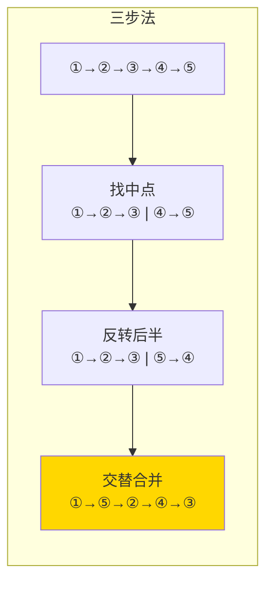

---

title: "重排链表"

difficulty: 中等

category: 链表

tags:

  - leetcode

  - 链表

created: "2026-07-21"

---

# 143. 重排链表（Reorder List）

> 难度：中等 | 主题：链表、反转、合并

## 题目

给定一个单链表 `L: L₀→L₁→…→Lₙ₋₁→Lₙ`，将其重新排列为 `L₀→Lₙ→L₁→Lₙ₋₁→L₂→Lₙ₋₂→…`。不能只改变节点的值，必须进行实际的节点交换。

**示例**

```text

输入：head = [1,2,3,4]

输出：[1,4,2,3]

输入：head = [1,2,3,4,5]

输出：[1,5,2,4,3]

```

---

## 思路
### 先讲个故事：重新排座位

一排学生按学号坐：① ② ③ ④ ⑤。老师说："从今天开始，按 ①→⑤→②→④→③ 的顺序坐。"

怎么操作最快？三步：

1. **找中间**：找到第 ③ 个同学（中点），分成两排

2. **反转后排**：让后排同学 ④ ⑤ 变成 ⑤ ④（顺序颠倒）

3. **交叉合并**：从两排各取一人，交替排好

---

### 引导式推导：三步走

**第 1 层：数组存节点（直观但空间大）**

遍历链表存到数组，然后用双指针从两端交替取节点。时间 O(n)，但空间 O(n)。

**第 2 层：找中点 + 反转 + 合并（O(1) 空间）**

这就是三个基本功的组合：

```text

原始：①→②→③→④→⑤

第一步（找中点）：①→②→③  ④→⑤

第二步（反转后半）：①→②→③  ⑤→④

第三步（交替合并）：①→⑤→②→④→③

```



| 解法 | 时间 | 空间 |
|------|------|------|
| 数组存节点 | O(n) | O(n) |
| **中点+反转+合并** | O(n) | O(1) |

---

## 代码

```python

def reorderList(self, head):

    if not head or not head.next:

        return

    # 第一步：快慢指针找中点

    slow = fast = head

    while fast.next and fast.next.next:

        slow = slow.next

        fast = fast.next.next

    # 第二步：断开 + 反转后半段

    mid = slow.next

    slow.next = None

    prev = None

    curr = mid

    while curr:

        nxt = curr.next

        curr.next = prev

        prev = curr

        curr = nxt

    # 第三步：交叉合并

    second = prev

    first = head

    while second:

        first_next = first.next

        second_next = second.next

        first.next = second

        second.next = first_next

        first = first_next

        second = second_next

```

---

## 复杂度

| 指标 | 值 | 解释 |
|------|----|------|
| 时间 | O(n) | 找中点 + 反转 + 合并，各 O(n) |
| 空间 | O(1) | 只用了几个指针 |

---

## 实战考量
### 频率分析

> **出现在**：美团/字节 常考，约 25% 的 AI Agent 常会出这种"三个基本功组合"的题。考察你能不能**把复杂问题拆成已知子问题**。

### 延伸思考

**Q：如果要求空间 O(1) 但允许修改值呢？**

A：用数组存值，双指针从两端交替赋值。但题目明确要求改节点，所以不行。

**Q：递归怎么做？**

A：递归找到尾节点，然后一层层把头尾连接。但空间是 O(n)（递归栈）。

**Q：合并时为什么以 `second` 为循环条件？**

A：后半段长度 ≤ 前半段（偶数时相等，奇数时前半段多 1 个）。

### 易错点

- 找中点没断开 `slow.next = None`，两半还连着

- 合并时没保存 `first.next` 和 `second.next`，导致断链

- 合并循环条件用 `second`，不是 `first`

---

## 生活类比

> **重排链表 → 重新排座位**

>

> 三步法就像重新排教室座位：先找到教室中间那排（找中点），让后排同学掉头（反转），然后两排各出一个人交替坐下（合并）。三个简单动作的组合解决一个看似复杂的问题。

---

## 相关题目

| 题目 | 关系 |
|------|------|
| 206反转链表 | 反转基本功 |
| 876. 链表的中间结点 | 找中点基本功 |

---

→ 返回题单：[[LeetCode学习路线图#四、链表]]

## 速记卡（面试闪卡）

**Q1：一句话讲清「143. 重排链表（Reorder List）」到底是什么？**

A：重排链表拆成"找中点+反转后半+交替合并"三个基本功组合。

**Q2：一、题目与重排目标 —— 怎么理解？**

A：像把一排座位重排成"头尾交替"：L0→Ln→L1→Ln-1…，且必须真换节点不能只改值——看起来复杂，其实能拆成熟练动作。英文：Reorder List。

**Q3：二、三步走：中点、反转、合并 —— 怎么理解？**

A：像重排教室座位：先用快慢指针找中间切断，再把后半段掉头反转，最后两排各出一个交替接上——三个基本功串起来。英文：Mid + Reverse + Merge。

**Q4：三、代码关键：断开、反转、保链 —— 怎么理解？**

A：像拆装零件别弄丢：找中点后必须 `slow.next=None` 断开，反转后半段，合并时先存 `first.next`/`second.next` 再接，否则断链。英文：Pointer Surgery。

**Q5：四、复杂度与易错点 —— 怎么理解？**

A：像三道工序各跑一遍：时间 O(n)、空间 O(1) 只几个指针；易错在没断开、没存 next、循环条件用 second 不是 first（后半更短）。英文：O(n) / O(1)。

**Q6：核心速记主线有哪些？**

- 三步法：快慢指针找中点 → 反转后半 → 交替合并

- 空间：数组法 O(n)，三步法 O(1)

- 易错：断开中点、合并前存 next、循环用 second

- 本质：把复杂问题拆成已知子问题

**口诀**

A：重排链表三步棋，

中点反转再并齐；

快慢指针断还接，

O(1) 空间不迟疑。

## 相关链接

- [[笔记/Leetcode笔记/04_链表/234回文链表|回文链表]]

- [[笔记/Leetcode笔记/04_链表/86分隔链表|分隔链表]]

- [[笔记/Leetcode笔记/04_链表/206反转链表|反转链表]]

- [[笔记/Leetcode笔记/04_链表/141环形链表|环形链表]]

- [[笔记/Leetcode笔记/04_链表/61旋转链表|旋转链表]]

