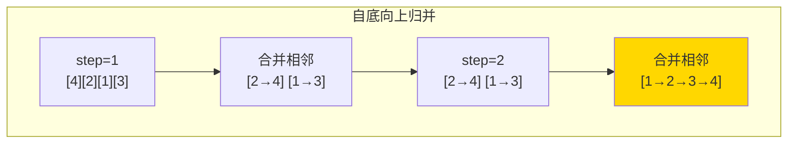

# 148. 排序链表（Sort List）

> 难度：中等 | 主题：链表、归并排序

## 题目

给你链表的头结点 `head`，请将其按升序排列并返回排序后的链表。要求 O(n log n) 时间复杂度和常数级空间复杂度。

**示例**
```text
输入：head = [4,2,1,3]
输出：[1,2,3,4]

输入：head = [-1,5,3,4,0]
输出：[-1,0,3,4,5]
```

---

## 思路

### 先讲个故事：整理一副乱序扑克牌

你有一副乱序的扑克牌。你想按大小排好，但桌子很小，只能同时操作少数几张牌。

你的方法：**先让相邻的两张有序，再让相邻的四张有序，再让相邻的八张有序……直到整副牌有序。**

这就是自底向上归并排序。

---

### 引导式推导：从递归到迭代

**排序算法选型：**
- 快排：链表不支持随机访问，partition 效率低 ❌
- 堆排：需要随机访问维护堆 ❌
- **归并排序**：链表天然适合！合并两个有序链表是 O(n)，不需要额外空间 ✅

**自顶向下（递归）：** 快慢指针找中点，递归排序左右，合并。代码简洁但需要 O(log n) 栈空间。

**自底向上（最优，严格 O(1) 空间）：**

```text
原始：4 → 2 → 1 → 3
step=1： [2→4] [1→3]    每 1 个和相邻 1 个合并
step=2： [1→2→3→4]       每 2 个和相邻 2 个合并
```

需要两个核心操作：
- `cut(head, n)`：从头截断 n 个节点，返回剩余的头
- `merge(l1, l2)`：合并两个有序链表，返回 (头, 尾)



| 解法 | 时间 | 空间 | 推荐 |
|------|------|------|----------|
| 自顶向下递归 | O(n log n) | O(log n) | 代码简洁 |
| **自底向上迭代** | O(n log n) | O(1) | ✅ 严格最优 |

---

## 代码

```python
class Solution:
    def sortList(self, head: Optional[ListNode]) -> Optional[ListNode]:
        if not head or not head.next:
            return head

        length = 0
        node = head
        while node:
            length += 1
            node = node.next

        dummy = ListNode(0)
        dummy.next = head
        step = 1

        while step < length:
            cur = dummy.next
            tail = dummy

            while cur:
                left = cur
                right = self.cut(left, step)
                cur = self.cut(right, step)

                merged_head, merged_tail = self.merge(left, right)
                tail.next = merged_head
                tail = merged_tail

            step <<= 1

        return dummy.next

    def cut(self, head, n):
        if not head:
            return None
        for _ in range(n - 1):
            if head.next:
                head = head.next
            else:
                break
        next_node = head.next
        head.next = None
        return next_node

    def merge(self, l1, l2):
        dummy = ListNode(0)
        tail = dummy
        while l1 and l2:
            if l1.val <= l2.val:
                tail.next = l1
                l1 = l1.next
            else:
                tail.next = l2
                l2 = l2.next
            tail = tail.next
        tail.next = l1 if l1 else l2
        while tail.next:
            tail = tail.next
        return dummy.next, tail
```

---

## 复杂度

| 指标 | 值 | 解释 |
|------|----|------|
| 时间 | O(n log n) | 外循环 log n 轮，每轮遍历 O(n) |
| 空间 | O(1) | 纯迭代，无递归栈 |

---

## 实战考量

### 频率分析

> **出现在**：字节/阿里/微软 常考，约 30% 的 AI Agent 会追问自顶向下 vs 自底向上的空间差异。重点考察**对链表特性和排序算法的理解深度**。

### 延伸思考

**Q：为什么不能用快排？**
A：快排依赖随机访问和双指针向中间移动，链表不支持。强行做会退化到 O(n²) 且 partition 操作复杂。

**Q：递归版有什么问题？**
A：快慢指针找中点需要递归栈，深度 O(log n)。题目要求常数空间，递归不满足。

**Q：如果要求降序排列怎么改？**
A：`merge` 中比较条件改成 `l1.val >= l2.val`。

**Q：怎么保证 `cut` 函数正确截断？**
A：`head.next = None` 是关键——在原链表上直接断开，不是复制。

### 易错点

- `cut` 函数忘记 `head.next = None`，两段还连着
- `merge` 只返回头节点没返回尾节点，下一轮无法拼接
- `step` 循环边界条件要 `step < length`，不是 `step <= length`

---

## 生活类比

> **排序链表 → 整理扑克牌**
>
> 自底向上归并就像整理打乱的扑克牌：先让相邻两张有序，再让相邻四张有序……你不需要一张张找最小的牌，只需要不断把已经排好的小段合并成大段。每轮翻倍，**log n 轮搞定**。

---

## 相关题目

| 题目 | 关系 |
|------|------|
| 21合并两个有序链表 | 归并基础：合并两个有序链表 |
| 912排序数组（手撕快排） | 排序操作：数组版排序 |

---

→ 返回题单：[[LeetCode学习清单#四、链表]]

## 速记卡（面试闪卡）

**Q1：一句话讲清「148. 排序链表（Sort List）」到底是什么？**
A：给你链表的头结点 ，请将其按升序排列并返回排序后的链表。要求 O(n log n) 时间复杂度和常数级空间复杂度。
**示例**
---

**Q2：题目 —— 怎么理解？**
A：给你链表的头结点 ，请将其按升序排列并返回排序后的链表。要求 O(n log n) 时间复杂度和常数级空间复杂度。
**示例**
---

**Q3：思路 —— 怎么理解？**
A：你有一副乱序的扑克牌。你想按大小排好，但桌子很小，只能同时操作少数几张牌。
你的方法：**先让相邻的两张有序，再让相邻的四张有序，再让相邻的八张有序……直到整副牌有序。**
这就是自底向上归并排序。
---
**排序算法选型：**
快排：链表不支持随机访问，partition 效率低 ❌
堆排：需要随机访问维护堆 ❌
**归并排序**：链表天然适合！合并两个有序链表是 O(n)，不需要额外空间 ✅

**Q4：代码 —— 怎么理解？**
A：---

**Q5：复杂度 —— 怎么理解？**
A：| 指标 | 值 | 解释 |
|------|----|------|
| 时间 | O(n log n) | 外循环 log n 轮，每轮遍历 O(n) |
| 空间 | O(1) | 纯迭代，无递归栈 |
---

**Q6：核心速记主线有哪些？**
A：抓住这几根：题目、思路、代码、复杂度、实战考量、生活类比。

