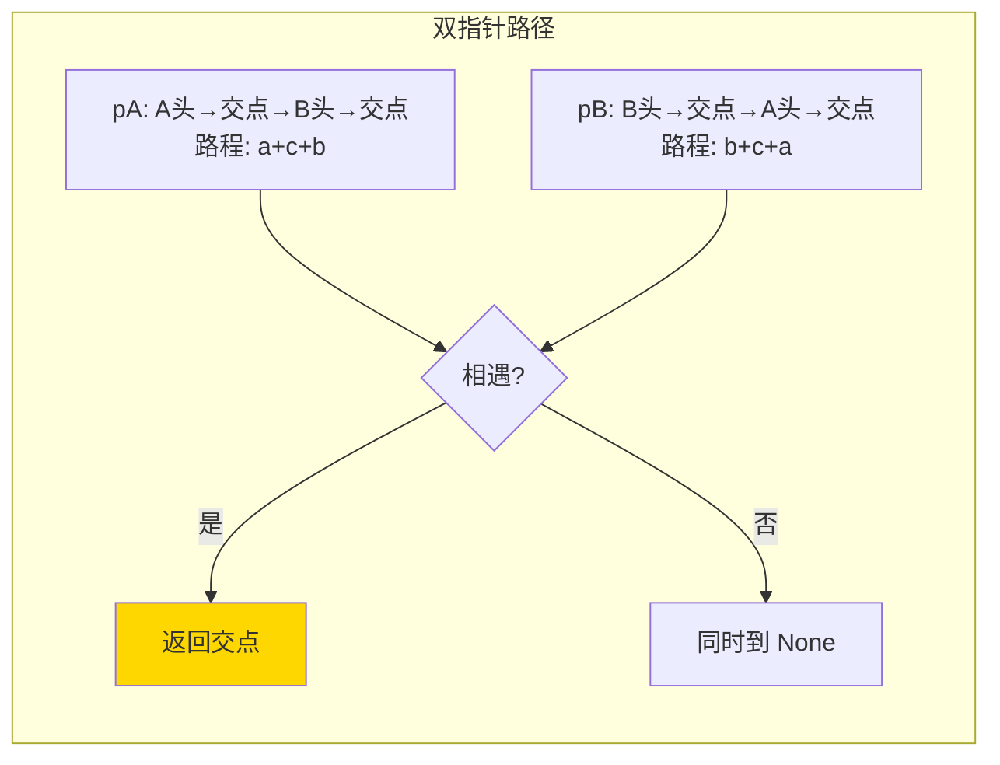

# 160. 相交链表（Intersection of Two Linked Lists）

> 难度：简单 | 主题：链表、双指针

## 题目

给你两个单链表的头节点 `headA` 和 `headB`，找出并返回两个单链表相交的起始节点。如果两个链表没有交点，返回 `null`。

**示例**
```text
输入：intersectVal = 8, listA = [4,1,8,4,5], listB = [5,0,1,8,4,5]
输出：Reference of the node with value = 8
```

---

## 思路

### 先讲个故事：两条路汇成一条路

有两条路，一条从 A 村出发，一条从 B 村出发，但它们在某点汇合后共用一条通往 C 村的路。你想找到那个**汇合点**。

你不知道每条路在汇合前各有多长。但你想到一个办法：**让两辆车分别出发，走完自己的路后，绕到对方的起点再走一遍。当它们都走完"对方的路"时，刚好同时到达汇合点。**

---

### 引导式推导：从哈希集到双指针

**第 1 层：哈希集（直觉）**

遍历 A，存所有节点到集合。遍历 B，第一个在集合中的节点就是交点。O(n) 空间。

**第 2 层：双指针（最优）**

```text
pA 走 A → 再接 B
pB 走 B → 再接 A
```

设 A 长度为 `a+c`，B 长度为 `b+c`（c 是公共部分）。pA 走 `a+c+b`，pB 走 `b+c+a`，路程相等！

- 如果有交点：pA 和 pB 在交点相遇
- 如果无交点：最后同时到 `None`



| 解法 | 时间 | 空间 |
|------|------|------|
| 哈希集 | O(a+b) | O(a) |
| **双指针** | O(a+b) | O(1) |

---

## 代码

```python
def getIntersectionNode(self, headA, headB):
    if not headA or not headB:
        return None

    pA = headA
    pB = headB

    while pA != pB:
        pA = pA.next if pA else headB
        pB = pB.next if pB else headA

    return pA
```

---

## 复杂度

| 指标 | 值 | 解释 |
|------|----|------|
| 时间 | O(a+b) | a, b 为两链表长度 |
| 空间 | O(1) | 两个指针 |

---

## 实战考量

### 频率分析

> **出现在**：字节/美团/微软 常考，约 30% 的 AI Agent 常会出这题。重点看你**能不能讲清楚"为什么两指针走的路程相等"**。

### 延伸思考

**Q：证明两指针一定会相遇？**
A：设 A 长 a+c, B 长 b+c。pA 走 a+c+b，pB 走 b+c+a，路程相等，必在交点相遇。

**Q：如果链表有环呢？**
A：先分别用快慢指针判环。有环时本方法不适用。

**Q：先算长度差再对齐怎么做？**
A：算两链表长度，长链表先走差值步，然后同步走。代码更长但思路更直观。

**Q：不相交时返回什么？**
A：最后 pA = pB = None，循环退出，返回 None。

### 易错点

- 条件用 `pA != pB`，不是 `pA.next != pB.next`
- 三目运算 `pA.next if pA else headB` 而不是 `pA.next if pA.next else headB`
- 不相交时能正确处理（同时变 None）

---

## 生活类比

> **相交链表 → 两条路汇合**
>
> 两辆车分别从两条路出发，走完自己的路后抄对方的起点再走一次。路程相同，所以同时到达汇合点。如果永远到不了同一个点？那说明两条路根本没有汇合，它们都开到了虚空（None）。

---

## 相关题目

| 题目 | 关系 |
|------|------|
| 141环形链表 | 双指针链表遍历技巧同源 |
| 142环形链表II | 双指针找环入口同源 |

---

→ 返回题单：[[LeetCode学习清单#四、链表]]
