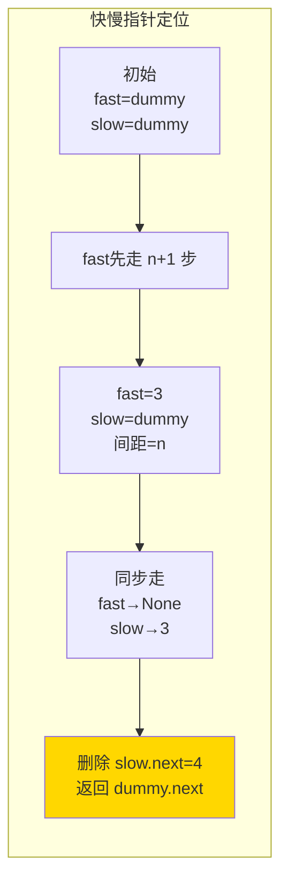

---

title: "删除链表的倒数第N个结点"

difficulty: 中等

category: 链表

tags:

  - leetcode

  - 链表

created: "2026-07-21"

---

# 19. 删除链表的倒数第 N 个结点（Remove Nth Node From End of List）

> 难度：中等 | 主题：链表、双指针

## 题目

给你一个链表，删除链表的倒数第 `n` 个结点，返回链表的头结点。

**示例**

```text

输入：head = [1,2,3,4,5], n = 2

输出：[1,2,3,5]

```

---

## 思路
### 先讲个故事：你不知道终点在哪里的队列

你排在一列看不到尽头的人群里。保安说："倒数第 3 个人出列。"

你不知道队伍有多长，没法直接数。怎么办呢？你拉来一个朋友：**让朋友先往前走出 3 步，然后你们同步走。朋友走到终点时，你正好在倒数第 3 个人前面。**

这就是快慢指针的精髓——**利用距离差定位**。

---

### 引导式推导：从两趟扫描到一趟

**第 1 层：两趟扫描（直观）**

先遍历一遍求长度 L，再遍历到 L-n 处删除。简单但两趟。

**第 2 层：快慢指针（一趟，最优）**

快指针先走 n+1 步（包括 dummy），然后快慢同步走。快指针到末尾时，慢指针正好在待删节点的**前一个**。

**为什么是 n+1 不是 n？**

因为我们要停在**待删节点的前驱**（方便执行 `slow.next = slow.next.next`）。快指针走 n+1 步后，快慢指针相距 n 个节点（不是 n+1）。

举个例子，n=2：

```text

dummy → 1 → 2 → 3 → 4 → 5

```

快指针先走 3 步（n+1），从 dummy 到 3 的位置。然后同步走，快指针到 None 时，慢指针在 3 的位置（待删节点 4 的前驱）。



| 解法 | 时间 | 空间 |

|------|------|------|

| 两趟扫描 | O(n) | O(1) |

| **快慢指针** | O(n) | O(1) |

---

## 代码

```python

def removeNthFromEnd(self, head, n):

    dummy = ListNode(0, head)

    fast = dummy

    for _ in range(n + 1):

        fast = fast.next

    slow = dummy

    while fast:

        fast = fast.next

        slow = slow.next

    slow.next = slow.next.next

    return dummy.next

```

---

## 复杂度

| 指标 | 值 | 解释 |

|------|----|------|

| 时间 | O(n) | 一趟遍历 |

| 空间 | O(1) | 几个指针 |

---

## 实战考量
### 频率分析

> **出现在**：字节/阿里/美团常考，约 35% 的 AI Agent 常会出这题。考察快慢指针的基本应用和 dummy 节点意识。

### 延伸思考

**Q：不用 dummy 怎么做？**

A：快指针先走 n 步（不是 n+1），然后同步走。fast 到末尾时 slow 就是待删节点，但需要额外记录前驱节点。

**Q：如果要求删除后返回倒数第 n+1 个节点的值呢？**

A：删除后 slow 就指向倒数第 n+1 个节点。

**Q：如果 n = 链表长度（删除头节点）呢？**

A：dummy 正好派上用场——slow 停在 dummy，`slow.next = slow.next.next` 删掉原头节点。

### 易错点

- `range(n + 1)` 不是 `range(n)`，因为要停在待删节点前一个

- `while fast:` 不是 `while fast.next:`

- 返回 `dummy.next`，不是 `head`（头节点可能被删）

---

## 生活类比

> **删除倒数第 N 个 → 队列里找人**

>

> 让朋友先往前多走一段，再同步走到终点。朋友到终点时，你站的"刚好差一步"的位置就是目标。一步之差就是 n+1 和 n 的区别。

---

## 相关题目

| 题目 | 关系 |

|------|------|

| [[61旋转链表]] | 同族：快慢指针找链表断点 |

| 141环形链表 | 同族：快慢指针判环 |

---

→ 返回题单：[[LeetCode学习路线图#四、链表]]

## 速记卡（面试闪卡）

**Q1：一句话讲清「19. 删除链表的倒数第 N 个结点（Remove Nth Node From End of List）」到底是什么？**

A：《删除链表的倒数第 N 个结点》用快慢指针一趟定位并删除，返回新头结点。

**Q2：题目 —— 怎么理解？**

A：像排队删人：给你链表，删掉倒数第 n 个结点并返回头结点；题目（Problem）要的是删后的链表。

**Q3：思路 —— 怎么理解？**

A：像拉朋友探路：快指针先走 n+1 步，再同步走，快到头时慢指针正好停在待删节点前驱；快慢指针（Two Pointers）靠距离差定位。

**Q4：代码 —— 怎么理解？**

A：dummy 节点垫头，fast 先走 n+1 步，快慢同步走到 fast 为 None，slow.next=slow.next.next；代码（Code）返回 dummy.next。

**Q5：复杂度 —— 怎么理解？**

A：像一趟走完：时间 O(n) 单遍遍历，空间 O(1) 只用几个指针；复杂度（Complexity）一趟搞定，dummy 还稳处理删头。

**Q6：核心速记主线有哪些？**

- 题目：删链表倒数第 n 个，返回头结点

- 思路：快指针先走 n+1 步，同步定位前驱

- 代码：dummy 垫头，slow.next 跳过待删

- 复杂度：时间 O(n)，空间 O(1)

**口诀**

A：删倒数第n，

快先走n加一；

同步到终点，

前驱删它去。

## 相关链接

- [[笔记/Leetcode笔记/04_链表/143重排链表|重排链表]]

- [[笔记/Leetcode笔记/04_链表/234回文链表|回文链表]]

- [[笔记/Leetcode笔记/04_链表/86分隔链表|分隔链表]]

- [[笔记/Leetcode笔记/04_链表/61旋转链表|旋转链表]]

- [[笔记/Leetcode笔记/04_链表/206反转链表|反转链表]]

