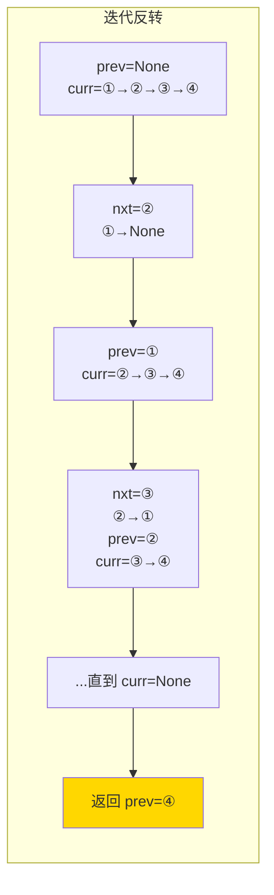

# 206. 反转链表（Reverse Linked List）

> 难度：简单 | 主题：链表、递归

## 题目

给你单链表的头节点 `head`，请你反转链表，并返回反转后的链表。

**示例**
```text
输入：head = [1,2,3,4,5]
输出：[5,4,3,2,1]
```

---

## 思路

### 先讲个故事：一列火车掉头

一列火车车头朝前挂着 5 节车厢。你想让它变成车尾朝前。怎么办？

**方法一：一节一节拆** —— 从车头开始，每节车厢拆下来，一个一个堆到前面去。

**方法二：告诉司机"开到终点再回头"** —— 递归到最后一节，然后从后往前重新挂。

---

### 引导式推导：从迭代到递归

**第 1 层：迭代（三指针）**

逐个反转 next 指针方向。需要三个指针：`prev`（前驱）、`curr`（当前）、`nxt`（后继）。

```text
初始：prev=None  curr=①→②→③→None
第1步：①→None, prev=①, curr=②
第2步：②→①,  prev=②, curr=③
第3步：③→②,  prev=③, curr=None → 返回 prev
```

**第 2 层：递归（从后往前）**

递归到尾节点，回溯时反转箭头。关键操作：`head.next.next = head`。

```text
递归到 ⑤，返回 ⑤
回溯到 ④：⑤→④
回溯到 ③：④→③
...
```



| 解法 | 时间 | 空间 |
|------|------|------|
| **迭代** | O(n) | O(1) |
| 递归 | O(n) | O(n) |

---

## 代码

```python
# 迭代（推荐）
def reverseList(self, head):
    prev, curr = None, head
    while curr:
        nxt = curr.next
        curr.next = prev
        prev, curr = curr, nxt
    return prev

# 递归
def reverseList(self, head):
    if not head or not head.next:
        return head
    new_head = self.reverseList(head.next)
    head.next.next = head
    head.next = None
    return new_head
```

---

## 复杂度

| 解法 | 时间 | 空间 |
|------|------|------|
| 迭代 | O(n) | O(1) |
| 递归 | O(n) | O(n) |

---

## 实战考量

### 频率分析

> **出现在**：链表"必会基本功"，约 60% 的 AI Agent 常会考到，要求**闭眼写出迭代版**。不可能不会——不会这题链表部分直接凉。

### 延伸思考

**Q：递归版的时间和空间复杂度？**
A：时间 O(n)，空间 O(n)——递归栈深度等于链表长度。

**Q：反转前 n 个节点怎么做？**
A：记录第 n+1 个节点作为后继，反转前 n 个后接上。需要额外参数 tracking。

**Q：反转链表和两两交换有什么区别？**
A：反转是全部逆序；两两交换是相邻两节点为一组交换位置。后者指针操作更复杂。

### 易错点

- `nxt` 要在修改 `curr.next` 之前保存
- 最后返回 `prev` 不是 `curr`（curr 是 None）
- 递归必须 `head.next = None`，否则头尾互指成环

---

## 生活类比

> **反转链表 → 一列火车掉头**
>
> 迭代法：从车头开始，一节节拆下来重新挂——新挂的永远是新头。递归法：开车到最后一节，然后从后往前重新编组——最后一节变成车头。

---

## 相关题目

| 题目 | 关系 |
|------|------|
| 24两两交换链表中的节点 | 指针操作同族 |
| 92反转链表II | 局部反转 |
| 25K个一组翻转链表 | 分段反转 |

---

→ 返回题单：[[LeetCode学习清单#四、链表]]
