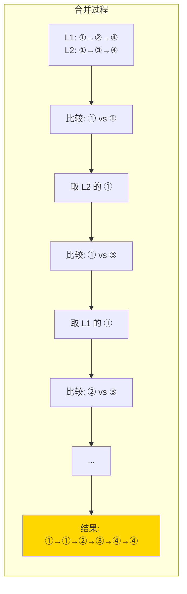

# 21. 合并两个有序链表（Merge Two Sorted Lists）

> 难度：简单 | 主题：链表、递归

## 题目

将两个升序链表合并为一个新的升序链表并返回。新链表是通过拼接给定的两个链表的所有节点组成的。

**示例**
```text
输入：l1 = [1,2,4], l2 = [1,3,4]
输出：[1,1,2,3,4,4]
```

---

## 思路

### 先讲个故事：两支有序的队伍合并

两队小朋友已经按身高从矮到高排好了。老师想把他们合并成一队，还是按身高从矮到高。

老师从两队队首各拉一个小朋友出来比较——矮的进队，高的回去等下一轮。哪队先没人了，另一队剩下的人直接排上去。

---

### 引导式推导：从合并到递归

**第 1 层：迭代（哨兵节点 + 双指针）**

两个链表各一指针，比较当前节点值，小的接到结果链表尾部。

```text
l1: [1, 2, 4]
l2: [1, 3, 4]

比较 1 vs 1 → 取 l2 的 1（稳定排序）
比较 1 vs 3 → 取 l1 的 1
比较 2 vs 3 → 取 l1 的 2
比较 4 vs 3 → 取 l2 的 3
比较 4 vs 4 → 取 l1 的 4
剩下 l2 的 4 → 直接接上

结果：[1, 1, 2, 3, 4, 4]
```

**为什么用哨兵节点（dummy）？**

避免单独处理头节点——如果不确定第一个节点来自 l1 还是 l2，dummy 让你统一用 `tail.next = ...` 追加。

**第 2 层：递归**

```text
merge([1,2,4], [1,3,4])
= 1→merge([2,4], [1,3,4])     // 1 vs 1, 取 l1 的 1
= 1→1→merge([2,4], [3,4])     // 2 vs 1, 取 l2 的 1
= 1→1→2→merge([4], [3,4])     // 2 vs 3, 取 l1 的 2
= 1→1→2→3→merge([4], [4])     // 4 vs 3, 取 l2 的 3
= 1→1→2→3→4→merge([], [4])    // 4 vs 4, 取 l1 的 4
= 1→1→2→3→4→4                 // l1 空了，返回 l2
```



| 解法 | 时间 | 空间 |
|------|------|------|
| **迭代** | O(n+m) | O(1) |
| 递归 | O(n+m) | O(n+m) |

---

## 代码

```python
# 迭代（推荐）
def mergeTwoLists(self, list1, list2):
    dummy = tail = ListNode()
    while list1 and list2:
        if list1.val <= list2.val:
            tail.next = list1
            list1 = list1.next
        else:
            tail.next = list2
            list2 = list2.next
        tail = tail.next
    tail.next = list1 or list2
    return dummy.next

# 递归
def mergeTwoLists(self, list1, list2):
    if not list1:
        return list2
    if not list2:
        return list1
    if list1.val <= list2.val:
        list1.next = self.mergeTwoLists(list1.next, list2)
        return list1
    list2.next = self.mergeTwoLists(list1, list2.next)
    return list2
```

---

## 复杂度

| 解法 | 时间 | 空间 |
|------|------|------|
| 迭代 | O(n+m) | O(1) |
| 递归 | O(n+m) | O(n+m) |

---

## 实战考量

### 频率分析

> **出现在**：链表入门"必做题"，约 50% 的 AI Agent 会作为热身或归并排序的子问题。不会这题后面没法做排序链表（148 题）。

### 延伸思考

**Q：合并 k 个有序链表怎么做？**
A：用最小堆（优先队列），k 个头入堆，弹出最小后把它的 next 入堆，重复到空。O(N log k)。

**Q：合并两个无序链表并去重呢？**
A：先各自排序（归并排序），再调用本方法合并，合并时跳过重复值。

**Q：递归版空间复杂度为什么是 O(n+m)？**
A：递归层数等于合并后链表长度，每层需要栈空间。深度跟输入总长度成正比。

### 易错点

- `tail = tail.next` 必须在循环内维护，不能忘
- 接剩余部分用 `tail.next = list1 or list2` 最简洁
- 返回 `dummy.next`，不是 `dummy`

---

## 生活类比

> **合并有序链表 → 两队小朋友排队**
>
> 哑节点就像在最前面举着的"虚拟小旗"，让你永远不需要问"谁是第一个"。从两队队首各拉一个比较，矮的走，高的等。一队没人了，另一队剩下的直接排上。

---

## 相关题目

| 题目 | 关系 |
|------|------|
| [[88合并两个有序数组]] | 合并模式同族（数组版） |
| 23合并K个升序链表 | K 个链表合并（堆/分治） |
| 146LRU缓存 | 哨兵节点技巧同源 |

---

→ 返回题单：[[LeetCode学习清单#四、链表]]

## 速记卡（面试闪卡）

**Q1：一句话讲清「21. 合并两个有序链表（Merge Two Sorted Lists）」到底是什么？**
A：将两个升序链表合并为一个新的升序链表并返回。新链表是通过拼接给定的两个链表的所有节点组成的。
**示例**
---

**Q2：题目 —— 怎么理解？**
A：将两个升序链表合并为一个新的升序链表并返回。新链表是通过拼接给定的两个链表的所有节点组成的。
**示例**
---

**Q3：思路 —— 怎么理解？**
A：两队小朋友已经按身高从矮到高排好了。老师想把他们合并成一队，还是按身高从矮到高。
老师从两队队首各拉一个小朋友出来比较——矮的进队，高的回去等下一轮。哪队先没人了，另一队剩下的人直接排上去。
---
**第 1 层：迭代（哨兵节点 + 双指针）**
两个链表各一指针，比较当前节点值，小的接到结果链表尾部。

**Q4：代码 —— 怎么理解？**
A：---

**Q5：复杂度 —— 怎么理解？**
A：| 解法 | 时间 | 空间 |
|------|------|------|
| 迭代 | O(n+m) | O(1) |
| 递归 | O(n+m) | O(n+m) |
---

**Q6：核心速记主线有哪些？**
A：抓住这几根：题目、思路、代码、复杂度、实战考量、生活类比。

