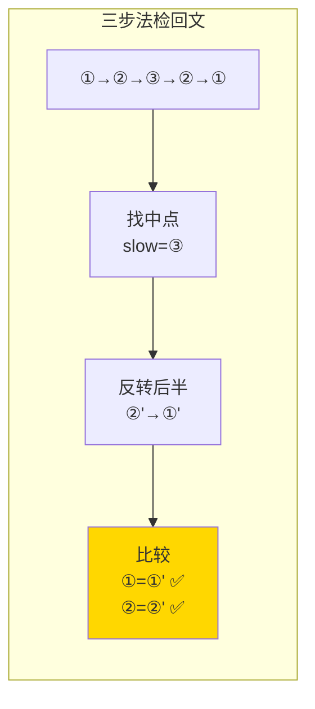

# 234. 回文链表（Palindrome Linked List）

> 难度：简单 | 主题：链表、双指针、反转

## 题目

请判断一个链表是否为回文链表。

**示例**
```text
输入：head = [1,2,2,1]
输出：True

输入：head = [1,2]
输出：False
```

---

## 思路

### 先讲个故事：对折看对称

你有一串珠子，想知道是不是左右对称的。最简单的办法：找到中间，把后半截**倒过来**，然后和前半截一对比。

就像拿一张纸对折——左右两半完全重合就是对称。

---

### 引导式推导：从数组到反转

**第 1 层：转成数组（直观但费空间）**

遍历链表存到数组，然后双指针从两端往中间对比。O(n) 空间。

**第 2 层：快慢指针 + 反转后半（O(1) 空间）**

```text
[1, 2, 3, 2, 1]

第一步：快慢指针找中点
slow → 3

第二步：反转后半
[1, 2] 和 [1, 2, 3] → 反转后半得到 [1, 2]

第三步：逐节点比较
1 vs 1 ✅  2 vs 2 ✅  3（后半已走完，不用比）
```

**偶数情况：**
```text
[1, 2, 2, 1]

第一步：slow → 第二个 2
第二步：反转后半得到 [1, 2]
第三步：1 vs 1 ✅  2 vs 2 ✅
```



| 解法 | 时间 | 空间 |
|------|------|------|
| 转数组 | O(n) | O(n) |
| **快慢指针+反转** | O(n) | O(1) |

---

## 代码

```python
def isPalindrome(self, head):
    if not head or not head.next:
        return True

    # 第一步：快慢指针找中点
    slow = fast = head
    while fast and fast.next:
        slow = slow.next
        fast = fast.next.next

    # 第二步：反转后半段
    prev = None
    curr = slow
    while curr:
        nxt = curr.next
        curr.next = prev
        prev = curr
        curr = nxt

    # 第三步：逐节点比较
    left = head
    right = prev
    while right:
        if left.val != right.val:
            return False
        left = left.next
        right = right.next

    return True
```

---

## 复杂度

| 指标 | 值 | 解释 |
|------|----|------|
| 时间 | O(n) | 找中点 + 反转 + 比较，各 O(n) |
| 空间 | O(1) | 几个指针 |

---

## 实战考量

### 频率分析

> **出现在**：字节/美团常考，约 30% 的 AI Agent 常会出这题。考察快慢指针 + 反转两个基本功的组合。

### 延伸思考

**Q：如果要求恢复链表呢？**
A：比较完后再反转一次后半段，把链表恢复原状。实践中提一嘴"工程中需要恢复"，展示严谨性。

**Q：用递归怎么做？**
A：递归到尾节点，然后和头节点比较，回溯时头节点后移。空间 O(n)。

**Q：奇数长度时中间节点怎么处理？**
A：中间节点在反转后半后变成尾节点，不影响前半段的比较（循环只到 right 走完）。

**Q：快慢指针条件为什么是 `while fast and fast.next`？**
A：偶数长度时 fast 最终为 None，odd 长度时 fast.next 为 None。两种都要处理。

### 易错点

- 快慢指针条件写错（`fast.next and fast.next.next`），导致偶数长度时中点不对
- 奇数长度中间节点是否需要参与比较？不需要
- 比较时以 `right` 为循环条件

---

## 生活类比

> **回文链表 → 对折看对称**
>
> 找中点就像找到珠串的中间，反转后半就像把后半截倒过来。两半一对比就知道是不是对称的——回文就是链表界的"左右脸对称"。

---

## 相关题目

| 题目 | 关系 |
|------|------|
| 206反转链表 | 反转基本功 |
| 125验证回文串 | 回文校验数组版 |

---

→ 返回题单：[[LeetCode学习清单#四、链表]]
