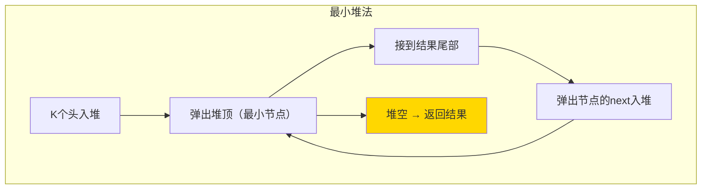

---

title: "合并K个升序链表"

difficulty: 困难

category: 链表

tags:

  - leetcode

  - 链表

created: "2026-07-21"

---

# 23. 合并 K 个升序链表（Merge k Sorted Lists）

> 难度：困难 | 主题：链表、堆、分治

## 题目

给你一个链表数组，每个链表都已经按升序排列。请你将所有链表合并到一个升序链表中，返回合并后的链表。

**示例**

```text

输入：lists = [[1,4,5],[1,3,4],[2,6]]

输出：[1,1,2,3,4,4,5,6]

```

---

## 思路
### 先讲个故事：K 条队伍合并成一条

学校有 K 条队伍，每队已按身高排好。现在要把这 K 条队伍合并成一条身高递增的大队。

一个简单的方法：**在每条队伍最前面插一面小旗，每次把旗最低的那个人拉出来，然后他后面的补上**。这样就不用每次从头比较。

---

### 引导式推导：从逐一合并到堆优化

**第 1 层：逐一合并（最直观）**

复用 21 题的合并两个有序链表，依次合并：

```text

结果 = merge(merge(merge(l0, l1), l2), l3, ...)

```

每次合并两条，第 i 次合并长度为 O(N×i/k)，总复杂度 O(N×k)。k 很大时极慢。

**第 2 层：分治合并**

两两配对合并，类似归并排序：

```text

轮1：merge(l0,l1), merge(l2,l3), merge(l4,l5)...

轮2：merge(轮1结果)...

```

k 个链表只需 log k 轮合并，每轮 O(N)，总 O(N log k)。

**第 3 层：优先队列（最小堆，最优）**

K 个头节点入堆，弹出最小，将其 next 入堆。堆大小 ≤ k。

```text

堆初始：[①, ①, ②]  （每个链表的头）

弹出 ①（来自 l0）→ ① 的 next=④ 入堆 → 堆 [①, ②, ④]

弹出 ①（来自 l1）→ ① 的 next=③ 入堆 → 堆 [②, ③, ④]

弹出 ②（来自 l2）→ ② 的 next=⑥ 入堆 → 堆 [③, ④, ⑥]

...

```



| 解法 | 时间 | 空间 | 推荐 |
|------|------|------|----------|
| 逐一合并 | O(N×k) | O(1) | ❌ |
| 分治合并 | O(N log k) | O(log k) | ✅ 思想加分 |
| **最小堆** | O(N log k) | O(k) | ✅ 直观首选 |

---

## 代码

```python

import heapq

def mergeKLists(self, lists):

    heap = []

    for i, head in enumerate(lists):

        if head:

            heapq.heappush(heap, (head.val, i, head))

    dummy = tail = ListNode(0)

    while heap:

        val, i, node = heapq.heappop(heap)

        tail.next = node

        tail = tail.next

        if node.next:

            heapq.heappush(heap, (node.next.val, i, node.next))

    return dummy.next

```

---

## 复杂度

| 指标 | 值 | 解释 |
|------|----|------|
| 时间 | O(N log k) | N 总节点数，k 链表数，每个节点进出堆各一次 |
| 空间 | O(k) | 堆中最多同时存 k 个节点 |

---

## 实战考量
### 频率分析

> **出现在**：字节/微软/Amazon 常考，约 30% 的 AI Agent 常会出这题。考察堆 + 链表的综合能力。先讲堆法再提分治加分。

### 延伸思考

**Q：分治法和堆法的区别？**

A：分治不需额外堆空间（递归栈 O(log k) 除外），堆法需要 O(k) 堆空间。时间都是 O(N log k)。

**Q：为什么堆中元组要加链表索引 i？**

A：当节点值相同时，Python 会继续比较元组第二个元素。没有 i 就会比较 ListNode 对象，抛 TypeError。

**Q：如果 K 非常大（10000 条），每条很短呢？**

A：堆法堆大小 = K，操作 O(log K) 仍然快。如果每条都极短（如 1 节点），分治法可能更好。

**Q：链表动态生成、不能一次全读取怎么办？**

A：堆法天然支持数据流——节点按需入堆，不需预先读完所有链表。

### 易错点

- 堆中元组必须包含索引 `i`，否则可能 TypeError

- 空链表数组需要跳过（`if head:`）

- `tail = tail.next` 不能忘

---

## 生活类比

> **合并 K 个有序链表 → K 条队伍选出最矮的**

>

> 每条队伍最前面插一面旗，每次把旗最低的人拉出来，然后他后面的人补位。你不需要每次都看所有人——一面小旗就是一个"当前最小候选"，维护 K 面旗的成本很低。

---

## 相关题目

| 题目 | 关系 |
|------|------|
| 21合并两个有序链表 | K=2 的基础版 |
| 215数组中的第K个最大元素 | 堆的同类应用 |

---

→ 返回题单：[[LeetCode学习路线图#四、链表]]

## 速记卡（面试闪卡）

**Q1：一句话讲清「23. 合并 K 个升序链表（Merge k Sorted Lists）」到底是什么？**

A：把 K 个已排序链表合并成一个升序链表并返回。

**Q2：题目 —— 怎么理解？**

A：像 K 条身高排好的队伍并成一条大队：给链表数组，每条已升序排列，合并到单一升序链表。例 [[1,4,5],[1,3,4],[2,6]] → [1,1,2,3,4,4,5,6]。

**Q3：思路 —— 怎么理解？**

A：K 条队伍选最矮的：最优用最小堆（Min Heap），K 个头节点入堆，弹最小、接结果、其 next 入堆，堆大小≤k。还可分治合并（两两配对数归并）达 O(N log k)，思想加分。

**Q4：代码 —— 怎么理解？**

A：heapq 建堆，每个头以 (val,i,node) 入堆（i 防同值比较 ListNode 报错）；循环弹堆顶接尾、其 next 入堆，直到堆空。dummy 哨兵节点串起结果。

**Q5：复杂度与实战考量 —— 怎么理解？**

A：时间 O(N log k)（N 总节点、k 链表数，每节点进出堆一次），空间 O(k)（堆存 k 个节点）。元组必须带索引 i 否则 TypeError；空链表要跳过；tail=tail.next 不能忘。

**Q6：核心速记主线有哪些？**

- 最优：最小堆弹最小、next 入堆

- 分治法两两归并，思想加分

- 时间 O(N log k)、空间 O(k)

- 元组带索引 i 防报错

**口诀**

A：K 条队伍并一队，最小堆里选最矮；

弹顶接尾 next 入，循环到空大队成；

分治归并也可行，时间同优思想赢；

元组带 i 防报错，空链跳过尾莫停。

## 相关链接

- [[笔记/Leetcode笔记/04_链表/21合并两个有序链表|合并两个有序链表]]

- [[笔记/Leetcode笔记/04_链表/148排序链表|排序链表]]

- [[笔记/Leetcode笔记/04_链表/143重排链表|重排链表]]

- [[笔记/Leetcode笔记/04_链表/160相交链表|相交链表]]

- [[笔记/Leetcode笔记/04_链表/234回文链表|回文链表]]

