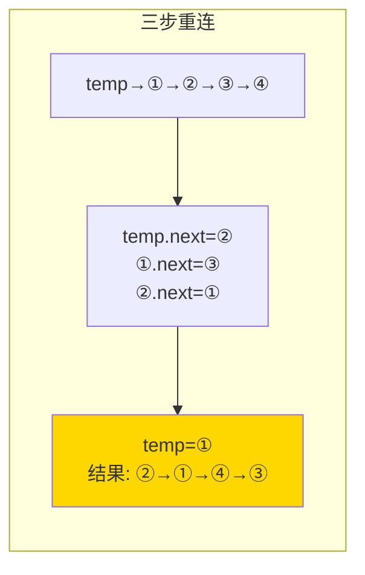

---

title: "两两交换链表中的节点"

difficulty: 中等

category: 链表

tags:

  - leetcode

  - 链表

created: "2026-07-21"

---

# 24. 两两交换链表中的节点（Swap Nodes in Pairs）

> 难度：中等 | 主题：链表、指针操作

## 题目

给你一个链表，两两交换其中相邻的节点，并返回交换后链表的头节点。只能进行节点交换，不能修改节点内部的值。

**示例**

```text

输入：head = [1,2,3,4]

输出：[2,1,4,3]

```

---

## 思路
### 先讲个故事：跳舞时的换位

交谊舞课上，舞伴们站成一排：①和②是一对，③和④是一对……老师说："每对交换位置，①去②的位置，②去①的位置。"

你不是直接交换两个人的名字——而是让他们**实际走动**。①走到②后面，②走到①前面。然后下一对重复。

---

### 引导式推导：从暴力到三步重连

**不要和反转链表搞混了！**

反转链表是全部倒过来：①→②→③→④ 变成 ④→③→②→①

两两交换是相邻交换：①→②→③→④ 变成 ②→①→④→③

**操作过程：**

需要操作三个节点：前驱 temp、node1、node2。三步重连：

```text

操作前：temp → ① → ② → ③ → ④

                                                 temp.next = ②

第1步：temp → ② → ① → ③ → ④                     ①.next = ③

第2步：temp → ② → ① → ③ → ④                     ②.next = ①  (已完成)

第3步：temp 前移到 ① 的位置（下一对的前驱）

        ① → ④ → ③  (下一轮：temp=①, n1=③, n2=④)

```



| 解法 | 时间 | 空间 |

|------|------|------|

| **迭代** | O(n) | O(1) |

| 递归 | O(n) | O(n) |

---

## 代码

```python

# 迭代（推荐）

def swapPairs(self, head):

    dummy = ListNode(0, head)

    temp = dummy

    while temp.next and temp.next.next:

        n1 = temp.next

        n2 = temp.next.next

        temp.next = n2

        n1.next = n2.next

        n2.next = n1

        temp = n1

    return dummy.next

# 递归

def swapPairs(self, head):

    if not head or not head.next:

        return head

    newHead = head.next

    head.next = self.swapPairs(newHead.next)

    newHead.next = head

    return newHead

```

---

## 复杂度

| 解法 | 时间 | 空间 |

|------|------|------|

| 迭代 | O(n) | O(1) |

| 递归 | O(n) | O(n) |

---

## 实战考量
### 频率分析

> **出现在**：字节/阿里中间件常考，约 20% 的 AI Agent 常会出这题。如果你不会反转链表，这题会当场暴露——很多人分不清"交换相邻"和"反转"。

### 延伸思考

**Q：和反转链表（206 题）的区别？**

A：反转链表全部逆序，原尾变新头。两两交换只交换相邻节点位置，不改变整体顺序方向。

**Q：递归怎么做？**

A：先交换前两个节点，递归处理剩下的链表。递归返回的是已处理好的子链表的头。

**Q：如果链表是奇数个节点呢？**

A：最后剩一个节点不用交换（`while` 条件保证了至少两个才能交换）。

**Q：只交换值不交换节点行不行？**

A：可以——直接交换 `n1.val` 和 `n2.val`。但题目明确要求节点交换。

### 易错点

- 不是反转！不是反转！不是反转！

- `while` 条件判断 `temp.next and temp.next.next`

- 交换后 `temp = n1`（n1 已经交换到后面去了）

---

## 生活类比

> **两两交换 → 舞伴换位**

>

> 每次只关心一对舞伴：前一个人（temp）看着他们，抬手示意——第一个人走到对面，第二个人走过来，然后前一个人前进到下一对的位置。三步搞定一对，不打扰后面的舞伴。

---

## 相关题目

| 题目 | 关系 |

|------|------|

| 206反转链表 | 指针操作同族 |

| 25K个一组翻转链表 | 每 K 个一组交换/反转（本题是 K=2 特例） |

---

→ 返回题单：[[LeetCode学习路线图#四、链表]]

## 速记卡（面试闪卡）

**Q1：一句话讲清「24. 两两交换链表中的节点（Swap Nodes in Pairs）」到底是什么？**

A：只交换链表中相邻的节点（不换值），返回交换后的头节点。

**Q2：题目 —— 怎么理解？**

A：像舞伴换位：给你一条链表，每对相邻节点互换位置（①→② 变 ②→①），返回新头。明确要求节点交换、不能只改内部值，如 [1,2,3,4] 变 [2,1,4,3]。

**Q3：思路 —— 怎么理解？**

A：像三步换位：别和反转链表搞混（反转是全倒，交换只调相邻）。用三个指针 temp（前一对前驱）、n1、n2，三步重连：temp.next=n2、n1.next=n2.next、n2.next=n1，然后 temp 移到 n1 处理下一对。奇数个剩最后一个不换。

**Q4：代码 —— 怎么理解？**

A：加 dummy 节点，temp=dummy；while temp.next and temp.next.next：取 n1=temp.next、n2=n1.next，做 temp.next=n2、n1.next=n2.next、n2.next=n1，再 temp=n1。迭代 O(n)/O(1)；递归版先换前两个再处理剩余，O(n)/O(n)。

**Q5：复杂度 —— 怎么理解？**

A：像走一趟：迭代时间 O(n) 空间 O(1)；递归时间 O(n) 空间 O(n)（递归栈）。while 条件至少两个节点才交换——奇数个最后剩一个不动。

**Q6：核心速记主线有哪些？**

- 是相邻交换，不是反转链表，千万别混

- 三步重连：temp.next=n2、n1.next=n2.next、n2.next=n1

- 循环条件 temp.next and temp.next.next，交换后 temp=n1

- 奇数节点最后剩一个不交换；也可只换 val 但题目要求换节点

**口诀**

A：两两交换非反转，

三步重连 temp 前；

n1n2 调个位，

奇数剩一个。

## 相关链接

- [[笔记/Leetcode笔记/04_链表/143重排链表|重排链表]]

- [[笔记/Leetcode笔记/04_链表/61旋转链表|旋转链表]]

- [[笔记/Leetcode笔记/04_链表/82删除排序链表中的重复元素II|删除排序链表中的重复元素II]]

- [[笔记/Leetcode笔记/04_链表/83删除排序链表中的重复元素|删除排序链表中的重复元素]]

- [[笔记/Leetcode笔记/04_链表/234回文链表|回文链表]]

