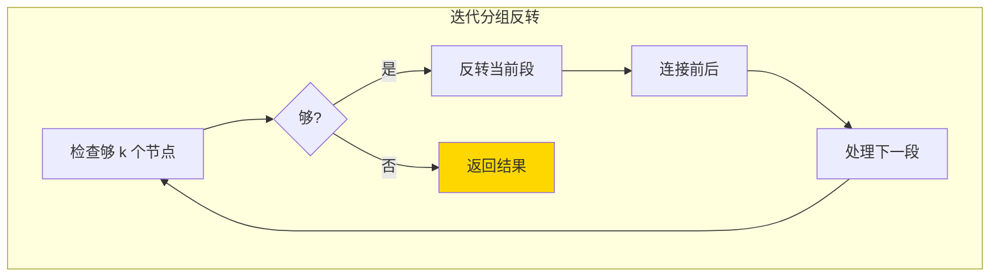

---

title: "K个一组翻转链表"

difficulty: 困难

category: 链表

tags:

  - leetcode

  - 链表

created: "2026-07-21"

---

# 25. K 个一组翻转链表（Reverse Nodes in k-Group）

> 难度：困难 | 主题：链表、递归/迭代

## 题目

给你链表的头节点 `head`，每 `k` 个节点一组进行翻转。如果节点总数不是 `k` 的整数倍，最后剩余的节点保持原有顺序。

**示例**

```text

输入：head = [1,2,3,4,5], k = 2

输出：[2,1,4,3,5]

输入：head = [1,2,3,4,5], k = 3

输出：[3,2,1,4,5]

```

---

## 思路
### 先讲个故事：拆火车车厢

一列火车有若干节车厢。你要把车厢按 K 节一组拆开，每组内部掉头，再重新挂上。

比如 K=3：先检查后面够不够 3 节，够 → 摘下来 → 掉头 → 挂上。不够 3 节 → 保持原样。

---

### 引导式推导：从分段到反转再连接

**第 1 层：递归分组**

先检查够不够 K 个节点，够了就反转当前段，再递归处理剩余部分。

```text

reverseKGroup([1,2,3,4,5], 3)

够 3 个 → 反转 [1,2,3] → [3,2,1]

递归处理剩余 [4,5]

不够 3 个 → 直接返回 [4,5]

结果: [3,2,1,4,5]

```

**第 2 层：迭代（O(1) 空间）**

```text

dummy → ① → ② → ③ → ④ → ⑤, k=2

第1组（①→②）：

检查够 k 个 ✅

group_prev=dummy, group_next=③

反转 ①→② 得到 ②→①

连接：dummy→②→①→③...

第2组（③→④）：

检查够 k 个 ✅

group_prev=①, group_next=⑤

反转 ③→④ 得到 ④→③

连接：①→④→③→⑤

不够了 → 返回

```



| 解法 | 时间 | 空间 | 推荐 |

|------|------|------|----------|

| 递归 | O(n) | O(n/k) | 代码简洁 |

| **迭代** | O(n) | O(1) | ✅ 最优 |

---

## 代码

```python

def reverseKGroup(self, head, k):

    dummy = ListNode(0, head)

    group_prev = dummy

    while True:

        kth = group_prev

        for _ in range(k):

            kth = kth.next

            if not kth:

                return dummy.next

        group_next = kth.next

        prev = kth.next

        curr = group_prev.next

        while curr != group_next:

            nxt = curr.next

            curr.next = prev

            prev = curr

            curr = nxt

        tmp = group_prev.next

        group_prev.next = kth

        group_prev = tmp

```

---

## 复杂度

| 指标 | 值 | 解释 |

|------|----|------|

| 时间 | O(n) | 每个节点访问常数次 |

| 空间 | O(1) | 几个指针 |

---

## 实战考量
### 频率分析

> **出现在**：字节/微软/Amazon 压轴题，约 20% 的 AI Agent 常会出。考察你能不能把"分段 + 反转 + 连接"说清楚。这题能写对说明链表基本功扎实。

### 延伸思考

**Q：递归怎么做？**

A：先处理后面再反转当前段。递归返回后面已处理好的头，当前段反转后接上。代码更短但空间 O(n/k)。

**Q：如果 k=1 或 k=n 呢？**

A：k=1 不翻转直接返回；k=n 整个链表翻转。

**Q：`prev` 为什么初始为 `kth.next`？**

A：反转后当前段的尾要指向下一段的头。`prev` 初始化成 `group_next`，这样反转过程中自动建立连接。

**Q：和 24 题（两两交换）的关系？**

A：24 题是本题 k=2 的特例。24 题也可以看作一个简化版的分组反转。

### 易错点

- 检查不够 k 个就返回，不要反转

- `group_prev` 更新顺序：先保存 `tmp = group_prev.next`，再更新 `group_prev.next = kth`，再 `group_prev = tmp`

- 反转边界 `curr != group_next`，不是 `for _ in range(k)`

---

## 生活类比

> **K 个一组反转 → 拆火车车厢掉头**

>

> 先数够 K 节车厢才动手拆。拆下来掉头挂上后，再处理下一组。不够 K 节的尾巴？保持原样不动。分组、反转、连接——三条基本功拼成一道 hard 题。

---

## 相关题目

| 题目 | 关系 |

|------|------|

| 206反转链表 | 基础反转 |

| 24两两交换链表中的节点 | K=2 的特例 |

---

→ 返回题单：[[LeetCode学习路线图#四、链表]]

## 速记卡（面试闪卡）

**Q1：一句话讲清「25. K 个一组翻转链表（Reverse Nodes in k-Group）」到底是什么？**

A：把链表每 k 个节点切成一段，每段就地反转，末尾不够一组就原样保留。

**Q2：题目核心 —— 怎么理解？**

A：像把一长串糖葫芦每 k 颗掰下来掉头再串回去；英文 K 个一组翻转链表全称 Reverse Nodes in k-Group，即按固定大小分组反转链表节点。

**Q3：思路拆解 —— 怎么理解？**

A：好比拆火车：先数够 k 节车厢才摘下来掉头挂上，不够就不动；英文两组做法——递归 Recursive 与迭代 Iterative（O(1) 空间）。

**Q4：代码骨架 —— 怎么理解？**

A：就像玩"指针接龙"：用 group_prev 守住段前，反转时把 curr 一个个往 prev 上挂，最后把段尾接回下一段；迭代法 Iterative 仅需几个指针。

**Q5：复杂度与实战 —— 怎么理解？**

A：如同流水线每人只摸一次零件，总时间 O(n)、空间 O(1)；英文 Reverse Nodes in k-Group 是字节/微软压轴题，专考"分段+反转+连接"。

**Q6：核心速记主线有哪些？**

- 分段：先数够 k 个再动手，不够一组原样留

- 反转：组内原地掉头，指针接龙不新建

- 连接：段尾接段头，group_prev 往后挪

- 复杂度：时间 O(n)，空间 O(1)，迭代最稳

**口诀**

A：链表分段 k 个头

够数掉头不够留

指针接龙组组接

时间O(n)一遍收

## 相关链接

- [[笔记/Leetcode笔记/04_链表/206反转链表|反转链表]]

- [[笔记/Leetcode笔记/04_链表/61旋转链表|旋转链表]]

- [[笔记/Leetcode笔记/04_链表/92反转链表II|反转链表II]]

- [[笔记/Leetcode笔记/04_链表/234回文链表|回文链表]]

- [[笔记/Leetcode笔记/04_链表/143重排链表|重排链表]]

