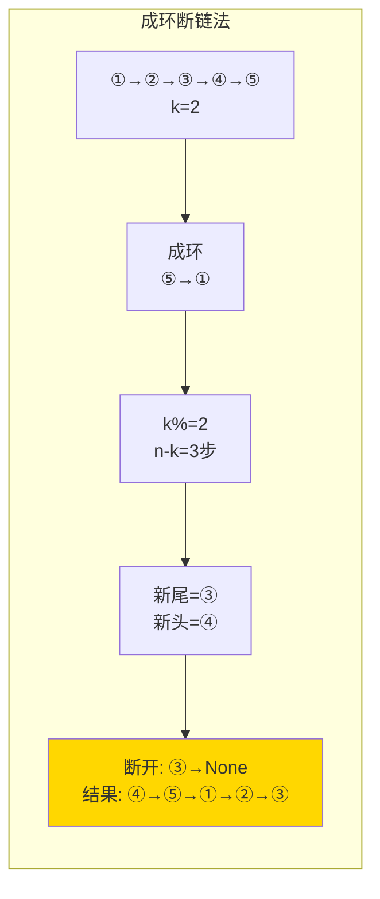

# 61. 旋转链表（Rotate List）

> 难度：中等 | 主题：链表、双指针

## 题目

给你一个链表的头节点 `head`，旋转链表，将链表每个节点向右移动 `k` 个位置。

**示例**
```text
输入：head = [1,2,3,4,5], k = 2
输出：[4,5,1,2,3]
```

---

## 思路

### 先讲个故事：循环队列出列

一群人坐成一圈，报数向右移动 K 位后重新排成一排。

实际上你不需要真的让每个人移动——你只需要找到**新的起点**在哪，然后从那里断开重排就行。

---

### 引导式推导：从暴力到成环断链

**第 1 层：暴力（每次移动 1 位）**

每次找到尾节点，让尾指向头，然后断开倒数第二个节点。重复 k 次。O(n×k)，k 可能很大，慢到爆炸。

**第 2 层：成环 + 求模（最优）**

核心洞察：向右旋转 k 位 = 把最后 (k % n) 个节点搬到前面。

```text
原始：①→②→③→④→⑤
k=2, n=5, k%n=2

步骤：
1. 成环：⑤→①
2. k%n=2，所以从原尾走 5-2=3 步，到达新尾 ③
3. ③.next = None，④ 是新头
结果：④→⑤→①→②→③
```

**为什么是 `n - k` 步？**

从头走到新尾需要 `n - k - 1` 步（0-indexed），从原尾走更简单——原尾走 `n - k` 步到新尾。



| 解法 | 时间 | 空间 |
|------|------|------|
| 暴力逐位移 | O(n×k) | O(1) |
| **成环断链** | O(n) | O(1) |

---

## 代码

```python
def rotateRight(self, head, k):
    if not head or not head.next:
        return head

    n = 1
    tail = head
    while tail.next:
        tail = tail.next
        n += 1

    k = k % n
    if k == 0:
        return head

    tail.next = head

    steps = n - k
    new_tail = tail
    for _ in range(steps):
        new_tail = new_tail.next

    new_head = new_tail.next
    new_tail.next = None

    return new_head
```

---

## 复杂度

| 指标 | 值 | 解释 |
|------|----|------|
| 时间 | O(n) | 算长度 + 找新尾 |
| 空间 | O(1) | 几个指针 |

---

## 实战考量

### 频率分析

> **出现在**：阿里/腾讯常考，约 15% 的 AI Agent 常会出这题。考察链表成环和断环的操作意识。

### 延伸思考

**Q：为什么成环比暴力好？**
A：暴力每次移动 O(n)，共 k 次 O(nk)。成环法 O(n) + O(n) 一次搞定。

**Q：向左旋转 k 个位置怎么做？**
A：等价于向右旋转 n-k 个位置。或者改一下：找到新头的位置 = 正数第 k 个节点（不是倒数第 k 个）。

**Q：如果 k 可能为负数呢？**
A：负数表示向左旋转。`k = k % n` 后，如果 k < 0，`k += n` 转成正数。

**Q：必须成环吗，不成都法怎么做？**
A：可以不用成环——直接算新头位置，断开重连。但代码会多一个找新头前驱的步骤。

### 易错点

- 忘记 `k %= n`，k 很大时无效旋转浪费时间
- 成环后忘记断环，形成循环链表
- steps 算错：是 `n - k` 不是 `k`

---

## 生活类比

> **旋转链表 → 移花接木**
>
> 就像把一列队伍的最后几个人叫到最前面来——你不必让每个人真的"移动"，只需要告诉最后几个人"你们现在是第一名了，断开这里"。

---

## 相关题目

| 题目 | 关系 |
|------|------|
| 189旋转数组 | 数组版旋转 |

---

→ 返回题单：[[LeetCode学习清单#四、链表]]
