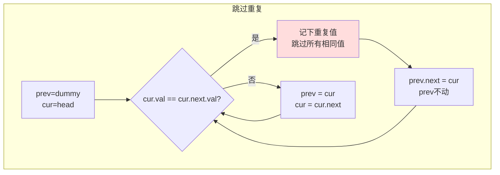

# 82. 删除排序链表中的重复元素 II（Remove Duplicates from Sorted List II）

> 难度：中等 | 主题：链表

## 题目

给定已排序的链表的头节点 `head`，删除原始链表中所有重复数字的节点，只保留原始链表中没有重复出现的数字。返回同样按升序排列的结果链表。

**示例**
```text
输入：head = [1,2,3,3,4,4,5]
输出：[1,2,5]

输入：head = [1,1,1,2,3]
输出：[2,3]
```

---

## 思路

### 先讲个故事：火车站检票

在火车站排队检票，你不确定前面的人是不是"有问题"（重复）。你手里有一张"确认没问题"的最后一张票（prev）。你朋友在前面一个一个检查。

如果发现前后两张票号码一样（重复团伙）→ 跳过整个团伙。如果票不一样 → 这张票安全，你往前站一格。

关键：**跳过重复团伙后，你不往前走**——因为新接上的可能也有问题。

---

### 引导式推导：从保留一个到全删除

**跟 83 题（保留一个重复）的区别：**

83：遇到重复，跳过后面的，`curr` 继续往前
**82：遇到重复，全部跳过，一个不留**

```text
83题处理 [1,1,2,2]：1→2
82题处理 [1,1,2,2]：[]（全删）
```

**过程模拟：**
```text
[1,1,2,2,3]
dummy → ① → ① → ② → ② → ③

prev=dummy, cur=①
①==① → 重复！记下 duplicate=1，跳过所有 1
cur=②，prev.next=②
②==② → 又重复！记下 duplicate=2，跳过所有 2
cur=③，prev.next=③
③.next=None → 退出

结果：③
```



| 解法 | 时间 | 空间 |
|------|------|------|
| **虚拟头+单指针扫描** | O(n) | O(1) |

---

## 代码

```python
class Solution:
    def deleteDuplicates(self, head: Optional[ListNode]) -> Optional[ListNode]:
        dummy = ListNode(0)
        dummy.next = head

        prev = dummy
        cur = head

        while cur and cur.next:
            if cur.val == cur.next.val:
                duplicate_val = cur.val
                while cur and cur.val == duplicate_val:
                    cur = cur.next
                prev.next = cur
            else:
                prev = prev.next
                cur = cur.next

        return dummy.next
```

---

## 复杂度

| 指标 | 值 | 解释 |
|------|----|------|
| 时间 | O(n) | 每个节点最多访问一次 |
| 空间 | O(1) | 几个指针 |

---

## 实战考量

### 频率分析

> **出现在**：腾讯/美团约 20% 的 AI Agent 常会出这题对比 83 题。重点考察**对"重复"边界的精确控制**。

### 延伸思考

**Q：和 83 题的核心区别？**
A：83 题遇到重复保留一个，curr 会前进。本题遇到重复全删，prev 不前进——因为新接上的可能也是重复。

**Q：为什么发现重复时 `prev` 不能前进？**
A：`[1,1,2,2]` 为例——跳过第一个 1 团伙后，`prev.next = cur`（cur=2）。如果 prev 前进了，下一对 2,2 就无法被跳过。

**Q：如果链表没排序还能做吗？**
A：不能。排序后重复必相邻，才能用相邻比较。未排序需要用哈希表统计频率。

**Q：不用 dummy 能做吗？**
A：头节点可能被删（如 [1,1,2]），不用 dummy 需要单独处理头节点删除的情况，代码更复杂。

### 易错点

- 发现重复后 prev 跟着前进（应该不动）
- 内层用 `if` 而不是 `while`，只能跳过一个重复节点
- 忘记用 dummy，头节点被删除时返回错误结果

---

## 生活类比

> **删除所有重复 → 火车站检票跳过问题团伙**
>
> 你手里拿着最后一张确认有效的票。发现前后两人票号一样？整个团伙（所有人）全部请出去。你站在原地不动——因为新排上来的人可能也是团伙成员。

---

## 相关题目

| 题目 | 关系 |
|------|------|
| [[83删除排序链表中的重复元素]] | 保留一个 vs 全删 |

---

→ 返回题单：[[LeetCode学习清单#四、链表]]
