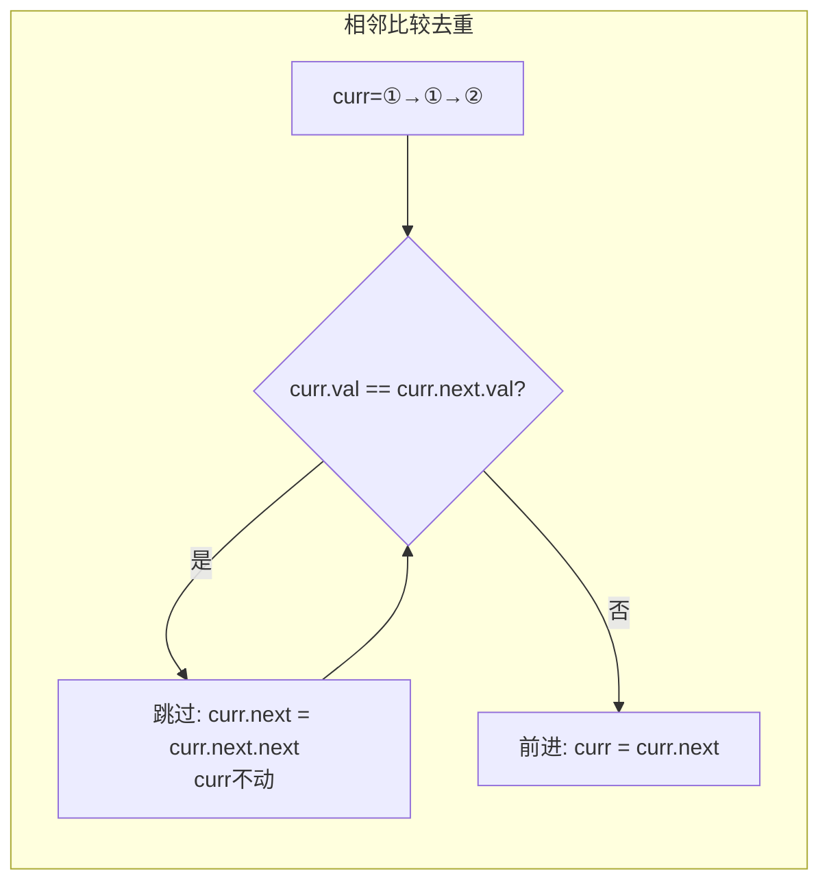

# 83. 删除排序链表中的重复元素（Remove Duplicates from Sorted List）

> 难度：简单 | 主题：链表

## 题目

给定一个已排序的链表的头节点 `head`，删除所有重复的元素，使每个元素只出现一次。返回已排序的链表。

**示例**
```text
输入：head = [1,1,2]
输出：[1,2]

输入：head = [1,1,2,3,3]
输出：[1,2,3]
```

---

## 思路

### 先讲个故事：同一排座位挨着的双胞胎

教室座位按学号排好。双胞胎总是挨着坐（学号相同）。老师想只保留每个学号一人：看到学号相同 → 第二个人站起来出去，第一个不动。学号变了 → 前移到新人。

因为已排序，重复的一定相邻。

---

### 引导式推导：相邻比较

**关键洞察：排序后重复必相邻。**

```text
[1, 1, 2, 3, 3]

curr=1,  curr.next=1  → 跳过：curr.next = curr.next.next
curr=1,  curr.next=2  → 不等，前进：curr = curr.next
curr=2,  curr.next=3  → 不等，前进：curr = curr.next
curr=3,  curr.next=3  → 跳过：curr.next = curr.next.next
curr=3,  curr.next=None → 结束
```

**为什么相等时 curr 不前进？**

`[1, 1, 1]`：第一次跳过得到 `① → ①`，如果 curr 前进了，第二个 1 就漏了。不前进才能继续检查新的 `curr.next`。



| 解法 | 时间 | 空间 |
|------|------|------|
| **单指针** | O(n) | O(1) |
| 双指针 | O(n) | O(1) |

---

## 代码

```python
def deleteDuplicates(self, head):
    curr = head
    while curr and curr.next:
        if curr.val == curr.next.val:
            curr.next = curr.next.next
        else:
            curr = curr.next
    return head
```

---

## 复杂度

| 指标 | 值 | 解释 |
|------|----|------|
| 时间 | O(n) | 一次遍历 |
| 空间 | O(1) | 一个指针 |

---

## 实战考量

### 频率分析

> **出现在**：链表入门题，约 15% 的 AI Agent 会作为热身。通常不会单独考，而是作为更难题的子问题或对比。

### 延伸思考

**Q：和 82 题（重复全删）的区别？**
A：本题重复保留一个，curr 遇到重复时跳过多个但不动。82 题重复全删，prev 不动等新节点。

**Q：如果链表没排序呢？**
A：用哈希集合记录出现过的值。时间复杂度 O(n)，空间 O(n)。

**Q：相等时 curr 为什么不前进？**
A：`[1,1,1]`——跳过第一个重复后变成 `① → ①`，还需要继续检查新的 `curr.next` 是否还是 1。

**Q：如果要求只删除第一个重复元素（保留第二个）呢？**
A：反过来判断：`curr.next.val == curr.val` 时跳过 curr.next。逻辑反着写。

### 易错点

- 相等时 curr 不前进——很多人习惯性写了 `curr = curr.next`
- 忘记判断 `curr.next` 存在（`while` 条件 `curr and curr.next`）
- 链表已排序是前提，未排序不能用此法

---

## 生活类比

> **删除重复（保留一个）→ 双胞胎只留一个**
>
> 学号相同的人挨着坐。看到学号一样？第二个人出去，我留在原地继续看下一个——直到看到不同学号才往前坐。每次只处理一个重复，不贪心。

---

## 相关题目

| 题目 | 关系 |
|------|------|
| [[82删除排序链表中的重复元素II]] | 进阶版：重复元素全部删除 |

---

→ 返回题单：[[LeetCode学习清单#四、链表]]

## 速记卡（面试闪卡）

**Q1：一句话讲清「83. 删除排序链表中的重复元素（Remove Duplicates from Sorted List）」到底是什么？**
A：给定一个已排序的链表的头节点 ，删除所有重复的元素，使每个元素只出现一次。返回已排序的链表。
**示例**
---

**Q2：题目 —— 怎么理解？**
A：给定一个已排序的链表的头节点 ，删除所有重复的元素，使每个元素只出现一次。返回已排序的链表。
**示例**
---

**Q3：思路 —— 怎么理解？**
A：教室座位按学号排好。双胞胎总是挨着坐（学号相同）。老师想只保留每个学号一人：看到学号相同 → 第二个人站起来出去，第一个不动。学号变了 → 前移到新人。
因为已排序，重复的一定相邻。
---
**关键洞察：排序后重复必相邻。**
**为什么相等时 curr 不前进？**
：第一次跳过得到 ，如果 curr 前进了，第二个 1 就漏了。不前进才能继续检查新的 。

**Q4：代码 —— 怎么理解？**
A：---

**Q5：复杂度 —— 怎么理解？**
A：| 指标 | 值 | 解释 |
|------|----|------|
| 时间 | O(n) | 一次遍历 |
| 空间 | O(1) | 一个指针 |
---

**Q6：核心速记主线有哪些？**
A：抓住这几根：题目、思路、代码、复杂度、实战考量、生活类比。

