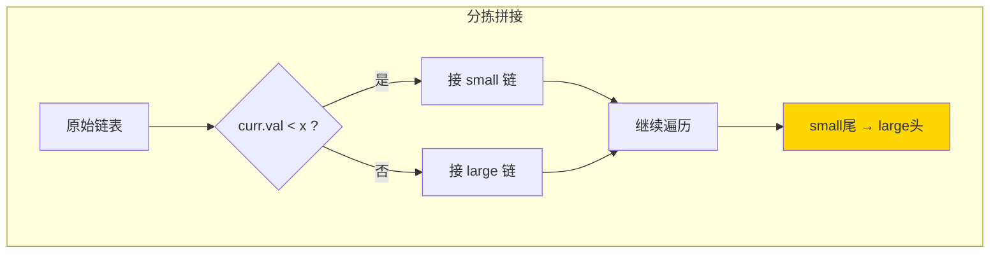

# 86. 分隔链表（Partition List）

> 难度：中等 | 主题：链表、双指针

## 题目

给你一个链表的头节点 `head` 和一个特定值 `x`，对链表进行分隔，使得所有小于 `x` 的节点都出现在大于或等于 `x` 的节点之前。不需要保留初始的相对顺序。

**示例**
```text
输入：head = [1,4,3,2,5,2], x = 3
输出：[1,2,2,4,3,5]
```

---

## 思路

### 先讲个故事：分拣快递

传送带上滚下来一堆包裹，上面标着重量。你要把重量小于 3kg 的放左边传送带，≥ 3kg 的放右边传送带。最后左边传送带的尾部对接右边传送带的头部。

你不需要在一条传送带上折腾——**开两条新传送带同时分拣，最后拼起来就行。**

---

### 引导式推导：两个链表分别建

**核心洞察：不要在原链表上折腾，拆成两个独立链表再拼接。**

```text
原始：① → ④ → ③ → ② → ⑤ → ②, x = 3

small: ① → ② → ②
large: ④ → ③ → ⑤

拼接：① → ② → ② → ④ → ③ → ⑤
```

**为什么不需要保持相对顺序？**

题目说了"不需要"。但如果需要保持，尾插法自然维持了顺序（因为是原序遍历）。



| 解法 | 时间 | 空间 |
|------|------|------|
| **双链表法** | O(n) | O(1) |

---

## 代码

```python
def partition(self, head, x):
    small_dummy = ListNode(0)
    small_tail = small_dummy

    large_dummy = ListNode(0)
    large_tail = large_dummy

    curr = head
    while curr:
        nxt = curr.next

        if curr.val < x:
            small_tail.next = curr
            small_tail = small_tail.next
            small_tail.next = None
        else:
            large_tail.next = curr
            large_tail = large_tail.next
            large_tail.next = None

        curr = nxt

    small_tail.next = large_dummy.next
    return small_dummy.next
```

---

## 复杂度

| 指标 | 值 | 解释 |
|------|----|------|
| 时间 | O(n) | 一次遍历 |
| 空间 | O(1) | 只移动指针，没创建新节点 |

---

## 实战考量

### 频率分析

> **出现在**：字节/阿里约 20% 的 AI Agent 常会出这题。考察利用多个哑节点拆解链表的能力。

### 延伸思考

**Q：如果要求保持各自内部的相对顺序呢？**
A：当前解法已经保持了——因为按原序遍历，尾插法维持了先后关系。

**Q：快排的 partition 操作能用到链表上吗？**
A：链表的随机访问不支持传统快排 partition。但这题提供了一个思路——可以用两个链表分别收集。

**Q：和奇偶链表（328 题）有什么区别？**
A：奇偶链表是按位置（奇数位/偶数位）分，本题是按值分。但实现思路一样——双哑节点分别构造再拼接。

**Q：能原地操作不用额外哑节点吗？**
A：哑节点只是为了统一处理头节点，开两个哑节点比原地操作（定位分割点然后重排）简单得多。

### 易错点

- 忘记断开原链表的 `next`（`small_tail.next = None`），可能形成环
- 返回 `small_dummy.next`，不是 `large_dummy`
- 需要保存 `curr.next`（`nxt`）再修改，防止丢失后续节点

---

## 生活类比

> **分隔链表 → 包裹分拣**
>
> 开两条传送带，一条放轻件一条放重件，最后把两条传送带首尾相接。这就是最简单的分拣流水线——分类然后合并，从不需要在原地折腾。

---

## 相关题目

| 题目 | 关系 |
|------|------|
| 148排序链表 | 链表分区 + 归并排序 |

---

→ 返回题单：[[LeetCode学习清单#四、链表]]

## 速记卡（面试闪卡）

**Q1：一句话讲清「86. 分隔链表（Partition List）」到底是什么？**
A：给你一个链表的头节点  和一个特定值 ，对链表进行分隔，使得所有小于  的节点都出现在大于或等于  的节点之前。不需要保留初始的相对顺序。
**示例**
---

**Q2：题目 —— 怎么理解？**
A：给你一个链表的头节点  和一个特定值 ，对链表进行分隔，使得所有小于  的节点都出现在大于或等于  的节点之前。不需要保留初始的相对顺序。
**示例**
---

**Q3：思路 —— 怎么理解？**
A：传送带上滚下来一堆包裹，上面标着重量。你要把重量小于 3kg 的放左边传送带，≥ 3kg 的放右边传送带。最后左边传送带的尾部对接右边传送带的头部。
你不需要在一条传送带上折腾——**开两条新传送带同时分拣，最后拼起来就行。**
---
**核心洞察：不要在原链表上折腾，拆成两个独立链表再拼接。**
**为什么不需要保持相对顺序？**
题目说了"不需要"。但如果需要保持，尾插法自然维持了顺序（因为是原序遍历）。

**Q4：代码 —— 怎么理解？**
A：---

**Q5：复杂度 —— 怎么理解？**
A：| 指标 | 值 | 解释 |
|------|----|------|
| 时间 | O(n) | 一次遍历 |
| 空间 | O(1) | 只移动指针，没创建新节点 |
---

**Q6：核心速记主线有哪些？**
A：抓住这几根：题目、思路、代码、复杂度、实战考量、生活类比。

