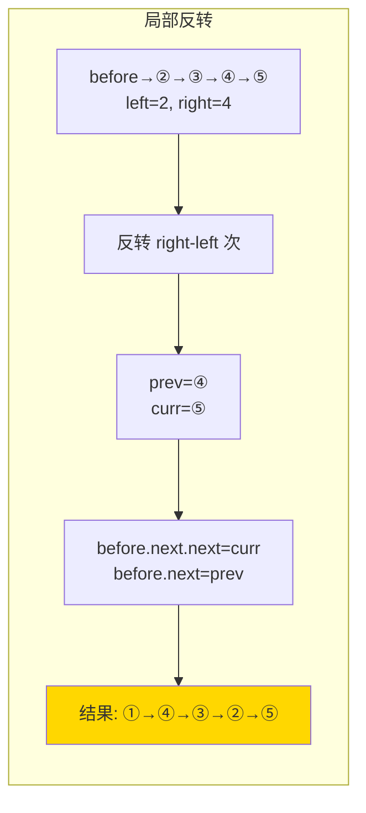

---

title: "反转链表II"

difficulty: 中等

category: 链表

tags:

  - leetcode

  - 链表

created: "2026-07-21"

---

# 92. 反转链表 II（Reverse Linked List II）

> 难度：中等 | 主题：链表、反转

## 题目

给你单链表的头指针 `head` 和两个整数 `left` 和 `right`，反转从位置 `left` 到位置 `right` 的链表节点，返回反转后的链表。

**示例**

```text

输入：head = [1,2,3,4,5], left = 2, right = 4

输出：[1,4,3,2,5]

```

---

## 思路
### 先讲个故事：一段铁轨换方向

一段铁路线，第 2 根到第 4 根枕木之间的铁轨要换方向。你先把这两根枕木前后的连接断开，把这段取下来掉头，再重新接回去。

---

### 引导式推导：从整段反转 to 局部反转

**第 1 层：拆成三段**

```text

原始：① → ② → ③ → ④ → ⑤, left=2, right=4

三段：

前段不变：①

反转段：② → ③ → ④  →  反转后 ④ → ③ → ②

后段不变：⑤

拼接：① → ④ → ③ → ② → ⑤

```

**第 2 层：一次遍历原地反转**

不需要真的拆开。找到 `left` 的前驱节点 `before`，然后用标准反转法反转 `right - left` 个节点。

```text

before.next = ②（反转段原头，反转后变尾）

反转（right-left）次后：

prev = ④（反转后的新头）

curr = ⑤（right 后的节点）

连接：

before.next.next = curr    // 反转段尾指向后面

before.next = prev         // before 指向反转段新头

```



| 解法 | 时间 | 空间 |
|------|------|------|
| 拆三段分别处理 | O(n) | O(1) |
| **原地反转连接** | O(n) | O(1) |

---

## 代码

```python

def reverseBetween(self, head, left, right):

    dummy = ListNode(0, head)

    before = dummy

    for _ in range(left - 1):

        before = before.next

    prev = before.next

    curr = prev.next

    for _ in range(right - left):

        nxt = curr.next

        curr.next = prev

        prev = curr

        curr = nxt

    before.next.next = curr

    before.next = prev

    return dummy.next

```

---

## 复杂度

| 指标 | 值 | 解释 |
|------|----|------|
| 时间 | O(n) | 最多遍历到 right |
| 空间 | O(1) | 几个指针 |

---

## 实战考量
### 频率分析

> **出现在**：字节/阿里常考，约 25% 的 AI Agent 常会出这题。考察你能不能把"标准反转 + 前后连接"做对。206 题（全反转）的变体，但很多人一到区间反转就翻车。

### 延伸思考

**Q：如果 left=1, right=n（整个链表反转）呢？**

A：就是标准的 206 题。`before = dummy`，`before.next = head`，反转完成后整个链表就反转了。

**Q：反转区间长度为 0（left=right）呢？**

A：`right - left = 0`，内层循环 0 次，什么也不做，返回原链表。

**Q：为什么先接 `before.next.next = curr`，再接 `before.next = prev`？**

A：顺序反了会丢失 `before.next`（原反转段头节点），导致无法连接后半段。

**Q：递归怎么做？**

A：类似反转链表前 n 个节点的递归，但需要额外记录 left 的前驱和 right 的后继。

### 易错点

- `before` 走到 `left-1` 不是 `left`

- 反转次数 = `right - left`，不是 `right - left + 1`

- 连接顺序：先接 `before.next.next = curr`，再接 `before.next = prev`

- 必须用 dummy（left=1 时 before=dummy）

---

## 生活类比

> **反转链表 II → 一段铁轨换方向**

>

> 你不用重新铺整条铁路。只需要走到要换的那段前，把这段拆下来掉头，然后重新接好——前面不动，后面也不动。算法的优雅在于只动该动的部分。

---

## 相关题目

| 题目 | 关系 |
|------|------|
| 206反转链表 | 基础反转（left=1, right=n） |
| 25K个一组翻转链表 | 多次局部反转的进阶 |

---

→ 返回题单：[[LeetCode学习路线图#四、链表]]

## 速记卡（面试闪卡）

**Q1：一句话讲清「92. 反转链表 II（Reverse Linked List II）」到底是什么？**

A：把链表中 left 到 right 区间的节点原地反转，前后不动，只动该段。

**Q2：一、题目与局部反转 —— 怎么理解？**

A：像一段铁轨要掉头，只拆下第 left 到 right 根枕木那段换方向再接回。其余部分原封不动（Partial Reverse）。

**Q3：二、一次遍历原地反转 —— 怎么理解？**

A：像找到 before 前驱，用标准反转法翻 right-left 次，再把段头接段尾。dummy 兜底 left=1 的情况（In-place Reverse）。

**Q4：三、关键连接顺序 —— 怎么理解？**

A：像接水管先接段尾再接段头，顺序反了会丢原段头节点。必须先 before.next.next=curr 再 before.next=prev（Reconnect Order）。

**Q5：四、复杂度与易错点 —— 怎么理解？**

A：像只走到 right 就收工，时间 O(n) 空间 O(1)。易错在 before 走 left-1 次、反转 right-left 次（Time/Space Complexity）。

**Q6：核心速记主线有哪些？**

- 只反转 left 到 right 区间，前后不变

- 找 before 前驱，原地反转 right-left 次

- 连接顺序：先接段尾再接段头

- 必须用 dummy，left=1 时 before=dummy

**口诀**

A：区间要反转，

前后都不动；

先接尾再接头，

dummy 来兜底。

## 相关链接

- [[笔记/Leetcode笔记/04_链表/206反转链表|反转链表]]

- [[笔记/Leetcode笔记/04_链表/61旋转链表|旋转链表]]

- [[笔记/Leetcode笔记/04_链表/25K个一组翻转链表|K个一组翻转链表]]

- [[笔记/Leetcode笔记/04_链表/142环形链表II|环形链表II]]

- [[笔记/Leetcode笔记/04_链表/143重排链表|重排链表]]

