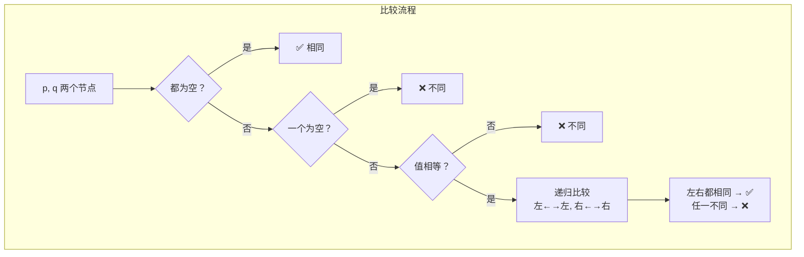

---

title: "相同的树"

difficulty: 简单

category: 二叉树

tags:

  - leetcode

  - 二叉树

created: "2026-07-21"

---

# 100. 相同的树（Same Tree）

> 难度：简单 | 主题：二叉树、DFS、递归

## 题目

给你两棵二叉树的根节点 `p` 和 `q`，判断它们是否**结构相同且对应节点值相同**。

**示例**

```text

输入：p = [1,2,3], q = [1,2,3] → 输出：true

输入：p = [1,2], q = [1,null,2] → 输出：false

输入：p = [1,2,1], q = [1,1,2] → 输出：false

```

---

## 思路
### 先讲个故事：双胞胎鉴定

你拿到了两张"家族树"的 DNA 鉴定报告。每棵树每个节点上写着一个数字。

要判断两棵树"是否相同"，就像判断一对双胞胎——你不能只看长相（根节点），还得看他们的左臂和左臂、右腿和右腿是不是也对得上。

**核心规则**：

> 两棵树相同 ↔ 当前节点值相同 **且** 左子树相同 **且** 右子树相同

---

### 引导式推导：从手动比较到递归

**场景：两棵只有一个节点的树**

```text

  [1]          [1]

```

根值都是 1，相同。

**场景：高度为 2 的树**

```text

    p: 1          q: 1

      / \          / \

     2   3        2   3

```

人脑是这样判断的：

1. p.val(1) == q.val(1) ✅

2. p.left(2) == q.left(2) ✅

3. p.right(3) == q.right(3) ✅

4. 全部通过 → 相同

**发现规律了吗？**

判断两棵树相同 = 判断**三个条件**同时成立：

- 根节点值相等

- 左子树相同（又是一个"两棵树相同"问题 → **递归**）

- 右子树相同（同上 → 递归）

这就是**原问题转化为同结构的子问题**——递归的天然信号。

**终止条件**：

- 两个节点都为空 → 相同（走到叶子尽头了）

- 一个为空一个不为空 → 不相同（结构就不同）

- 值不相等 → 不相同



**三步递归模板**

```text

终止条件 → 递归左右

```

就三行逻辑，覆盖了所有边界情况。

---

## 代码

```python

def isSameTree(self, p, q):

    if not p and not q:                     # 都为空：相同

        return True

    if not p or not q or p.val != q.val:    # 一个为空 或 值不等：不同

        return False

    return (self.isSameTree(p.left, q.left) and   # 左左相同

            self.isSameTree(p.right, q.right))     # 右右相同

```

---

## 复杂度

| 指标 | 值 | 解释 |
|------|----|------|
| 时间 | O(n) | 每个节点最多访问一次 |
| 空间 | O(h) | 递归栈深度，h 为树高 |

---

## 实战考量
### 频率分析

> **出现在**：一面树递归热身，约 40% 的二叉树从这种"逐节点比较"的逻辑开始。重点不是难度，是**递归终止条件的完整性**。

### 延伸思考

**Q：迭代怎么做？**

A：用栈模拟递归。同时 push 两棵树的节点，弹出后比较。关键是一对一对地 push——p.left 配 q.left，p.right 配 q.right，保持同步。

**Q：572另一棵树的子树 和这题什么关系？**

A：子树问题（572）需要遍历主树的每个节点，对每个节点调用 isSameTree 来判断。所以 100 题是 572 题的基础子过程。

**Q：如果树很大（比如 10⁶ 节点），递归会栈溢出吗？**

A：会的。极端不平衡的树递归深度 = n，Python 默认递归限制 ~1000。这时必须用迭代（栈/BFS）。

**Q：如果你用 BFS 做层序比较，要注意什么？**

A：两个队列同步遍历，空节点也要入队（用占位符），否则 `[1,2]` 和 `[1,null,2]` 会被判为相同。

### 易错点

- `not p or not q` 不能单独判断不同——因为 `p=null, q=null` 时也满足但实际上是相同

- 递归终止条件的顺序：**先处理全空 → 再处理一空或值不等**

- 题目是"结构相同且值相同"，不能用中序遍历序列比较（不同结构可能产生相同中序序列）

---

## 生活类比

> **判断两棵树相同 → 双胞胎鉴定**

>

> 你不可能只看脸（根节点）就判断双胞胎是不是一模一样。

> 必须从头到脚、左手对左手、右脚对右脚逐一核对——这就是递归的"分治比较"。

>

> 而递归终止条件就像检查"有没有手"：两只手都没有 → OK；一个有手一个没手 → 不是双胞胎。

---

## 相关题目

| 题目 | 关系 |
|------|------|
| 101对称二叉树 | 同族变体，比较方式从"左左对右右"变为"左右交叉" |
| 572另一棵树的子树 | 以此题为子过程的进阶题 |
| 226翻转二叉树 | 翻转后可以转化为比较问题 |

---

→ 返回题单：[[LeetCode学习路线图#五、二叉树]]

## 速记卡（面试闪卡）

**Q1：一句话讲清「100. 相同的树（Same Tree）」到底是什么？**

A：判断两棵二叉树是否结构相同且对应节点值一样：根相等、左子树相同、右子树相同，三者必须同时成立。

**Q2：题目：双胞胎鉴定（root val + subtree） —— 怎么理解？**

A：判断两棵树相同就像鉴定双胞胎——不能只看脸（根节点值），还得左手对左手、右脚对右脚逐一核对。核心规则：同 ⇔ 当前节点值相等 且 左子树相同 且 右子树相同，任一不一致就不是同卵。

**Q3：思路：原问题变同结构子问题（recursion） —— 怎么理解？**

A：判断整棵树 = 判断「根相等」+「左子树相同」+「右子树相同」，而左右子树各自又是「两棵树相同」问题 → 天然递归。终止条件：都为空→相同；一空一有→不同；值不等→不同。三行逻辑就覆盖所有边界情况。

**Q4：代码：三行递归模板（DFS） —— 怎么理解？**

A：先判都空 return True；再判一空或值不等 return False；最后 return 左左相同 and 右右相同。注意顺序：先全空、再一空或值不等。迭代可用栈同步 push p.left/q.left、p.right/q.right，成对比较，保持两边节奏一致。

**Q5：复杂度与实战易错（O(n)/O(h)） —— 怎么理解？**

A：时间 O(n) 每个节点访一次；空间 O(h) 递归栈，h 为树高。易错：not p or not q 不能单独判不同（两空也满足却应相同）；不能用中序序列比较（不同结构可能同中序）；树太大（10⁶）递归会栈溢出，改迭代。572 子树题以此为基础子过程。

**Q6：核心速记主线有哪些？**

- 题目：结构相同且对应节点值相同

- 思路：同=根等∧左同∧右同，递归分治

- 代码：先全空→真，再一空或值不等→假，最后左右递归

- 复杂度：时间 O(n)，空间 O(h)

- 易错：两空也算相同；别用中序比；大树改迭代防栈溢出

**口诀**

A：相同两树要查清，

根等左右递归下；

双空为真一空假，

值异结构便分家。

## 相关链接

- [[笔记/Leetcode笔记/05_二叉树/112路径总和|路径总和]]

- [[笔记/Leetcode笔记/05_二叉树/104二叉树的最大深度|二叉树的最大深度]]

- [[笔记/Leetcode笔记/05_二叉树/226翻转二叉树|翻转二叉树]]

- [[笔记/Leetcode笔记/05_二叉树/102二叉树的层序遍历|二叉树的层序遍历]]

- [[笔记/Leetcode笔记/05_二叉树/105从前序与中序遍历序列构造二叉树|从前序与中序遍历序列构造二叉树]]

