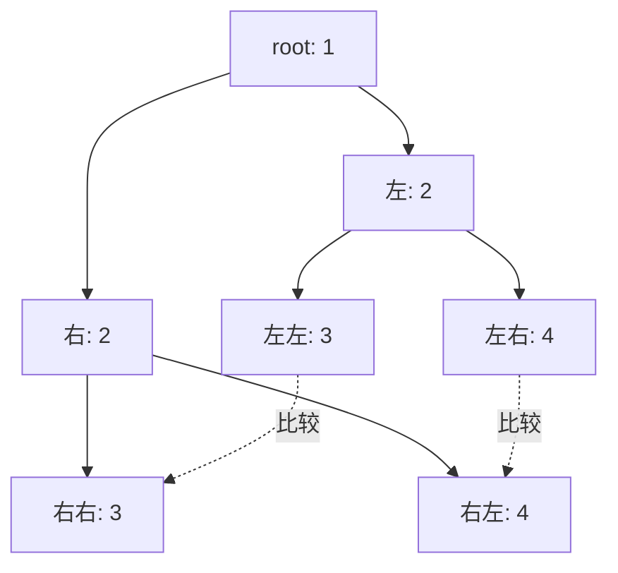

---

title: "对称二叉树"

difficulty: 简单

category: 二叉树

tags:

  - leetcode

  - 二叉树

created: "2026-07-21"

---

# 101. 对称二叉树（Symmetric Tree）

> 难度：简单 | 主题：二叉树、DFS、递归

## 题目

给你一个二叉树的根节点 `root`，判断它是否**轴对称**。

**示例**

```text

输入：root = [1,2,2,3,4,4,3] → 输出：true

输入：root = [1,2,2,null,3,null,3] → 输出：false

```

---

## 思路
### 先讲个故事：照镜子

你站在一面全身镜前，举起左手——镜子里的人举起了右手。

镜子不会把"左手"和"左手"比较，而是把**你的左手**和**镜中人的右手**比较，**你的右手**和**镜中人的左手**比较。这就是对称的本质——**左右交叉对应**。

树是否轴对称也是一样：不是左子树和自己比，是**左子树的左**和**右子树的右**比，**左子树的右**和**右子树的左**比。

---

### 引导式推导：从对称的定义到交叉递归

**什么是对称？**

```text

     1

   /   \

  2     2

 / \   / \

3  4  4   3

```

这棵树对称吗？直觉：是的。但怎么严谨验证？

**错误直觉**：左子树和右子树分别对称

- 左子树 [2,3,4] 本身不对称（左右子节点 3 ≠ 4）

- 右子树 [2,4,3] 本身不对称（左右子节点 4 ≠ 3）

- 但整棵树是对称的！

**正确理解**：不是"左子树对称且右子树对称"，而是**左子树和右子树互为镜像**。

**镜像条件**：

1. 根值相等

2. 左的左 ↔ 右的右（对应）

3. 左的右 ↔ 右的左（交叉）

```text

比较 (2, 2):

  ├─ 值相等 ✅

  ├─ 比较 (3, 3) → 值相等 ✅ → 都为空 ✅

  └─ 比较 (4, 4) → 值相等 ✅ → 都为空 ✅

→ 镜像成立 ✅

```



**和 100 题对比**：

```text

100 相同的树:   p.left ↔ q.left    p.right ↔ q.right

101 对称二叉树:  left.left ↔ right.right   left.right ↔ right.left

```

**终止条件**：

- 都为空 → 对称

- 一个为空 → 不对称

- 值不等 → 不对称

---

## 代码

```python

def isSymmetric(self, root):

    if not root:

        return True

    def check(left, right):

        if not left and not right:          # 都为空：对称

            return True

        if not left or not right:           # 一个为空：不对称

            return False

        return (left.val == right.val and           # 根值相等

                check(left.left, right.right) and   # 交叉比较：左左 ↔ 右右

                check(left.right, right.left))      # 交叉比较：左右 ↔ 右左

    return check(root.left, root.right)

```

---

## 复杂度

| 指标 | 值 | 解释 |

|------|----|------|

| 时间 | O(n) | 每个节点访问一次 |

| 空间 | O(h) | 递归栈深度，h 为树高 |

---

## 实战考量
### 频率分析

> **出现在**：树递归的"变形题"。看到你 100 题会了，立刻问 101 看看你能不能从"相同"迁移到"对称"。考察的是**能不能识别出"交叉比较"这个关键变化**。

### 延伸思考

**Q：迭代怎么做？**

A：用队列模拟。初始化队列放入 `(root.left, root.right)`。每次弹出两个节点比较，然后交叉入队：先入 `(left.left, right.right)`，再入 `(left.right, right.left)`。

**Q：能不能转化成 100 题？**

A：可以。先把右子树翻转（226翻转二叉树），然后判断左子树和翻转后的右子树是否相同。但多了一次遍历，不推荐。

**Q：如果不止二叉树，而是多叉树呢？**

A：多叉树的对称是"子节点序列是回文的"——第一个和最后一个比，第二个和倒数第二个比。

**Q：空树怎么处理？**

A：空树定义为对称（没有不对称的理由）。`if not root: return True` 先处理这个边界。

### 易错点

- ~~比较"左子树 == 右子树"~~ → ❌ 这是 100 题的逻辑

- 应该是"交叉比较"——左的左 VS 右的右，左的右 VS 右的左

- 忘记处理空树的情况（根节点为 None）

- 递归函数 `check` 的参数顺序不要搞混

---

## 生活类比

> **对称树 → 照镜子**

>

> 你伸出左手，镜子里的人伸出右手——你的左手对应镜中人的右手，这就是"交叉对应"。

>

> 非对称的树就像你一边嘴角上扬，镜中人另一边嘴角也上扬——但两边上扬的高度不一样，不对称一眼就能看出来。

---

## 相关题目

| 题目 | 关系 |

|------|------|

| 100相同的树 | 基础版，从"相同比较"进阶到"交叉比较" |

| 226翻转二叉树 | 翻转 + 相同比较 = 对称判断的另一种实现 |

| 572另一棵树的子树 | 对称性是子树匹配的进阶用法 |

---

→ 返回题单：[[LeetCode学习路线图#五、二叉树]]

## 速记卡（面试闪卡）

**Q1：一句话讲清「101. 对称二叉树（Symmetric Tree）」到底是什么？**

A：对称不是左子树等于右子树，而是左右互为镜像：左左比右右、左右比右左。

**Q2：一、题目：树镜不对称 —— 怎么理解？**

A：像判断一棵树照镜子对不对：给 root，看是否轴对称（Symmetric Tree）。[1,2,2,3,4,4,3] 对称，[1,2,2,null,3,null,3] 不对称。

**Q3：二、思路：照镜子交叉比 —— 怎么理解？**

A：像照全身镜：你举左手，镜中人举右手——比的是"你的左"和"镜中右"。树也是：左的左↔右的右、左的右↔右的左交叉比较（Mirror comparison），不是各自对称。

**Q4：三、代码：check 交叉递归 —— 怎么理解？**

A：像递归照镜子：check(left,right) 判根值等、再 check(left.left,right.right) 与 check(left.right,right.left)（Cross recursion）。终止：都空对称、一空不对称、值不等不对称。

**Q5：四、复杂度与实战：变形题 —— 怎么理解？**

A：时间 O(n)、空间 O(h)。常紧跟 100 题考，看你能否从"相同比较"迁移到"交叉比较"（100 vs 101）。迭代用队列交叉入队。

**Q6：核心速记主线有哪些？**

- 核心：左右互为镜像，交叉比较（非各自对称）

- 镜像三条件：根值等、左左↔右右、左右↔右左

- 代码：check(left,right) 递归，终止都空/一空/值不等

- 复杂度：时间 O(n) 空间 O(h)

- 关联：100 相同树用 left↔left；迭代用队列交叉入队

**口诀**

A：对称不是左右同，

照镜交叉来对碰；

左左比那右右下，

左右比那右左通。

## 相关链接

- [[笔记/Leetcode笔记/05_二叉树/226翻转二叉树|翻转二叉树]]

- [[笔记/Leetcode笔记/05_二叉树/110平衡二叉树|平衡二叉树]]

- [[笔记/Leetcode笔记/05_二叉树/814二叉树剪枝|二叉树剪枝]]

- [[笔记/Leetcode笔记/05_二叉树/543二叉树的直径|二叉树的直径]]

- [[笔记/Leetcode笔记/05_二叉树/199二叉树的右视图|二叉树的右视图]]

