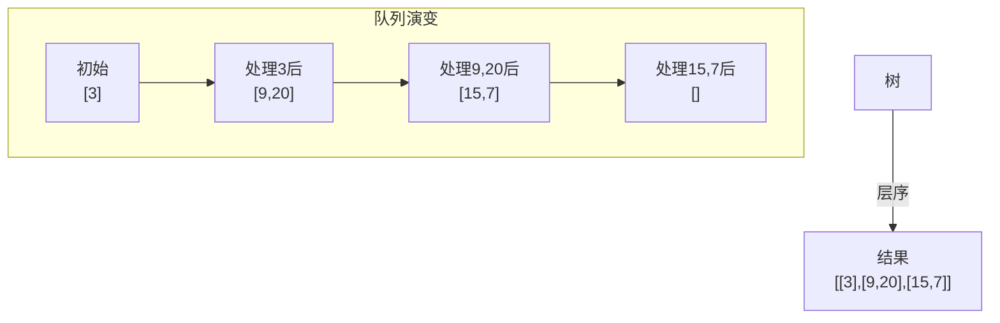

# 102. 二叉树的层序遍历（Binary Tree Level Order Traversal）

> 难度：中等 | 主题：二叉树、BFS、队列 ⭐常见

## 题目

给你二叉树的根节点 `root`，返回其节点值的**层序遍历**（逐层从左到右访问）。

**示例**
```text
输入：root = [3,9,20,null,null,15,7]
输出：[[3],[9,20],[15,7]]
```

---

## 思路

### 先讲个故事：地铁站台广播

想象你在**地铁调度中心**，监控着一条线路上的所有站台。

调度员的口号是：
> "当前站的乘客全部上车后，列车才开到下一站。"

这和层序遍历一模一样——**先把当前层的所有节点"放行"完，才进入下一层**。而实现的秘密武器就是：**队列（先进先出）**。

---

### 引导式推导：从手动模拟到 BFS 模板

**场景：手动层序遍历以下树**

```text
      3
     / \
    9   20
       /  \
      15   7
```

**第 1 步**：queue = [3]，处理 3，让它的子节点 9、20 进队
- 输出：[3]

**第 2 步**：queue = [9, 20]，这俩都要处理（都在同一层），然后让它们的子节点进队
- 输出：[3], [9, 20]

**第 3 步**：queue = [15, 7]，处理掉
- 输出：[3], [9, 20], [15, 7]

**关键洞察**：怎么知道哪些节点属于同一层？

答：**在处理当前层之前，先记录队列长度 `level_size = len(queue)`**。
接下来只弹出 `level_size` 个节点——这些就是当前层的全部节点。新入队的下一层节点，不在本轮处理范围内。



**BFS 层序模板（四步走）**：
```text
1. 根节点入队列
2. while 队列不为空：
3.   level_size = len(队列)     ← 记录当前层大小
4.   for _ in range(level_size): ← 只处理当前层
5.     出队一个节点，记录值
6.     左右子节点入队
```

---

## 代码

```python
from collections import deque

def levelOrder(self, root):
    if not root:
        return []

    result = []
    q = deque([root])

    while q:
        level_size = len(q)         # 关键：先固定当前层大小
        level = []                  # 存当前层值

        for _ in range(level_size):
            node = q.popleft()      # O(1) 出队
            level.append(node.val)
            if node.left:
                q.append(node.left)
            if node.right:
                q.append(node.right)

        result.append(level)

    return result
```

---

## 复杂度

| 指标 | 值 | 解释 |
|------|----|------|
| 时间 | O(n) | 每个节点出队入队恰好一次 |
| 空间 | O(w) | w 为树的最大宽度，队列最多存一层节点 |

---

## 实战考量

### 频率分析

> **出现在**：字节/美团/阿里 高频。层序遍历是 BFS 的**标准模板**，约 50% 的树 BFS 题可以套这个模板微调。关键点在于：**`level_size` 为什么要提前记录？**

### 延伸思考

**Q：为什么 `level_size = len(q)` 要写在 `for` 循环外面？**
A：因为在 for 循环中队列会不断有新节点入队（子节点），len(q) 会动态变化。如果在 `for` 里直接写 `range(len(q))`，Python 的 `range` 只在初始化时求值一次，所以实际上也正确。但写成变量更清晰。

**Q：不用队列，用两个列表交替存储行不行？**
A：可以。用 `cur_level` 和 `next_level` 两个列表，每轮处理完一轮就交换。这在某些变体题（如之字形）中会更方便。

**Q：如果要求每层平均值呢？**
A：在 level 求和，除以 level_size。对应 637 题。

**Q：如果要求每层最大值呢？**
A：遍历每层时记录 max。对应 515 题。

**Q：如果要求自底向上层序遍历呢？**
A：正常 BFS，最后 `result.reverse()` 或在每次插入时 `result.insert(0, level)`。对应 107 题（二叉树层序遍历 II）。

**Q：199二叉树的右视图 怎么用层序做？**
A：每层只取最后一个节点的值。还是在 `for` 循环中，判断 `i == level_size - 1` 时记录。

### 易错点

- 空树的处理：`if not root: return []`
- `level_size = len(q)` 必须在处理当前层之前记录
- Python 中 `list.pop(0)` 是 O(n)，要用 `collections.deque.popleft()` 优化到 O(1)

---

## 生活类比

> **层序遍历 → 地铁站台广播**
>
> "**请先上车的乘客往车厢中部走**"——广播只说"当前站"的乘客，不关心下一站谁在等车。
>
> 队列就是站台闸机：当前层的乘客（节点）全部通过闸机后，闸机才放行下一层的人。
> `level_size` 就是广播员手里的**当前站人数清单**——拿着清单清点，不会把下一站的人算进来。

---

## 相关题目

| 题目 | 关系 |
|------|------|
| 103二叉树的锯齿形层序遍历 | 层序变体，奇数层反转方向 |
| 199二叉树的右视图 | 每层只取最右节点 |
| 107 二叉树的层序遍历 II | 自底向上层序，最后反转结果 |
| 515 在每个树行中找最大值 | 每层记录最大值 |
| 637 二叉树的层平均值 | 每层求和取均值 |

---

→ 返回题单：[[LeetCode学习清单#五、二叉树]]

## 速记卡（面试闪卡）

**Q1：一句话讲清「102. 二叉树的层序遍历（Binary Tree Level Order Traversal）」到底是什么？**
A：给你二叉树的根节点 ，返回其节点值的**层序遍历**（逐层从左到右访问）。
**示例**
---

**Q2：题目 —— 怎么理解？**
A：给你二叉树的根节点 ，返回其节点值的**层序遍历**（逐层从左到右访问）。
**示例**
---

**Q3：思路 —— 怎么理解？**
A：想象你在**地铁调度中心**，监控着一条线路上的所有站台。
调度员的口号是：
"当前站的乘客全部上车后，列车才开到下一站。"
这和层序遍历一模一样——**先把当前层的所有节点"放行"完，才进入下一层**。而实现的秘密武器就是：**队列（先进先出）**。

**Q4：代码 —— 怎么理解？**
A：---

**Q5：复杂度 —— 怎么理解？**
A：| 指标 | 值 | 解释 |
|------|----|------|
| 时间 | O(n) | 每个节点出队入队恰好一次 |
| 空间 | O(w) | w 为树的最大宽度，队列最多存一层节点 |
---

**Q6：核心速记主线有哪些？**
A：抓住这几根：题目、思路、代码、复杂度、实战考量、生活类比。

