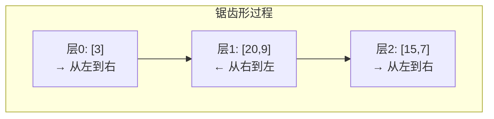
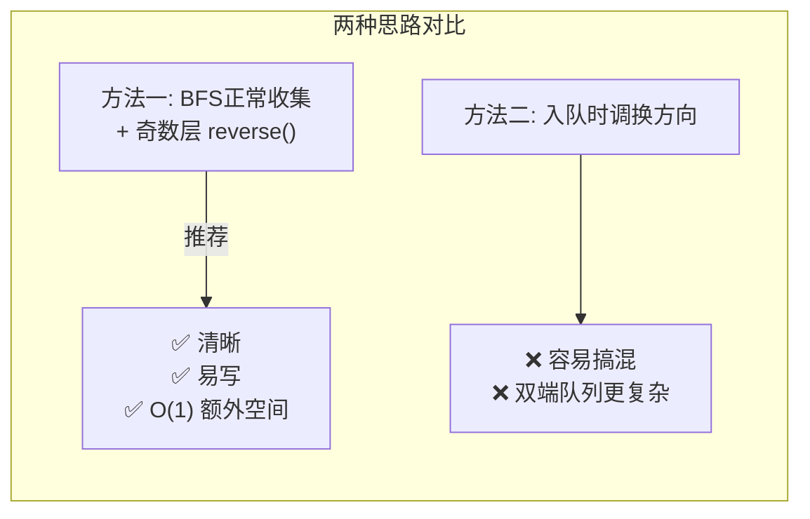

---

title: "二叉树的锯齿形层序遍历"

difficulty: 中等

category: 二叉树

tags:

  - leetcode

  - 二叉树

created: "2026-07-21"

---

# 103. 二叉树的锯齿形层序遍历（Binary Tree Zigzag Level Order Traversal）

> 难度：中等 | 主题：二叉树、BFS、双端队列

## 题目

给你二叉树的根节点 `root`，返回其节点值的**锯齿形层序遍历**：第一层从左到右，第二层从右到左，第三层从左到右……交替进行。

**示例**

```text

输入：root = [3,9,20,null,null,15,7]

输出：[[3],[20,9],[15,7]]

```

---

## 思路
### 先讲个故事：过山车检票

游乐园过山车的检票通道很特别：

- **第一排**从左到右入座

- **第二排**从右到左入座

- **第三排**又从左到右……

为什么？为了平衡车身重量，也因为乘客喜欢"反着来"的体验。

锯齿形层序遍历就是这辆过山车——每一层"上下车方向"交替变换。

---

### 引导式推导：从层序模板到方向标记

**基础**：102二叉树的层序遍历 已经告诉你怎么逐层处理。

**变化**：在 102 的模板上，加一个**方向标记**。



**思考过程**：

**方法一：先正常入队，再反转**

```text

正常层序收集每层 → 偶数层（0,2,4...）不变，奇数层 reverse()

```

最简单，`level.reverse()` 一行就搞定交替。

**方法二：入队时控制方向**

```text

偶数层从左到右（先左子入队，再右子入队）

奇数层从右到左（先右子入队，再左子入队）

```

听起来合理但**行不通**——因为队列的 FIFO 特性会打乱顺序。子节点入队是为下一层准备的，下层是反方向，但入队顺序不能简单靠交换左右子来解决。

**结论**：方法一（收集后反转）最简单且不易出错。



**方向标记控制**：

```text

left_to_right = True

每处理完一层: left_to_right = not left_to_right

偶数层 (0, 2, 4...) → left_to_right 为 True → 不反转

奇数层 (1, 3, 5...) → left_to_right 为 False → 反转

```

---

## 代码

```python

from collections import deque

def zigzagLevelOrder(self, root):

    if not root:

        return []

    result = []

    q = deque([root])

    left_to_right = True            # 方向标记：第一层从左到右

    while q:

        level_size = len(q)

        level = []

        for _ in range(level_size):

            node = q.popleft()

            level.append(node.val)  # 始终正向收集

            if node.left:

                q.append(node.left)

            if node.right:

                q.append(node.right)

        if not left_to_right:       # 奇数层 → 反转

            level.reverse()

        result.append(level)

        left_to_right = not left_to_right   # 切换方向

    return result

```

---

## 复杂度

| 指标 | 值 | 解释 |

|------|----|------|

| 时间 | O(n) | 每个节点访问一次，reverse 累计 O(n) |

| 空间 | O(n) | 队列最大宽度 + 结果数组 |

---

## 实战考量
### 频率分析

> **出现在**：102 题的"变体追问"，用来判断你**是真理解 BFS 模板还是只会背**。如果能从 102 秒切到 103 并清楚说清楚"只加了一个 reverse 和方向标记"，说明你理解了。

### 延伸思考

**Q：不用 `reverse()`，有没有更好的方式？**

A：可以用双端队列 `deque`，每层根据方向决定 `append`（正向）还是 `appendleft`（反向）。但还是 `level.reverse()` 更直观。实践中先写清晰版，再提这个优化。

**Q：空间能优化吗？**

A：结果本身 O(n) 不可避免。但如果不要求返回值只要求打印，可以 O(w) 空间（队列宽度）。方向标记 `left_to_right` 本身只占 O(1)。

**Q：如果第一层是从右到左开始呢？**

A：`left_to_right` 初始为 False 即可。

**Q：N 叉树怎么做锯齿形？**

A：BFS 模板不变，方向标记不变。每层收集子节点时，把所有子节点（不限于左右两个）入队即可。

### 易错点

- `level_size = len(q)` 必须在 for 循环前记录

- 子节点入队顺序始终**先左后右**，方向控制在输出时做，不是入队时做

- `left_to_right` 初始为 True（第一层从左到右），奇数层（索引 1, 3, 5...）才反转

- `level.reverse()` 是在每层收集完后才调用，不是每入队一个节点就反转

---

## 生活类比

> **锯齿形层序遍历 → 过山车检票**

>

> 检票员（BFS）每次放行一排人（一层节点），然后切换方向牌（`left_to_right`）。

> 第一排从左到右入座，第二排从右到左入座——人还是那些人，只是方向变了。

>

> 就像把 BFS 模板当"基础地基"，在上面"加一层方向开关"，就得到了新的行为。

---

## 相关题目

| 题目 | 关系 |

|------|------|

| 102二叉树的层序遍历 | 基础模板，本题就是在其基础上加了方向标记 |

| 199二叉树的右视图 | 层序变体，每层只取最后一个节点 |

| 107 二叉树的层序遍历 II | 自底向上层序，最后反转结果列表本身 |

---

→ 返回题单：[[LeetCode学习路线图#五、二叉树]]

## 速记卡（面试闪卡）

**Q1：一句话讲清「103. 二叉树的锯齿形层序遍历（Binary Tree Zigzag Level Order Traversal）」到底是什么？**

A：锯齿形层序在 BFS 模板上加"方向标记"，奇数层反转即成交替输出。

**Q2：一、题目与过山车检票类比 —— 怎么理解？**

A：像过山车检票：第一排从左到右、第二排从右到左交替入座——每层"上下车方向"变换，人还是那些节点。英文：Zigzag Level Order。

**Q3：二、思路：102 模板加方向标记 —— 怎么理解？**

A：像给 BFS 装个"方向开关"：正常层序收集每层，偶数层不动、奇数层 `reverse()` 一行搞定；入队时调方向会乱，方向控制在输出时做。英文：BFS + Direction Flag。

**Q4：三、代码与切换逻辑 —— 怎么理解？**

A：像每层收完再翻牌：始终先左后右入队，`left_to_right` 为 False 时 `level.reverse()`，处理完一层翻转标记——方向只在输出时变。英文：left_to_right Toggle。

**Q5：四、复杂度与易错点 —— 怎么理解？**

A：像多带一个布尔开关：时间 O(n)（reverse 累计 O(n)）、空间 O(n)（队列+结果）；易错在 `level_size` 提前记、方向初始 True、反转在收集后。英文：O(n) Time / O(n) Space。

**Q6：核心速记主线有哪些？**

- 基础：102 层序模板 + 一个方向标记

- 做法：正常收集，奇数层 reverse()，不在入队时调向

- 复杂度：时间 O(n)、空间 O(n)

- 易错：先记 level_size、方向初始 True、反转在收集后

**口诀**

A：锯齿层序像过山，

BFS 加个方向盘；

奇偶层间翻一翻，

反转输出不犯难。

## 相关链接

- [[笔记/Leetcode笔记/05_二叉树/102二叉树的层序遍历|二叉树的层序遍历]]

- [[笔记/Leetcode笔记/05_二叉树/145二叉树的后序遍历|二叉树的后序遍历]]

- [[笔记/Leetcode笔记/05_二叉树/144二叉树的前序遍历|二叉树的前序遍历]]

- [[笔记/Leetcode笔记/05_二叉树/199二叉树的右视图|二叉树的右视图]]

- [[笔记/Leetcode笔记/05_二叉树/543二叉树的直径|二叉树的直径]]

