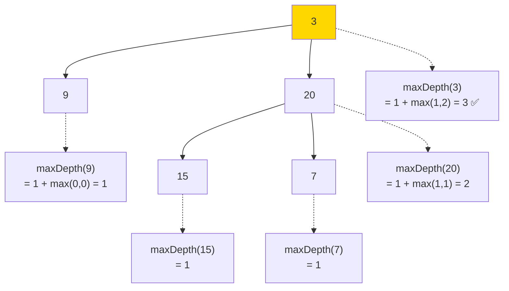

# 104. 二叉树的最大深度（Maximum Depth of Binary Tree）

> 难度：简单 | 主题：二叉树、DFS、BFS

## 题目

给定一个二叉树 `root`，返回其最大深度（从根节点到最远叶子节点的路径上的节点数）。

**示例**
```text
输入：root = [3,9,20,null,null,15,7]
输出：3
```

---

## 思路

### 先讲个故事：测量楼高

你要测量一栋楼的高度。你不能直接飞到楼顶去量，于是你想了个办法：
> 每层楼的高度是 **1 米**，那楼高就是**层数」**。

但等等——这不是一栋规整的大楼，而是**一棵倒着长的树形建筑**——每层可能有多个分支，你选哪条路？

> 选最深的那个分支。

这就是二叉树的最大深度：**1 + max(左子树深度, 右子树深度)**。

---

### 引导式推导：从手动数到递推公式

**场景：手动计算以下树的最大深度**

```text
      3            ← 第 1 层
     / \
    9   20         ← 第 2 层
       /  \
      15   7       ← 第 3 层
```

直观答案：3 层。

**从根节点思考**：
- 到最远叶子节点的路径 = 3 → 9 → 不，3 → 20 → 15（或 7）才是更深的
- 怎么确定？算一下右子树的最大深度 > 左子树最大深度

**递推公式诞生**：

```text
maxDepth(节点) = 0, 如果节点为空
maxDepth(节点) = 1 + max(maxDepth(左子), maxDepth(右子)), 如果节点不为空
```



**执行过程（后序遍历视角）**：
1. 先算 9：左空(0) + 右空(0) → 1
2. 算 15：左右空 → 1；算 7：左右空 → 1
3. 算 20：左(1) 和 右(1) 的最大值是 1，+1 → 2
4. 算 3：左(1) 和 右(2) 的最大值是 2，+1 → 3

**这就是后序遍历**：先算左右子树的结果，再计算当前节点。

**另一种方法：BFS 层序**

"最大深度"也等于"层数"——BFS 每处理一层，深度 +1。两种方法都可以。

| 解法 | 时间 | 空间 | 适用场景 |
|------|------|------|---------|
| **DFS 递归** | O(n) | O(h) | 最简洁，推荐首选 |
| BFS 层序 | O(n) | O(w) | 树特别深时避免栈溢出 |

---

## 代码

```python
# DFS 递归（三行，首选）
def maxDepth(self, root):
    if not root:
        return 0
    return 1 + max(self.maxDepth(root.left),
                   self.maxDepth(root.right))

# BFS 层序（树很深时避免递归栈溢出）
def maxDepth(self, root):
    if not root:
        return 0
    from collections import deque
    q = deque([root])
    depth = 0
    while q:
        depth += 1
        for _ in range(len(q)):
            node = q.popleft()
            if node.left:
                q.append(node.left)
            if node.right:
                q.append(node.right)
    return depth
```

---

## 复杂度

| 指标 | DFS | BFS |
|------|-----|-----|
| 时间 | O(n) | O(n) |
| 空间 | O(h)，h 为树高，最坏 O(n) | O(w)，w 为最宽层节点数 |

---

## 实战考量

### 频率分析

> **出现在**：一面必考的热身题，约 80% 的树类从这题开始。重点是看你能不能**从 DFS 自然过渡到 BFS 解法**，以及能不能回答"为什么这本质是后序遍历"。

### 延伸思考

**Q：为什么这是后序遍历？**
A：算当前节点的深度前，必须知道左右子树的深度。这符合后序遍历的"左右根"顺序——先算子节点，后算父节点。树的几乎所有"从下往上"的问题都是后序遍历。

**Q：最小深度怎么做？**
A：`minDepth = 1 + min(minDepth(left), minDepth(right))` 吗？**不**。最小深度是到**最近叶子节点**的距离。如果根有右子树没有左子树，`min(1+∞, 1+right)` 结果是 ∞（错！），正确答案是 `1 + left` 或 `1 + right`，取实际存在的那一侧。

**Q：[[337打家劫舍III]] 和这题有什么联系？**
A：337 是树形 DP，也用后序遍历框架：先算左右子树的偷/不偷收益，再算当前节点。最大深度是树形 DP 的"最小原型"——先算子树结果再算当前节点。

**Q：N 叉树的最大深度怎么做？（559 题）**
A：遍历所有子节点，取最大深度 +1。`1 + max(maxDepth(child) for child in root.children)`。

**Q：递归会栈溢出吗？**
A：极端不平衡的树（链表状）递归深度 = n，Python 默认递归限制 ~1000。这时用 BFS 或迭代栈避免溢出。

### 易错点

- 空节点返回 0（不是 None）
- 叶子节点 `1 + max(0,0) = 1`，正确
- 不要写成 `1 + maxDepth(root.left) + maxDepth(root.right)`（会变成求和）
- 最小深度不能直接套 max 换成 min，需要处理只有一侧子树的情况

---

## 生活类比

> **最大深度 → 测量楼高**
>
> 你站在一栋奇特的建筑里——不是规整的混凝土楼，而是像一棵倒长的榕树。
> 你不知道哪条路最长，只能让手下的人分头往上爬，各自报告自己路线的深度。
> 你在中间汇总：左边爬了 5 层，右边爬了 7 层——那楼高就是 `1 + max(5, 7) = 8` 层（算上你站的这层）。

---

## 相关题目

| 题目 | 关系 |
|------|------|
| 111 二叉树的最小深度 | 同族变体，注意"只有一侧子树"的边界 |
| 559 N 叉树的最大深度 | 扩展：从左右两个子节点变成多个子节点 |
| [[337打家劫舍III]] | 进阶：后序遍历框架 + DP 状态转移 |
| 110平衡二叉树 | 利用深度概念判断平衡（左右子树深度差 ≤ 1） |

---

→ 返回题单：[[LeetCode学习清单#五、二叉树]]

## 速记卡（面试闪卡）

**Q1：一句话讲清「104. 二叉树的最大深度（Maximum Depth of Binary Tree）」到底是什么？**
A：给定一个二叉树 ，返回其最大深度（从根节点到最远叶子节点的路径上的节点数）。
**示例**
---

**Q2：题目 —— 怎么理解？**
A：给定一个二叉树 ，返回其最大深度（从根节点到最远叶子节点的路径上的节点数）。
**示例**
---

**Q3：思路 —— 怎么理解？**
A：你要测量一栋楼的高度。你不能直接飞到楼顶去量，于是你想了个办法：
每层楼的高度是 **1 米**，那楼高就是**层数」**。
但等等——这不是一栋规整的大楼，而是**一棵倒着长的树形建筑**——每层可能有多个分支，你选哪条路？
选最深的那个分支。
这就是二叉树的最大深度：**1 + max(左子树深度, 右子树深度)**。
---
**场景：手动计算以下树的最大深度**
直观答案：3 层。

**Q4：代码 —— 怎么理解？**
A：---

**Q5：复杂度 —— 怎么理解？**
A：| 指标 | DFS | BFS |
|------|-----|-----|
| 时间 | O(n) | O(n) |
| 空间 | O(h)，h 为树高，最坏 O(n) | O(w)，w 为最宽层节点数 |
---

**Q6：核心速记主线有哪些？**
A：抓住这几根：题目、思路、代码、复杂度、实战考量、生活类比。

