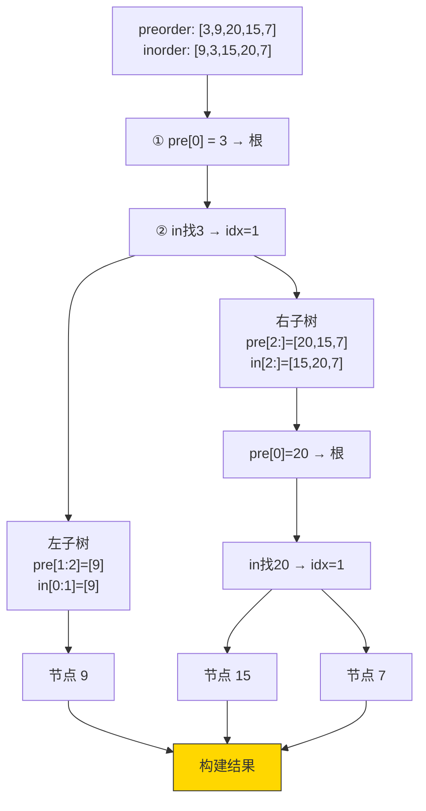

# 105. 从前序与中序遍历序列构造二叉树（Construct Binary Tree from Preorder and Inorder Traversal）

> 难度：中等 | 主题：二叉树、递归、哈希表、分治

## 题目

给定两个整数数组 preorder 和 inorder，其中 preorder 是二叉树的先序遍历，inorder 是同一棵树的中序遍历，请构造二叉树并返回其根节点。

**示例**
```text
preorder = [3, 9, 20, 15, 7]
inorder  = [9, 3, 15, 20, 7]
输出：[3, 9, 20, null, null, 15, 7]
```

---

## 思路

### 先讲个故事：鸳鸯锅

火锅店端上一口鸳鸯锅，中间有个隔板（根节点）。

服务员上菜的顺序 = **前序遍历**：先把菜放到**中间**（根），再放到**左边**（左子树），最后放到**右边**（右子树）。

你的涮菜顺序 = **中序遍历**：先涮**左边**的，再涮**中间**的隔板，最后涮**右边**的。

现在你把上菜顺序和涮菜顺序都记在纸上：

> 上菜顺序：[3, 9, 20, 15, 7] → 第一个上的是中间的 3（根）
> 涮菜顺序：[9, 3, 15, 20, 7] → 3 左边是左锅 [9]，右边是右锅 [15, 20, 7]

左锅只有 9 → 叶子节点。右锅同样推理：第一个上的是 20（根），在涮菜顺序中左边是 [15]、右边是 [7]。

还原完成：
```text
    3
   / \
  9   20
     /  \
    15   7
```

---

### 引导式推导：从具体到递归

**第 1 步：前序第一个永远是根**

因为前序遍历是「根 → 左 → 右」，第一个元素一定是当前子树的根。

```text
preorder = [3, 9, 20, 15, 7]  →  根 = 3
```

**第 2 步：中序中找根，划分子树**

因为中序是「左 → 根 → 右」，根在中间，左边全是左子树节点，右边全是右子树节点。

```text
inorder = [9, 3, 15, 20, 7]
              ↑
         左子树 [9]
         右子树 [15, 20, 7]
```

左子树有 1 个节点 → preorder 中根之后 1 个元素 [9] 就是左子树的前序。

**第 3 步：递归重复**

对右子树：
```text
前序 [20, 15, 7] → 根 = 20
中序 [15, 20, 7] → 左 [15], 右 [7]
```

**第 4 步：归纳成递归逻辑**

```text
function build(preorder, inorder):
    ① preorder[0] = root
    ② 在 inorder 中找到 root → 划分左右子树区间
    ③ 建根 → 递归建左子树 → 递归建右子树
```

### 核心洞察

> 前序告诉我们 **谁是根**，中序告诉我们 **左右各有几个节点**。两个信息缺一不可。



### 递进之路

| 解法 | 时间 | 空间 | 关键 |
|------|------|------|------|
| 暴力递归（每次 index） | O(n²) | O(n²) | 切片传数组 + O(n) 查找 |
| **哈希表 + 指针** | O(n) | O(n) | 省掉 index 和切片 |

核心优化：**不要切片传数组，传索引区间；不要遍历找根，哈希表存映射。**

---

## 代码

```python
def buildTree(self, preorder, inorder):
    # 值 → 中序索引的映射
    idx_map = {val: i for i, val in enumerate(inorder)}

    pre_idx = 0  # 前序数组指针

    def build(in_left, in_right):
        nonlocal pre_idx

        if in_left > in_right:
            return None

        # 前序当前位置 → 子树的根
        root_val = preorder[pre_idx]
        pre_idx += 1
        root = TreeNode(root_val)

        # 在中序中定位根
        mid = idx_map[root_val]

        # 左子树：中序区间 [in_left, mid-1]
        root.left = build(in_left, mid - 1)
        # 右子树：中序区间 [mid+1, in_right]
        root.right = build(mid + 1, in_right)

        return root

    return build(0, len(inorder) - 1)
```

**为什么先建左子树再建右子树？**

前序遍历顺序是「根 → 左子树 → 右子树」。在 preorder 数组中，左子树的根紧挨着当前根，跳过整个左子树之后才是右子树的根。所以必须按「前序走」的顺序：先递归左子树（消耗掉左子树对应的 preorder 元素），再递归右子树。

---

## 复杂度

| 指标 | 值 | 解释 |
|------|----|------|
| 时间 | O(n) | 每个节点建一次，哈希表 O(1) 查根 |
| 空间 | O(n) | 哈希表 O(n) + 递归栈 O(h) |
| 暴力（无哈希） | O(n²) | 每次 index 遍历 O(n) 找根 |

---

## 实战考量

### 频率分析

> **出现在**：微软/字节/美团常考题。考察对树遍历性质的理解 + 分治递归编码能力。约 40% 的二叉树常会从此题或同类题型切入。

### 延伸思考

**Q：为什么前序+中序能唯一确定二叉树？**
A：前序确定根节点，中序确定左右子树的节点集合。两个信息完全互补。类比：前序是"目录结构"（先父后子），中序是"排列顺序"（左中右）。

**Q：后序+中序能构造吗？**
A：能。后序最后一个元素是根，然后在中序中划分左右子树（106从中序与后序遍历序列构造二叉树）。

**Q：前序+后序为什么不能唯一确定？**
A：前序和后序都只告诉你谁是根，但**不知道左右子树的分界**。比如前序 [1,2] 和后序 [2,1]：1 是根，但 2 可以是左子树也可以是右子树。

**Q：能不能不用哈希表，改用二分查找？**
A：中序数组不是 BST 的有序数组，值没有单调性，无法二分。只能用哈希表 O(1) 或线性扫描 O(n)。

**Q：迭代法怎么做？**
A：用栈模拟递归过程。前序数组依次入栈，同时维护中序指针。空间 O(h)，写递归就够了。

### 易错点

- `pre_idx` 必须用 `nonlocal`（或可变对象包装）
- 区间是闭区间 `[left, right]`，终止条件 `left > right`
- **必须先左后右**：前序遍历顺序决定了左子树的根先出现
- 题目保证节点值无重复，否则哈希表会冲突

---

## 生活类比

> **前序 + 中序 → 二叉树**
>
> 像**搭乐高**：前序是图纸上的**零件编号顺序**（先搭底座 1 号，再搭左臂 2 号……），中序是**成品照片**里零件从左到右的排列。
>
> 只按编号顺序搭，你不知道零件放左边还是右边；只看照片，你不知道先搭哪个。两份一结合，完美还原。

---

## 相关题目

| 题目 | 关系 |
|------|------|
| 106从中序与后序遍历序列构造二叉树 | 同族，后序最后一个是根 |
| 889根据前序和后序遍历构造二叉树 | 不唯一版，条件放宽 |
| 105从前序与中序遍历序列构造二叉树 | 本题 |

---

→ 返回题单：[[LeetCode学习清单#五、二叉树]]
