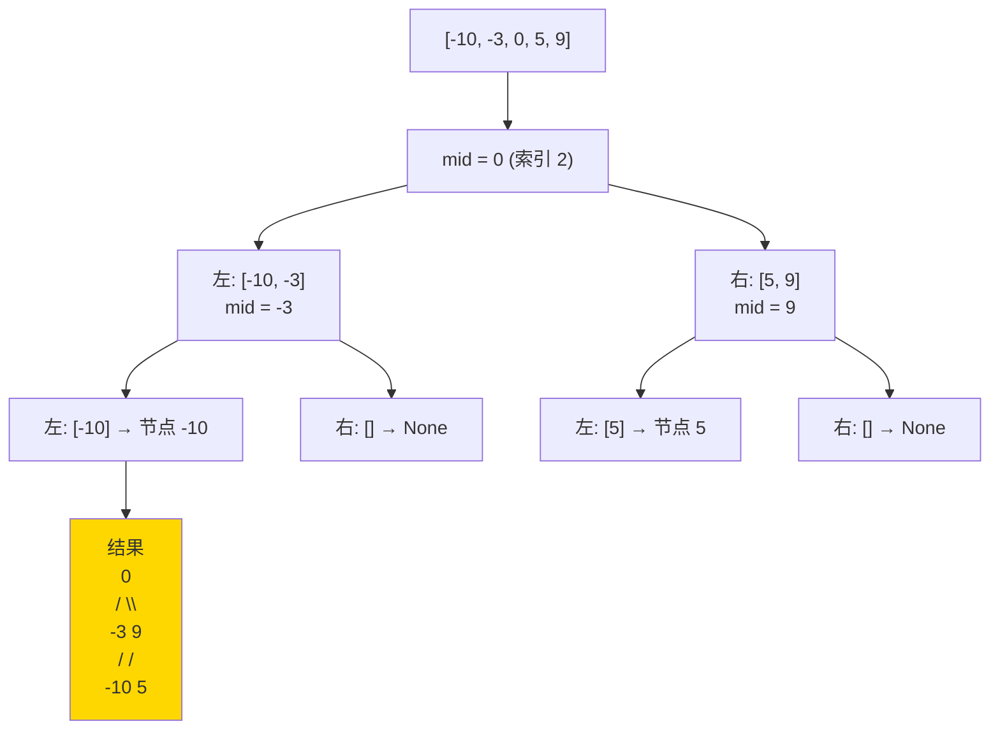

# 108. 将有序数组转换为二叉搜索树（Convert Sorted Array to Binary Search Tree）

> 难度：简单 | 主题：二叉树、BST、分治

## 题目

给你一个整数数组 `nums`，其中元素已经按升序排列，请你将其转换为一棵高度平衡二叉搜索树。

高度平衡：二叉树每个节点的左右两个子树的高度差的绝对值不超过 1。

**示例**
```text
nums = [-10, -3, 0, 5, 9]
输出：[0, -3, 9, -10, null, 5]

        0
       / \
     -3   9
     /   /
   -10  5
```

---

## 思路

### 先讲个故事：跷跷板

小朋友们按身高排队站成一排，要搭一个**平衡的人体金字塔**。

规则：
- 金字塔的每一层，中间的人站在最高处（根节点）
- 左边的人组成左半边，右边的人组成右半边
- 左右两边的人数最多差 1，这样才不会倒

这就是「将有序数组转换为平衡 BST」——数组已经按顺序排好了（BST 的中序遍历就是有序数组），你只需要不断取中间元素当根，递归构建左右子树。

---

### 引导式推导：从数组到平衡树

**第 1 步：有序数组和 BST 的关系**

BST 的中序遍历 = 递增序列。反过来也成立：递增序列重建 BST，中序遍历就是原数组。

```text
nums = [-10, -3, 0, 5, 9]
           ↑          ↑   ↑
        左半部分    根   右半部分
```

**第 2 步：取中间元素做根**

为了平衡，选中间元素 0 做根。左边比他小的 [-10, -3] 是左子树，右边比他大的 [5, 9] 是右子树。

```text
        0
       / \
  [-10,-3] [5,9]
```

**第 3 步：递归构建左右子树**

左子树 [-10, -3] → 中间 -3 为根，左 -10 为左叶子，右 None。
右子树 [5, 9] → 中间 9 为根，左 5 为左叶子，右 None。

```text
        0
       / \
     -3   9
     /   /
   -10  5
```

**第 4 步：发现规律**

有序数组 = BST 的中序遍历结果。把有序数组还原为 BST 就是**中序遍历的逆过程**——每次取中间元素做根，递归处理左右两半。

---

### 为什么取中间能保证平衡？

因为左右子树的节点数相差不超过 1：
- 左半部分大小 = `mid - left` ≤ 右半部分大小 + 1
- 右半部分大小 = `right - mid` ≤ 左半部分大小 + 1

递归下去，每个子树的左右高度差都 ≤ 1。



---

## 代码

```python
def sortedArrayToBST(self, nums):
    def build(left, right):
        # 闭区间 [left, right]，区间无效返回空
        if left > right:
            return None

        # 取中间元素作为根
        mid = (left + right) // 2
        node = TreeNode(nums[mid])

        # 递归构建左右子树
        node.left = build(left, mid - 1)
        node.right = build(mid + 1, right)

        return node

    return build(0, len(nums) - 1)
```

**mid 计算公式：**
- `(left + right) // 2` — Python 不怕溢出
- `left + (right - left) // 2` — C++/Java 防溢出写法
- 偶数长度时取左中还是右中不影响平衡性

---

## 复杂度

| 指标 | 值 | 解释 |
|------|----|------|
| 时间 | O(n) | 每个元素访问一次 |
| 空间 | O(log n) | 平衡二叉树递归栈深度 |

> 最坏情况（非平衡树）栈深度 O(n)，但本题构造的就是平衡树，所以是 O(log n)。

---

## 实战考量

### 频率分析

> **出现在**：常考的基础递归题。约 25% 的二叉树会用此题考察分治思维。通常是 105 题的前置热身或保底题。

### 延伸思考

**Q：为什么取中间元素能保证高度平衡？**
A：左右子树元素数量最多差 1。递归地，每个子树的节点数也平衡，整体高度差 ≤ 1。

**Q：如果数组长度是偶数，取左中还是右中？**
A：都可以。取左中或右中只是树的具体形态不同，但都是平衡的。LeetCode 接受两者。

**Q：如果是链表而不是数组，怎么找中点？**
A：用快慢指针找中点（109有序链表转换二叉搜索树）。链表不能 O(1) 随机访问，所以实现更复杂。

**Q：如果数组不是有序的，还能构造平衡 BST 吗？**
A：可以先排序变成有序数组，再按本题方法构造。但排序本身 O(n log n)。

**Q：为什么这叫"分治"？**
A：问题分解为：选根（解决）+ 构建左子树（子问题）+ 构建右子树（子问题），子问题独立且同类，典型的**分治法**。

### 易错点

- 终止条件写错：`left > right` 不是 `left >= right`（单个元素也要构建）
- `mid` 计算用 `(left + right) // 2` 不是 `len(nums) // 2`（递归中不能依赖完整数组）
- 区间用闭区间 `[left, right]`，保持一致

---

## 生活类比

> **有序数组 → 平衡 BST**
>
> 想象你有一排按身高排列的士兵，要组一个**人梯金字塔**。
> 你每次都抓中间那个当"基座"，左边一排自动矮下去成左塔，右边一排成右塔。
> 这样搭出来的金字塔最稳——左右高度差不超 1，任何一个人掉下来都不会让整座塔塌得太偏。

---

## 相关题目

| 题目 | 关系 |
|------|------|
| 109有序链表转换二叉搜索树 | 链表版，快慢指针找中点 |
| 105从前序与中序遍历序列构造二叉树 | 广义树构建，遍历序列→树 |
| 108将有序数组转换为二叉搜索树 | 本题 |

---

→ 返回题单：[[LeetCode学习清单#五、二叉树]]
