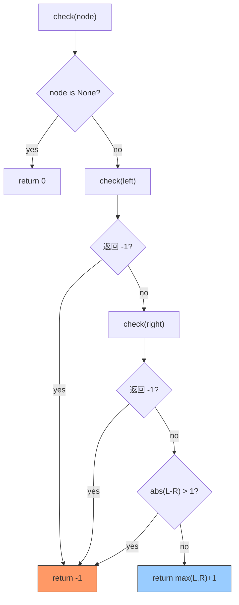

# 110. 平衡二叉树（Balanced Binary Tree）

> 难度：简单 | 主题：二叉树、DFS

## 题目

给定一个二叉树，判断它是否是高度平衡的二叉树。平衡的定义：每个节点的左右两个子树的高度差的绝对值不超过 1。

**示例**
```text
输入：root = [3, 9, 20, null, null, 15, 7]
输出：true

    3
   / \
  9   20
     /  \
    15   7
```

---

## 思路

### 先讲个故事：杂技演员叠椅子

杂技演员要把椅子一摞一摞叠起来，每把椅子上再叠一把椅子。

**规则**：任何一把椅子上左右两摞的高度差不能超过 1 把椅子。否则整座塔会倒。

你从**最底层开始**检查（自底向上）：
1. 检查最左边的椅子下面还有没有椅子（高度 0），再看看右边（高度 1）
2. 两边高度差超过 1 → ❌ 不平衡
3. 如果平衡，把自己这摞的高度传给上面的人：`max(左高度, 右高度) + 1`

---

### 引导式推导：从重读到高效

**思路 A：自顶向下（O(n²)）**

对每个节点，分别计算左右子树高度，判断差值 ≤ 1，再递归判断左右子树是否平衡。

```python
def isBalanced(root):
    if not root:
        return True
    left_h = height(root.left)
    right_h = height(root.right)
    return (abs(left_h - right_h) <= 1 and
            isBalanced(root.left) and
            isBalanced(root.right))
```

但 `height()` 本身就是 O(n) 的遍历。上层节点调 `height()` 时，下层节点被反复访问。这就是重复计算。

**思路 B：自底向上（O(n)）—— 后序遍历 + 哨兵值**

核心思想：**把"算高度"和"判平衡"合并成一次遍历**。后序遍历天然适合——先处理子树，再处理当前节点。

关键技巧：用 **-1** 作为"不平衡"的哨兵值。因为高度永远 ≥ 0，-1 不会和正常值冲突。

**第 1 步：空节点**
高度 = 0，平衡。返回 0。

**第 2 步：叶子节点**
左右子树高度都是 0，差 0 ≤ 1 → 平衡。返回高度 = max(0,0) + 1 = 1。

**第 3 步：非叶子节点**
```text
① 递归左子树 → 拿到左高度（或 -1）
② 递归右子树 → 拿到右高度（或 -1）
③ 如果任一子树返回 -1 → 整棵树不平衡，直接上抛 -1
④ 否则检查 |左 - 右| ≤ 1：
   - 是 → 返回 max(左, 右) + 1
   - 否 → 返回 -1
```



---

## 代码

```python
def isBalanced(self, root):
    def check(node):
        if not node:
            return 0  # 空节点高度 0，平衡

        left = check(node.left)
        if left == -1:   # 左子树不平衡，剪枝
            return -1

        right = check(node.right)
        if right == -1:  # 右子树不平衡，剪枝
            return -1

        if abs(left - right) > 1:
            return -1    # 当前节点不平衡

        return max(left, right) + 1  # 返回当前子树高度

    return check(root) != -1
```

**为什么用 -1 当哨兵？**

高度值是非负的（空树 0，单节点 1…），用 -1 表示"不平衡"不会和正常高度混淆。这叫**哨兵值模式**，在树递归中很常见。

---

## 复杂度

| 指标 | 值 | 解释 |
|------|----|------|
| 时间 | O(n) | 每个节点访问一次 |
| 空间 | O(h) | 递归栈深度，最坏 O(n) |
| 自顶向下 | O(n²) | 每层都重复计算高度 |

---

## 实战考量

### 频率分析

> **出现在**：字节跳动常考题。可能作为独立题，也可能是 104二叉树的最大深度 的引申追问。约 40% 的学习者在第一版写出 O(n²) 的自顶向下，延伸提问"能优化吗"。

### 延伸思考

**Q：为什么自顶向下是 O(n²)？**
A：对每个节点都调了一遍 `height()` 算高度。上层节点算高度时，下层节点被反复遍历。n 个节点，每层 O(n)，总 O(n²)。

**Q：自底向上的 -1 方案为什么能优化到 O(n)？**
A：每个节点只算一次高度。算完的同时就知道是否平衡，信息**一次传递**，没有重复计算。

**Q：如果说不能用 -1 哨兵怎么办？**
A：用一个对象包装返回值，比如 `(height, is_balanced)`。这是 Java/C++ 中常见手法——**多值返回**。

**Q：和 104二叉树的最大深度 有什么关系？**
A：最大深度是平衡判断的基础。110 是 104 的进阶——104 只算高度，110 是"算高度 + 途中检查"。

### 易错点

- 返回的是**高度**不是布尔值，但用 -1 表示不平衡
- 后序遍历必须**先判断左右子树是否平衡，再判断当前节点**
- 左右子树**有一个不平衡**则整棵树不平衡，立即剪枝返回 -1
- 主函数用 `check(root) != -1` 而不是 `check(root) is True`

---

## 生活类比

> **平衡二叉树 → 杂技叠椅**
>
> 杂技演员从最底层开始一把一把检查——
> 每把椅子拿左右两摞的高度，差太多就直接喊"不行"（-1 传播），
> 没问题就报自己这摞的总高度给上面的人。
> 整个过程只走一遍，每把椅子只碰一次。这就是**后序 + 剪枝**。

---

## 相关题目

| 题目 | 关系 |
|------|------|
| 104二叉树的最大深度 | 前置基础，单纯算深度 |
| 110平衡二叉树 | 本题 |
| 257二叉树的所有路径 | 同是二叉树递归遍历 |

---

→ 返回题单：[[LeetCode学习清单#五、二叉树]]
