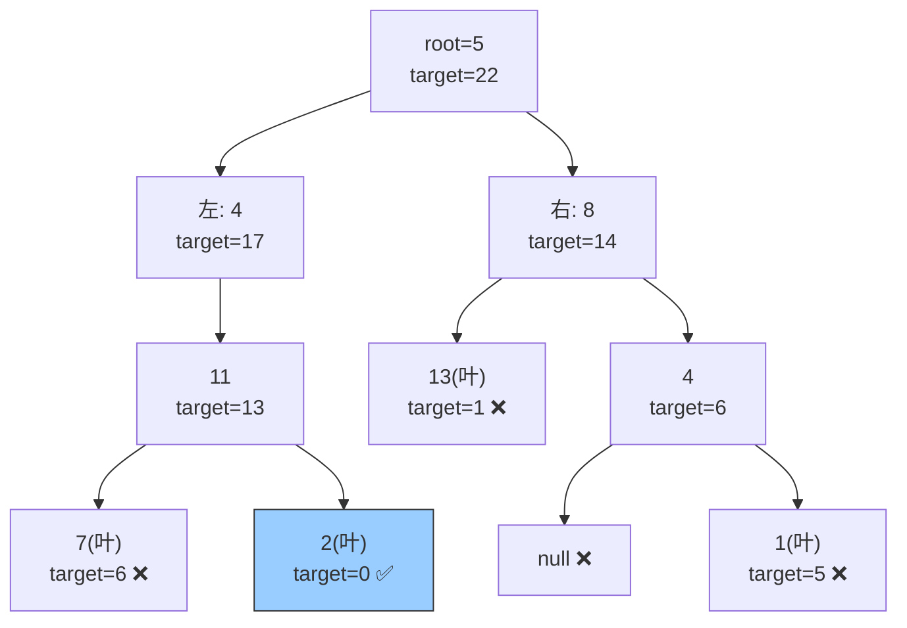

# 112. 路径总和（Path Sum）

> 难度：简单 | 主题：二叉树、DFS

## 题目

给你二叉树的根节点和一个整数 `targetSum`，判断该树中是否存在根节点到叶子节点的路径，这条路径上所有节点值之和等于 `targetSum`。

**示例**
```text
输入：root = [5,4,8,11,null,13,4,7,2,null,null,null,1], targetSum = 22
        5
       / \
      4   8
     /   / \
    11  13  4
   /  \
  7    2
输出：true（路径 5→4→11→2 = 22）
```

---

## 思路

### 先讲个故事：探险家的燃料

你是一个探险家，带着精确的 **22 升燃料**从营地出发（根节点），要到宝藏埋藏点（叶子节点）。

每经过一个区域，必须留下一些燃料作为过路费（节点值）。你需要判断是否存在一条从营地到宝藏的路线，刚好把燃料用完。

**关键规则**：
- 只能在**叶子节点**（没有岔路的地方）结束旅程
- 到了叶子，燃料必须刚好用完
- 不能折返，只能从根往叶子走

---

### 引导式推导：从手算到递归

**第 1 步：从根出发**

```text
targetSum = 22
root = 5
剩余 = 22 - 5 = 17
```

**第 2 步：选择方向**

到 4 还是 8？
```text
走左 → 4，剩余 17 - 4 = 13
走右 → 8，剩余 17 - 8 = 9
```

**第 3 步：继续往下**

```text
走 4 → 到 11，剩余 13 - 11 = 2
     → 到 7（叶子），剩余 2 - 7 = -5 ❌ 超了
     → 到 2（叶子），剩余 2 - 2 = 0 ✅ 找到！
```

**第 4 步：归纳发现**

> 从根到叶子的路径和 = target ⇔ 从根走到某个叶子，沿途减掉所有节点值后刚好等于 0。

```text
hasPathSum(node, target):
    if 是叶子: return target == node.val
    return hasPathSum(node.left, target - node.val) or
           hasPathSum(node.right, target - node.val)
```

**为什么用减法代替加法？**

减法方案更简洁：不需要额外的变量记录当前和，`target` 一路减下去就行。

| 思路 | 做法 | 评价 |
|------|------|------|
| 累加 | 传当前和，到叶子比较 | 需要多传一个参数 |
| **减法** | 传剩余目标，到叶子看是否为 0 | 参数少，终止条件直观 |



---

## 代码

```python
def hasPathSum(self, root, targetSum):
    if not root:
        return False

    # 叶子：判断剩余值是否等于当前节点值
    if not root.left and not root.right:
        return targetSum == root.val

    # 非叶子：递归左右子树，目标值减去当前节点值
    return (self.hasPathSum(root.left, targetSum - root.val) or
            self.hasPathSum(root.right, targetSum - root.val))
```

**注意**：`self.hasPathSum(root.left, targetSum - root.val)` 这一句中，减法在函数调用的参数中完成，当前层的 `targetSum` 不会被修改。这就是"减法 + 递归"的巧妙之处——不需要显式回溯。

---

## 复杂度

| 指标 | 值 | 解释 |
|------|----|------|
| 时间 | O(n) | 最坏遍历所有节点 |
| 空间 | O(h) | 递归栈深度，最坏 O(n) |

---

## 实战考量

### 频率分析

> **出现在**：实践中作为二叉树递归入门题，常见于一面热身。如果回答顺畅，通常会进一步追问 113（输出路径）或 437（任意路径）。

### 延伸思考

**Q：如果要求返回路径本身，怎么做？**
A：用 path 列表记录遍历路径，到叶子时如果和为 target 就加入结果集（113路径总和II）。需要**回溯**：递归前 push，递归后 pop。

**Q：回溯和这里的减法有什么区别？**
A：本题直接用函数参数递归，每层有独立变量拷贝，天然"回溯"。113 题要记录路径，用全局变量必须显式回溯（撤销选择）。

**Q：如果不要求根到叶子，而是任意起点和终点呢？**
A：[[437路径总和III]]，前缀和法 + 哈希表。O(n) 时间，思路基于两数之差。

**Q：BFS 能做吗？**
A：能。用队列存 `(node, remaining)` 进行层序遍历，到叶子时检查 remaining 是否为 0。空间 O(n)，不如 DFS 简洁。

**Q：节点值可以是负数吗？**
A：可以。有负数时不能提前剪枝（即使当前剩余 < 0，后面加负数还可能回到 0），必须遍历所有路径。

### 易错点

- 叶子定义：`not root.left and not root.right`，不是 `root is None`
- 空树（`root = None`）返回 False 而不是 True
- 路径必须从根到**叶子**，不能停在中间节点
- 有负数时不能提前剪枝

---

## 生活类比

> **路径总和 → 登山补给**
>
> 你从大本营（根）出发，带固定量的补给。
> 路上每个营地都会消耗一些补给。
> 你只能在**山顶（叶子）**插旗，如果到达山顶时补给刚好用完，挑战成功。
> 不用回头，一路向下。这就是 **DFS + 减法**。

---

## 相关题目

| 题目 | 关系 |
|------|------|
| 113路径总和II | 输出具体路径（需要回溯） |
| [[437路径总和III]] | 不要求根到叶，任意路径，前缀和 |
| 112路径总和 | 本题 |

---

→ 返回题单：[[LeetCode学习清单#五、二叉树]]
