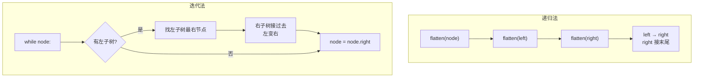

---

title: "二叉树展开为链表"

difficulty: 中等

category: 二叉树

tags:

  - leetcode

  - 二叉树

created: "2026-07-21"

---

# 114. 二叉树展开为链表（Flatten Binary Tree to Linked List）

> 难度：中等 | 主题：二叉树、链表、递归

## 题目

给你二叉树的根节点，请你将它展开为一个单链表。展开后的单链表应该同样使用 TreeNode，其中 right 子指针指向链表中下一个节点，而左子指针始终为 null。展开后的单链表应该与二叉树先序遍历顺序相同。

**示例**

```text

输入：root = [1,2,5,3,4,null,6]

    1

   / \

  2   5

 / \   \

3   4   6

输出：[1,null,2,null,3,null,4,null,5,null,6]

1 → 2 → 3 → 4 → 5 → 6

```

---

## 思路
### 先讲个故事：叠衣服

衣柜里有件衣服皱巴巴的（二叉树），你要把它**熨平**（展开成链表），按**从上到下的顺序**挂好（前序遍历）。

熨平方法：

1. 先把**左袖子**熨平（递归展开左子树）

2. 再把**右袖子**熨平（递归展开右子树）

3. 把左袖子**折到右边**（左子树变右子树）

4. 把原右袖子**接到下面**（接在新右子树的末尾）

每次只处理一个节点，不断重复这个"熨平→折叠→拼接"的操作。

---

### 引导式推导：从例子到算法

**第 1 步：最简单情况——只有一个节点**

```text

root = [1] → 不需要处理

```

**第 2 步：只有左子树**

```text

    1           1

   /      →      \

  2               2

```

把左子树移到右边，左指针置空。

**第 3 步：只有右子树**

```text

    1           1

     \    →      \

      2           2

```

本来就是对的，不动。

**第 4 步：左右都有**

```text

    1             1               1

   / \      →      \      →        \

  2   5             2                2

 / \   \            \                 \

3   4   6            3                 3

                      \                  \

                       4                  4

                                           \

                                            5

                                              \

                                               6

```

过程：

1. 后序递归展开左子树：2 → 3 → 4

2. 后序递归展开右子树：5 → 6

3. 左子树移到右边：`root.right = left`

4. 走到新右子树末尾（节点 4）

5. 原右子树接在末尾：`curr.right = right`

---

### 递归 vs 迭代



两种方法都是 O(n)。递归更直观，迭代空间 O(1)。

---

## 代码
### 递归法（推荐）

```python

def flatten(self, root):

    if not root:

        return

    # 后序：先展开左右子树

    self.flatten(root.left)

    self.flatten(root.right)

    # 保存展开后的左右子树链表头

    left = root.left

    right = root.right

    # 左子树移到右边，左指针置空

    root.left = None

    root.right = left

    # 找到当前链表末尾

    curr = root

    while curr.right:

        curr = curr.right

    # 原右子树接在末尾

    curr.right = right

```

### 迭代法（O(1) 空间）

```python

def flatten(self, root):

    curr = root

    while curr:

        if curr.left:

            # 找左子树的最右节点（前驱）

            pred = curr.left

            while pred.right:

                pred = pred.right

            # 右子树接到前驱后面

            pred.right = curr.right

            # 左子树移到右边，左指针置空

            curr.right = curr.left

            curr.left = None

        curr = curr.right

```

---

## 复杂度

| 指标 | 值 | 解释 |
|------|----|------|
| 时间 | O(n) | 每个节点最多访问两次 |
| 空间（递归） | O(h) | 递归栈深度，最坏 O(n) |
| 空间（迭代） | O(1) | 只用了指针变量 |

---

## 实战考量
### 频率分析

> **出现在**：微软/美团常考的树指针操作题。考察对树遍历的理解和指针/引用操作能力。可能作为前序遍历后的引申题出现。

### 延伸思考

**Q：展开顺序必须是前序吗？如果要求中序或后序呢？**

A：只需要调整递归顺序和拼接逻辑。中序展开：先展左、处理当前、再展右。后序展开：先展左右、再把当前放最后。**遍历顺序 = 展开顺序**。

**Q：递归法和迭代法的主要区别？**

A：递归法后序遍历子树再调整，思路清晰但空间 O(h)。迭代法使用类似 Morris 的思路，遍历过程中直接调整指针，空间 O(1)。

**Q：展开后的链表头在哪里？**

A：就是根节点。展开后 root 的左子树为空，右子树指向下一个节点。

**Q：找最右节点在递归法中会重复遍历吗？**

A：每个节点最多作为"最右节点"被访问一次，总体 O(n)。不是 O(n²)。

**Q：和 206反转链表 的思路有什么异同？**

A：206 是纯链表指针反转，114 是把树结构重组成链表。两者都是在原地调整指针。

### 易错点

- 先存 left/right 引用再操作，避免指针丢失

- 找最右节点的循环终止条件是 `while curr.right`，不是 `while curr`

- 递归法用后序遍历顺序：先子节点，后父节点

- 左子树展开后会变成一个没有分支的链表，所以找最右节点时只需一直 right

---

## 生活类比

> **二叉树 → 链表**

>

> 像把一棵圣诞树拆成一串彩灯——从树顶开始，把所有灯泡按顺序串在一根线上。

>

> 递归法：先把左树枝拆成串，再把右树枝拆成串，然后把左串搭在树顶的右边，右串挂在左串末尾。

>

> 迭代法：每次看到左边有分叉，就把右边的所有线整段挪到左边最下面，然后把左边那根竖起来当主线。

---

## 相关题目

| 题目 | 关系 |
|------|------|
| 144二叉树的前序遍历 | 展开结果 = 前序遍历顺序 |
| 206反转链表 | 纯链表反转基础 |
| 143重排链表 | 同是链表重组操作 |
| 114二叉树展开为链表 | 本题 |

---

→ 返回题单：[[LeetCode学习路线图#五、二叉树]]

## 速记卡（面试闪卡）

**Q1：一句话讲清「114. 二叉树展开为链表（Flatten Binary Tree to Linked List）」到底是什么？**

A：把二叉树原地展开成单链表，顺序与先序遍历相同、左指针全置空。

**Q2：思路 —— 怎么理解？**

A：像熨平衣服：递归展开左右子树，再把左串折到右、接上原右串（Flatten，展开）。

**Q3：代码 —— 怎么理解？**

A：递归法后序调整指针；迭代法找左子树最右节点接右子树（Morris-style，类 Morris）。

**Q4：复杂度 —— 怎么理解？**

A：时间 O(n) 每节点最多访问两次；递归空间 O(h)、迭代 O(1)（Tree Traversal，树遍历）。

**Q5：实战考量 —— 怎么理解？**

A：微软美团常考指针操作，可能作先序遍历引申题（In-place Restructure，原地重组）。

**Q6：核心速记主线有哪些？**

- 展开顺序 = 先序遍历顺序

- 递归：先展左右，左移右、右接末尾

- 迭代：找左子树最右节点，右边整段挪过去

- 先存 left/right 引用，避免指针丢失

**口诀**

A：二叉树展成链

先序顺序摆成线

左折右接莫慌乱

指针存好不丢链

## 相关链接

- [[笔记/Leetcode笔记/05_二叉树/226翻转二叉树|翻转二叉树]]

- [[笔记/Leetcode笔记/05_二叉树/101对称二叉树|对称二叉树]]

- [[笔记/Leetcode笔记/05_二叉树/144二叉树的前序遍历|二叉树的前序遍历]]

- [[笔记/Leetcode笔记/05_二叉树/110平衡二叉树|平衡二叉树]]

- [[笔记/Leetcode笔记/05_二叉树/145二叉树的后序遍历|二叉树的后序遍历]]

