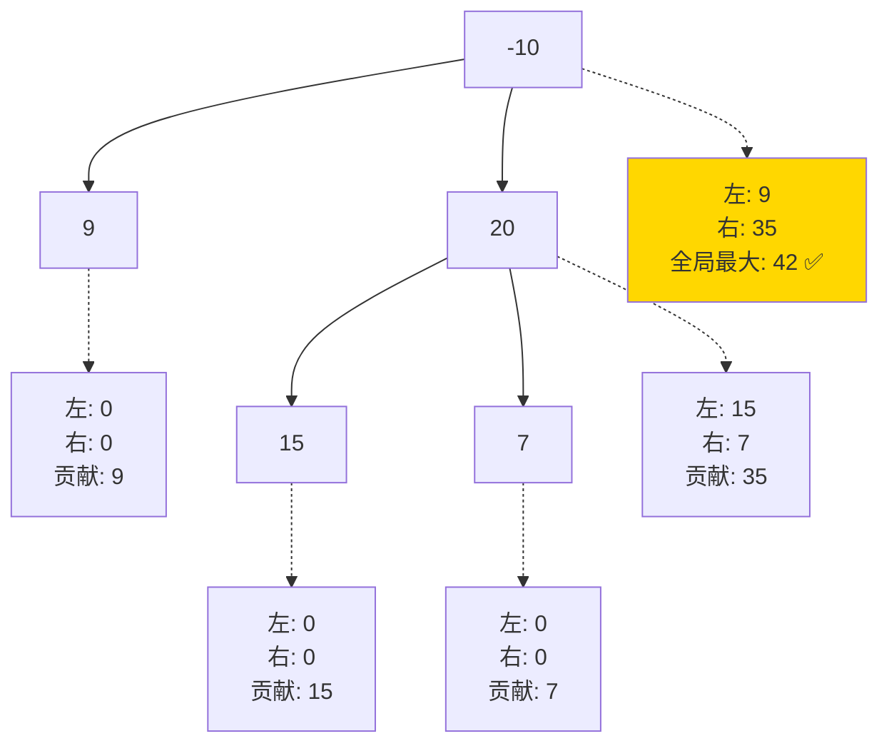

# 124. 二叉树中的最大路径和（Binary Tree Maximum Path Sum）

> 难度：困难 | 主题：二叉树、DFS、递归 ⭐常考

---

## 题目

路径被定义为一条从树中任意节点出发，沿父节点-子节点连接，达到任意节点的序列。该路径至少包含一个节点，且不一定经过根节点。求最大路径和。

**示例**
```text
输入：root = [-10,9,20,null,null,15,7]
输出：42
解释：路径 15 -> 20 -> 7 的和最大，为 42
```

---

## 思路

### 先讲个故事：快递站的包裹分拣

你经营一家快递站，每个分拣员（节点）手里都有一个包裹（节点值）。你要找出一条路线，把沿途包裹**串起来**，让总价值最大。

**关键约束**：分拣员只能同时走一条传送带——如果从左边接了包裹，又接了右边，那就只能停在当前节点，不能继续往上传了。

通俗说：每个节点可以做"拐点"（左右都接），但向上汇报时只能选一边。

---

### 引导式推导：从局部最大值到全局

**核心洞察：路径可以不经过根节点**

以每个节点为「拐点」的最大路径 = 左子树贡献 + 节点值 + 右子树贡献。但向上返回时只能选一侧（不能分叉）。

**第 1 步：后序遍历走起**

后序 DFS 的天然优势：先知道左右子树的结果，再决定当前节点怎么做。

```text
对每个节点 root：

left_gain = max(dfs(root.left), 0)     # 左子树能提供的最大贡献（负数不选）
right_gain = max(dfs(root.right), 0)   # 右子树能提供的最大贡献（负数不选）

当前拐点路径和 = root.val + left_gain + right_gain
→ 更新全局最大值

向上返回 = root.val + max(left_gain, right_gain)
→ 只能选一边，因为路径不能分叉往上传
```

**为什么左/右贡献取 max(0, ...)？**
因为负贡献只会让路径和变小。好比快递员说"我这边包裹是负价值"——你当然选择不接。



节点 20 作为拐点的路径 = 15 + 20 + 7 = 42。
但它向上返回时只能选 max(15, 7) + 20 = 35 给父节点 -10。

---

## 代码

```python
def maxPathSum(self, root):                 # 主函数：计算最大路径和
    self.max_sum = float('-inf')                # 全局最大值，用 -inf 确保全负数也能正确

    def dfs(node):                              # 返回以 node 为端点的单边最大贡献
        if not node:                            # 空节点贡献 0
            return 0

        left_gain = max(dfs(node.left), 0)      # 后序：左子树贡献，负数当 0
        right_gain = max(dfs(node.right), 0)    # 后序：右子树贡献，负数当 0

        # 以当前节点为拐点的路径和 = 左 + 自己 + 右
        current_path_sum = node.val + left_gain + right_gain
        self.max_sum = max(self.max_sum, current_path_sum)

        # 返回给父节点：只能选一边，不能分叉
        return node.val + max(left_gain, right_gain)

    dfs(root)
    return self.max_sum
```

---

## 复杂度

| 指标 | 值 | 解释 |
|------|----|------|
| 时间 | O(n) | 每个节点访问一次 |
| 空间 | O(h) | 递归栈深度，h 为树高，最坏 O(n) |

---

## 关键点

- `max(gain, 0)`：负数贡献不选，相当于不走那条分支
- 返回给父节点的只能选一边（`max(left, right)`），路径不能分叉
- 全局最大值可能在任意节点处更新，不一定是根节点
- 初始化为 `-inf` 很重要，全负数时也能正确返回（比如全 -1，最大路径就是最大的那个节点值）

---

## 实战考量

### 频率分析

> **出现在**：字节/美团/快手 二~三面困难高频题。考察后序 DFS 和递归返回值设计的理解。约 30% 的 Agent 会用到这个"全局变量 + 后序"模式。

### 延伸思考

**Q：为什么这道题要用后序遍历？**
A：因为需要先知道左右子树的结果，才能计算以当前节点为拐点的路径和。前序和中序都做不到——你得先处理孩子再处理爹。

**Q：如果要求返回路径本身呢？**
A：额外记录最大路径的端点，或者用类似"直径"题的做法，在更新最大值时同时保存路径节点。

**Q：如果边有权值而不是节点有权值呢？**
A：思路一样，只是加的是边权不是点权。后序 DFS 时返回的是"从当前节点出发走某一边能获得的最大路径和"。

**Q：全负数的情况怎么办？**
A：`max_sum` 初始化为 `-inf`，负数贡献取 `max(..., 0)`。这样每个节点至少考虑自己本身的值（因为 left_gain 和 right_gain 都取 0 时，拐点路径和 = node.val 本身）。

### 易错点

- 返回给父节点的只能选一边——写成了 `left + right + node.val` 向上返回就毁了
- 负数贡献取 0 而不是直接取负数结果
- `max_sum` 初始值是 `-inf` 不是 0（全负数时 0 就错了）
- 递归调用顺序：先 dfs 左右子树，再更新 max_sum

---

## 生活类比

> **最大路径和 → 快递分拣 → 后序遍历**
>
> 每个站点既要考虑"在我这拐弯能不能赚更多"（更新全局），
> 又要考虑"往上传该走哪条路"（返回单边最大值）。
>
> 就像快递分拣员：左手接一包、右手接一包，可以合成一个大单（拐点），
> 但往总站送的时候只能选最重的那包走。

---

## 相关题目

| 题目 | 关系 |
|------|------|
| 104二叉树的最大深度 | 后序递归基础，只返回单边，不更新全局 |
| [[543二叉树的直径]] | 同类全局变量技巧，"拐点"思路相同 |
| [[437路径总和III]] | 也是路径问题，但用前缀和 + DFS |

---

→ 返回题单：[[LeetCode学习清单#五、二叉树]]
