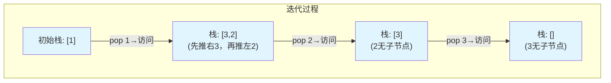

# 144. 二叉树的前序遍历（Binary Tree Preorder Traversal）

> 难度：简单 | 主题：二叉树、DFS、栈、Morris遍历

## 题目

给你二叉树的根节点 root，返回它节点值的前序遍历。

**示例**
```text
输入：root = [1,null,2,3]
输出：[1,2,3]
```

---

## 思路

### 先讲个故事：公司层层汇报

你是 CEO，要听全公司的汇报。规矩是：**每个部门经理先汇报自己，再让左团队汇报，最后让右团队汇报。**

这就是前序遍历——根 → 左 → 右。

从 CEO（根）开始：
1. CEO 先讲
2. 左部门经理讲 → 左部门的下属依次
3. 右部门经理讲 → 右部门的下属依次

---

### 引导式推导：从递归到迭代

**第 1 层：递归（最直观）**

```python
def preorder(root):
    if not root: return
    print(root.val)           # 先处理根
    preorder(root.left)       # 再遍历左
    preorder(root.right)      # 最后遍历右
```

三行代码，和文字描述一一对应。但递归深度 = 树高，树特别深时会栈溢出。

**第 2 层：迭代（用栈模拟递归）**

递归底层就是系统调用栈。我们自己维护一个栈，手动控制入栈出栈。

**关键技巧**：栈是 LIFO（后进先出），所以入栈时要先右后左——这样左孩子就会在栈顶，先被弹出。



**第 3 层：Morris 遍历（O(1) 空间）**

利用树的大量空闲右指针做线索，遍历完恢复原状。了解即可，不常考。

| 解法 | 时间 | 空间 | 推荐度 |
|------|------|------|--------|
| **迭代（推荐）** | O(n) | O(h) | ⭐⭐⭐⭐⭐ |
| 递归 | O(n) | O(h) | ⭐⭐⭐⭐ |
| Morris | O(n) | O(1) | ⭐⭐ |

---

## 代码

```python
# 迭代（推荐写法）
def preorderTraversal(self, root):      # 主函数：前序遍历 根-左-右
    if not root:
        return []

    result = []
    stack = [root]

    while stack:
        node = stack.pop()
        result.append(node.val)         # 前序：先访问根

        if node.right:
            stack.append(node.right)    # 右先入栈
        if node.left:
            stack.append(node.left)     # 左后入栈 → 左先出

    return result

# 递归（最直观）
def preorderTraversal(self, root):
    result = []

    def dfs(node):
        if not node:
            return
        result.append(node.val)         # 根
        dfs(node.left)                  # 左
        dfs(node.right)                 # 右

    dfs(root)
    return result

# Morris 遍历（O(1)空间，了解即可）
def preorderTraversal(self, root):
    result = []
    curr = root

    while curr:
        if curr.left:
            predecessor = curr.left
            while predecessor.right and predecessor.right != curr:
                predecessor = predecessor.right

            if not predecessor.right:
                result.append(curr.val)
                predecessor.right = curr
                curr = curr.left
            else:
                predecessor.right = None
                curr = curr.right
        else:
            result.append(curr.val)
            curr = curr.right

    return result
```

---

## 复杂度

| 指标 | 值 | 解释 |
|------|----|------|
| 时间 | O(n) | 每个节点访问一次 |
| 空间（迭代/递归） | O(h) | 栈深度 = 树高 |
| 空间（Morris） | O(1) | 利用空闲指针，不额外开栈 |

---

## 关键点

- 迭代栈：**右孩子先入、左孩子后入**，保证左先出
- Morris 遍历的核心是找「前驱节点」（左子树最右节点），通过临时右指针线索化
- 递归最简洁，但考迭代是为了考察你对递归底层实现（栈）的理解
- 三种 DFS 遍历的迭代写法中，前序最简单

---

## 实战考量

### 频率分析

> **出现在**：几乎所有 AI Agent 的二叉树开场题。这道题先确认写过树的遍历，再进入更复杂的题。迭代版是重点考核点。

### 延伸思考

**Q：递归和迭代的本质区别是什么？**
A：递归用系统调用栈（隐式），迭代用显式栈。本质一模一样——都是 DFS，只是栈的维护方式不同。

**Q：Morris 遍历为什么能做到 O(1) 空间？**
A：利用树的空闲右指针做线索，遍历完再恢复原状。不额外开栈，所以 O(1)。代价是遍历过程中会临时修改树的结构。

**Q：如果树很深，递归会栈溢出，怎么办？**
A：改用迭代（显式栈），或增加系统栈深度限制。Python 默认递归深度 ~1000。

**Q：前序、中序、后序的迭代写法有什么区别？**
A：前序最简（出栈即访问）；中序需要一直往左走到头再访问；后序可以用前序变形 + 反转来取巧。

### 易错点

- 迭代时右孩子先入栈，不是左孩子先入
- Morris 遍历时 `predecessor.right != curr` 防止死循环
- 递归终止条件不要漏掉空节点

---

## 生活类比

> **前序遍历 → 公司汇报 → 迭代栈**
>
> CEO（根节点）先讲自己的事儿，再让左团队讲、最后让右团队讲。
> 用栈模拟就像在看板上钉便签：先钉右团队的（钉下面），再钉左团队的（钉上面），
> 这样每次揭便签时左团队先被揭——先左后右。

---

## 相关题目

| 题目 | 关系 |
|------|------|
| 94二叉树的中序遍历 | DFS 遍历同族，左-根-右 |
| 145二叉树的后序遍历 | DFS 遍历同族，左-右-根 |
| 102二叉树的层序遍历 | BFS 层序，按层遍历 |

---

→ 返回题单：[[LeetCode学习清单#五、二叉树]]

## 速记卡（面试闪卡）

**Q1：一句话讲清「144. 二叉树的前序遍历（Binary Tree Preorder Traversal）」到底是什么？**
A：给你二叉树的根节点 root，返回它节点值的前序遍历。
**示例**
---

**Q2：题目 —— 怎么理解？**
A：给你二叉树的根节点 root，返回它节点值的前序遍历。
**示例**
---

**Q3：思路 —— 怎么理解？**
A：你是 CEO，要听全公司的汇报。规矩是：**每个部门经理先汇报自己，再让左团队汇报，最后让右团队汇报。**
这就是前序遍历——根 → 左 → 右。
从 CEO（根）开始：
CEO 先讲
左部门经理讲 → 左部门的下属依次
右部门经理讲 → 右部门的下属依次
---
**第 1 层：递归（最直观）**
三行代码，和文字描述一一对应。但递归深度 = 树高，树特别深时会栈溢出。

**Q4：代码 —— 怎么理解？**
A：---

**Q5：复杂度 —— 怎么理解？**
A：| 指标 | 值 | 解释 |
|------|----|------|
| 时间 | O(n) | 每个节点访问一次 |
| 空间（迭代/递归） | O(h) | 栈深度 = 树高 |
| 空间（Morris） | O(1) | 利用空闲指针，不额外开栈 |
---

**Q6：核心速记主线有哪些？**
A：抓住这几根：题目、思路、代码、复杂度、关键点、实战考量。

