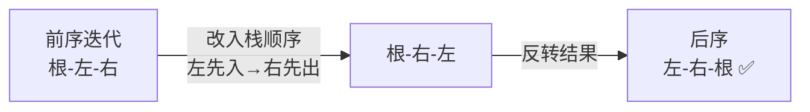

# 145. 二叉树的后序遍历（Binary Tree Postorder Traversal）

> 难度：简单 | 主题：二叉树、DFS、栈

## 题目

给你一棵二叉树的根节点 root，返回其节点值的后序遍历。

**示例**
```text
输入：root = [1,null,2,3]
输出：[3,2,1]
```

---

## 思路

### 先讲个故事：年会收摊

公司年会结束，你要收桌椅。规矩是：**先收左边的桌椅，再收右边的桌椅，最后收自己部门的桌椅。**

这就是后序遍历——左 → 右 → 根。

为什么最后收自己的？因为你得先把所有下属的东西收完，才知道自己的东西往哪儿放。

---

### 引导式推导：前序变后序

**第 1 层：递归（最直观）**

```python
def postorder(root):
    if not root: return
    postorder(root.left)      # 先左
    postorder(root.right)     # 再右
    print(root.val)           # 最后根
```

**第 2 层：迭代——取巧思路**

后序是「左-右-根」。「根-右-左」反转一下就是「左-右-根」。

而「根-右-左」怎么写？把前序「根-左-右」的入栈顺序改一下：左先入栈、右后入栈，得到的就是「根-右-左」。



三步走：
1. 按「根-右-左」遍历（前序改入栈顺序）
2. 结果存列表
3. 反转 → 得到「左-右-根」

**第 3 层：双栈法（原理一样）**

两个栈：stack1 做遍历，stack2 收集结果。stack2 弹出顺序自然就是后序。

| 解法 | 时间 | 空间 | 推荐度 |
|------|------|------|--------|
| **前序变形 + 反转（推荐）** | O(n) | O(n) | ⭐⭐⭐⭐⭐ |
| 双栈法 | O(n) | O(n) | ⭐⭐⭐ |
| 递归 | O(n) | O(h) | ⭐⭐⭐⭐ |

---

## 代码

```python
# 方法1：前序变形 + 反转（推荐，最简洁）
def postorderTraversal(self, root):      # 主函数：后序遍历 左-右-根
    if not root:
        return []

    result = []
    stack = [root]

    while stack:
        node = stack.pop()
        result.append(node.val)          # 先得到 根-右-左

        if node.left:                    # 左先入栈（后出）
            stack.append(node.left)
        if node.right:                   # 右后入栈（先出）
            stack.append(node.right)

    return result[::-1]                  # 反转 → 左-右-根

# 方法2：双栈法
def postorderTraversal(self, root):
    if not root:
        return []

    stack1 = [root]
    stack2 = []

    while stack1:
        node = stack1.pop()
        stack2.append(node)              # 压入 stack2

        if node.left:
            stack1.append(node.left)
        if node.right:
            stack1.append(node.right)

    result = []
    while stack2:
        result.append(stack2.pop().val)  # 弹出顺序 = 左-右-根

    return result

# 递归
def postorderTraversal(self, root):
    result = []

    def dfs(node):
        if not node:
            return
        dfs(node.left)                   # 左
        dfs(node.right)                  # 右
        result.append(node.val)          # 根

    dfs(root)
    return result
```

---

## 复杂度

| 指标 | 值 | 解释 |
|------|----|------|
| 时间 | O(n) | 每个节点访问一次，反转也是 O(n) |
| 空间 | O(n) | 栈空间 + 结果数组 |

---

## 关键点

- **前序变形法**：前序是「根-左-右」，改入栈顺序得「根-右-左」，反转得「左-右-根」
- **双栈法**：stack2 的压入顺序是「根-左-右」（stack1 弹出根后左右入 stack1 再弹出），所以 stack2 弹出是「左-右-根」
- 两种方法本质一样，前序变形用数组反转代替了第二个栈

---

## 实战考量

### 频率分析

> **出现在**：较少单独考，通常和 94 中序、144 前序组合考"请写出三种遍历的迭代版"。后序迭代在三者中最复杂，能写出来是进阶亮点。

### 延伸思考

**Q：后序迭代为什么比前序复杂？**
A：因为根节点要在左右都访问完才能输出，而前序根可以先输出。迭代时要处理"根最后输出"的顺序约束。

**Q：不用反转/双栈，单栈能实现后序吗？**
A：可以，但需要记录每个节点是否已访问右子树（加一个 visited 标记或用前驱指针）。代码较复杂，不推荐，知道前序变形法就够了。

**Q：Morris 后序能做吗？**
A：可以，但比前序和中序的 Morris 复杂得多，要加虚拟根节点，一般不要求。

**Q：后序遍历有什么实际应用？**
A：最常见的就是 124（二叉树最大路径和）、543（二叉树直径）这类需要先知道子树结果才能算父节点的题——后序就是为这种场景设计的。

### 易错点

- 前序变形时**左孩子先入栈**（和正常前序相反）
- 反转用 `result[::-1]`，不是 `reverse()`（后者 in-place 不返回）
- 递归版注意顺序是左-右-根

---

## 生活类比

> **后序遍历 → 年会收摊 → 前序变形**
>
> 收摊时先收左边的椅子，再收右边的椅子，最后收自己的桌子。
> 为什么能取巧用反转？就像你把收桌子的顺序反过来拍照：
> 从 root 拍一张「根-右-左」的照片，底片反转冲洗，就是「左-右-根」。

---

## 相关题目

| 题目 | 关系 |
|------|------|
| 144二叉树的前序遍历 | DFS 同族，根-左-右 |
| 94二叉树的中序遍历 | DFS 同族，左-根-右 |

---

→ 返回题单：[[LeetCode学习清单#五、二叉树]]
