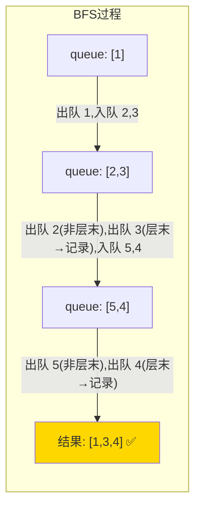
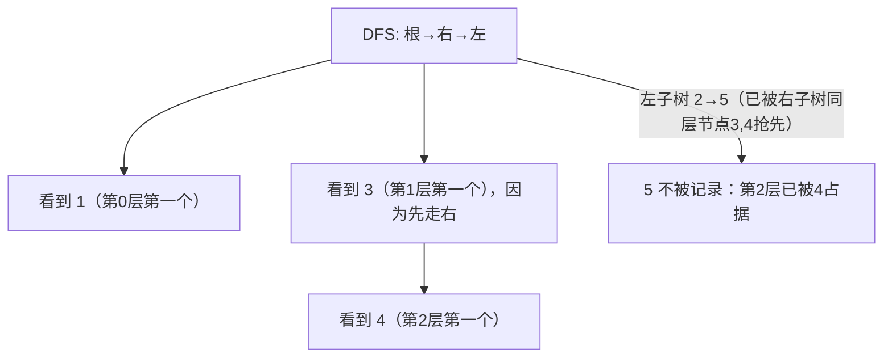

# 199. 二叉树的右视图（Binary Tree Right Side View）

> 难度：中等 | 主题：二叉树、BFS、DFS ⭐常考

---

## 题目

给定一个二叉树的根节点，按照从顶部到底部的顺序，返回从右侧所能看到的节点值。

**示例**
```text
输入：root = [1,2,3,null,5,null,4]
输出：[1,3,4]
解释：
    1            ← 看到 1
   / \
  2   3          ← 看到 3
   \   \
    5   4        ← 看到 4
```

---

## 思路

### 先讲个故事：电影院座位

你坐在电影院的**最右边过道**，每一排只能看到最右边那个人，前面的人挡不住你——你要记下每一排最右边的人是谁。

这就是右视图——每层最右边的节点。

---

### 引导式推导：从 BFS 到 DFS

**第 1 层：BFS（层序遍历）——最直观**

BFS 天然按层遍历。每层从左到右访问节点，我们只取每层最后一个节点值。

```text
第 1 层：[1]           → 取 1
第 2 层：[2, 3]        → 取 3
第 3 层：[5, 4]        → 取 4
```



**第 2 层：DFS（先右后左）——更巧妙**

按「根→右→左」的顺序 DFS，每层第一个访问到的节点就是该层的右视图节点。

为什么？因为先走右子树，右子树那层第一个被访问的就是最右边的节点。



| 解法 | 时间 | 空间 | 推荐度 |
|------|------|------|--------|
| **BFS（推荐）** | O(n) | O(w) | ⭐⭐⭐⭐⭐ |
| DFS 先右后左 | O(n) | O(h) | ⭐⭐⭐⭐ |

---

## 代码

```python
# BFS 法（推荐写法）
def rightSideView(self, root):              # 主函数：右视图 = 每层最右节点
    if not root:
        return []

    result = []
    queue = [root]

    while queue:
        level_size = len(queue)             # 当前层节点数

        for i in range(level_size):
            node = queue.pop(0)

            if i == level_size - 1:         # 当前层最后一个节点
                result.append(node.val)

            if node.left:
                queue.append(node.left)
            if node.right:
                queue.append(node.right)

    return result

# DFS 法（先右后左）
def rightSideView(self, root):
    result = []

    def dfs(node, depth):
        if not node:
            return
        if depth == len(result):            # 当前深度第一次到达
            result.append(node.val)         # 先右后左，第一个就是右视图

        dfs(node.right, depth + 1)          # 先走右
        dfs(node.left, depth + 1)           # 再走左

    dfs(root, 0)
    return result
```

---

## 复杂度

| 指标 | 值 | 解释 |
|------|----|------|
| 时间 | O(n) | 每个节点访问一次 |
| 空间（BFS） | O(w) | w 是树的最大宽度 |
| 空间（DFS） | O(h) | h 是树高 |

---

## 关键点

- BFS 版：和层序遍历几乎一样，只是每层只取最后一个节点
- `i == level_size - 1` 判断当前节点是否是该层最后一个
- DFS 版：按「根→右→左」顺序遍历，每层第一个访问的节点即为该层右视图
- BFS 用 `deque` 优化 pop(0) 的 O(n) 开销

---

## 实战考量

### 频率分析

> **出现在**：字节/美团 二面 BFS 变体题。不考裸 BFS，而是考你"能不能改一下层序遍历来解决新问题"。

### 延伸思考

**Q：左视图怎么做？**
A：每层取第一个节点（`i == 0`）。BFS 版只需改判断条件；DFS 版先走左再走右。

**Q：底部视图（Bottom View）呢？**
A：按列分组（用列号做 key），每列取最下面的节点。需要层序遍历或带列号的 DFS。

**Q：DFS 法为什么用 `depth == len(result)` 判断？**
A：因为先遍历右子树，同层中右子树节点先被访问。`depth == len(result)` 说明这一层还没有节点被记录过，当前节点就是该层最右节点。

**Q：BFS 用 list pop(0) 是 O(n) 的，怎么优化？**
A：用 `collections.deque`，`popleft()` 是 O(1)。实践中可以提这点，展示你对数据结构的熟悉。

### 易错点

- 忘记处理空树
- `i` 从 0 开始，最后一个判断是 `level_size - 1` 不是 `level_size`
- DFS 法注意先递归 `right` 再 `left`

---

## 生活类比

> **右视图 → 电影院座位 → BFS**
>
> 你站在影院最右侧过道，每一排只能看到最右边那个人。
> BFS 就是逐排扫过去，每排只记最后一个面孔。
> DFS 则是"优先看右边通道的人"——只要右边有人，左边那排就看不见了。

---

## 相关题目

| 题目 | 关系 |
|------|------|
| 102二叉树的层序遍历 | BFS 基础版，右视图就是层序遍历每层取最后一个 |
| 103二叉树的锯齿形层序遍历 | BFS 变体，交替方向 |

---

→ 返回题单：[[LeetCode学习清单#五、二叉树]]

## 速记卡（面试闪卡）

**Q1：一句话讲清「199. 二叉树的右视图（Binary Tree Right Side View）」到底是什么？**
A：给定一个二叉树的根节点，按照从顶部到底部的顺序，返回从右侧所能看到的节点值。
**示例**
---

**Q2：题目 —— 怎么理解？**
A：给定一个二叉树的根节点，按照从顶部到底部的顺序，返回从右侧所能看到的节点值。
**示例**
---

**Q3：思路 —— 怎么理解？**
A：你坐在电影院的**最右边过道**，每一排只能看到最右边那个人，前面的人挡不住你——你要记下每一排最右边的人是谁。
这就是右视图——每层最右边的节点。
---
**第 1 层：BFS（层序遍历）——最直观**
BFS 天然按层遍历。每层从左到右访问节点，我们只取每层最后一个节点值。
**第 2 层：DFS（先右后左）——更巧妙**
按「根→右→左」的顺序 DFS，每层第一个访问到的节点就是该层的右视图节点。

**Q4：代码 —— 怎么理解？**
A：---

**Q5：复杂度 —— 怎么理解？**
A：| 指标 | 值 | 解释 |
|------|----|------|
| 时间 | O(n) | 每个节点访问一次 |
| 空间（BFS） | O(w) | w 是树的最大宽度 |
| 空间（DFS） | O(h) | h 是树高 |
---

**Q6：核心速记主线有哪些？**
A：抓住这几根：题目、思路、代码、复杂度、关键点、实战考量。

