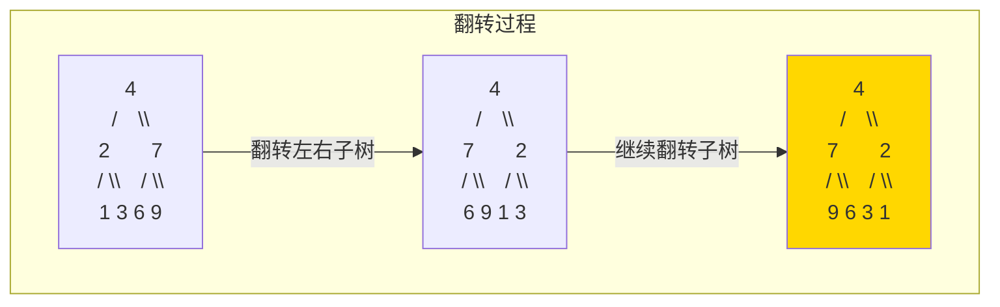

# 226. 翻转二叉树（Invert Binary Tree）

> 难度：简单 | 主题：二叉树、递归、DFS

## 题目

给你一棵二叉树的根节点 root，翻转这棵二叉树，并返回其根节点。

**示例**
```text
输入：root = [4,2,7,1,3,6,9]
输出：[4,7,2,9,6,3,1]

翻转前：
    4
   / \
  2   7
 / \ / \
1  3 6  9

翻转后：
    4
   / \
  7   2
 / \ / \
9  6 3  1
```

---

## 思路

### 先讲个故事：照镜子

你站在镜子前举起左手，镜子里的人举起的是右手。翻转二叉树就是给每一棵子树照镜子——**交换每个节点的左右孩子**。

---

### 引导式推导：递归三行

**核心操作**：对每个节点，交换左右孩子。

递归三步：
1. **终止**：空节点返回 None
2. **递归**：先翻转左子树，再翻转右子树（后序），或者先交换再递归（前序）
3. **当前层**：交换左右孩子



**前序 vs 后序**：
- **后序**：先递归翻转子树，再交换当前节点。更符合直觉："先把下面的都翻好，我再换"
- **前序**：先交换当前节点，再递归翻转子树。也行，但理解起来绕一点

建议用**后序**，逻辑更清晰。

| 解法 | 时间 | 空间 | 推荐度 |
|------|------|------|--------|
| **递归（推荐）** | O(n) | O(h) | ⭐⭐⭐⭐⭐ |
| 迭代（栈） | O(n) | O(h) | ⭐⭐⭐ |

---

## 代码

```python
# 递归（推荐，推荐写法）
def invertTree(self, root):                 # 主函数：翻转二叉树
    if not root:                                # 终止：空节点不用翻
        return None

    # 后序：先翻转左右子树，再交换
    left = self.invertTree(root.left)
    right = self.invertTree(root.right)

    root.left = right                           # 交换：左接右
    root.right = left                           # 右接左

    return root                                 # 返回翻转后的根

# 迭代：用栈模拟 DFS
from collections import deque

def invertTree(self, root):                 # 主函数：迭代版翻转
    if not root:
        return None

    stack = deque([root])

    while stack:
        node = stack.pop()
        # 交换当前节点的左右孩子
        node.left, node.right = node.right, node.left

        if node.left:
            stack.append(node.left)
        if node.right:
            stack.append(node.right)

    return root
```

---

## 复杂度

| 指标 | 值 | 解释 |
|------|----|------|
| 时间 | O(n) | 每个节点访问一次，交换一次 |
| 空间 | O(h) | 递归栈/迭代栈深度，最坏 O(n)，平衡树 O(log n) |

---

## 关键点

- 递归终止条件不能忘：空节点返回 None
- 交换左右孩子可以在递归前（前序）或递归后（后序），推荐后序
- 不能写成 `root.left = self.invertTree(root.right)` 同时直接递归，会重复翻转

---

## 实战考量

### 频率分析

> **出现在**：经典开场题。这道题常用来考察递归三要素（终止条件、递归调用、当前层操作）。写对了说明你有递归思维。

### 延伸思考

**Q：递归改成迭代怎么写？**
A：用栈模拟 DFS 或队列做 BFS。核心逻辑不变——遇到节点就交换左右孩子。

**Q：交换左右孩子时，是先递归还是先交换？**
A：都可以，但推荐先递归翻转子树再交换（后序）。逻辑更自然：先把下面翻好，我再来换。

**Q：如果只翻转奇数层的节点呢？**
A：加一个 depth 参数，奇数层交换，偶数层不动。

**Q：这题和对称二叉树有什么区别？**
A：翻转是"操作"（修改树结构），对称是"判断"（只比较不修改）。翻转是把树变成自己的镜像，对称是判断两棵树是否互为镜像。

### 易错点

- 不要写成 `root.left = self.invertTree(root.right)` 且在同一层用 `root.right = self.invertTree(root.left)`——此时 root.left 已经被改了
- 用 `root.left, root.right = root.right, root.left` 并行赋值最安全
- 递归终止条件别漏

---

## 生活类比

> **翻转二叉树 → 照镜子 → 递归交换**
>
> 翻转一棵树，就是让每个节点都照镜子。
> 后序版本的口诀：**先把左右孩子送进镜子间（递归翻转），然后让它们站到对方的位置上（交换）。**
> 就像公司换座位：先让左右两个团队各自内部重新排好座，再让两个团队的经理互换位置。

---

## 相关题目

| 题目 | 关系 |
|------|------|
| 101对称二叉树 | 判断两棵树是否镜像（只读，不改） |
| 104二叉树的最大深度 | 同款递归结构 |

---

→ 返回题单：[[LeetCode学习清单#五、二叉树]]

## 速记卡（面试闪卡）

**Q1：一句话讲清「226. 翻转二叉树（Invert Binary Tree）」到底是什么？**
A：给你一棵二叉树的根节点 root，翻转这棵二叉树，并返回其根节点。
**示例**
---

**Q2：题目 —— 怎么理解？**
A：给你一棵二叉树的根节点 root，翻转这棵二叉树，并返回其根节点。
**示例**
---

**Q3：思路 —— 怎么理解？**
A：你站在镜子前举起左手，镜子里的人举起的是右手。翻转二叉树就是给每一棵子树照镜子——**交换每个节点的左右孩子**。
---
**核心操作**：对每个节点，交换左右孩子。
递归三步：
**终止**：空节点返回 None
**递归**：先翻转左子树，再翻转右子树（后序），或者先交换再递归（前序）
**当前层**：交换左右孩子
**前序 vs 后序**：
**后序**：先递归翻转子树，再交换当前节点。

**Q4：代码 —— 怎么理解？**
A：---

**Q5：复杂度 —— 怎么理解？**
A：| 指标 | 值 | 解释 |
|------|----|------|
| 时间 | O(n) | 每个节点访问一次，交换一次 |
| 空间 | O(h) | 递归栈/迭代栈深度，最坏 O(n)，平衡树 O(log n) |
---

**Q6：核心速记主线有哪些？**
A：抓住这几根：题目、思路、代码、复杂度、关键点、实战考量。

