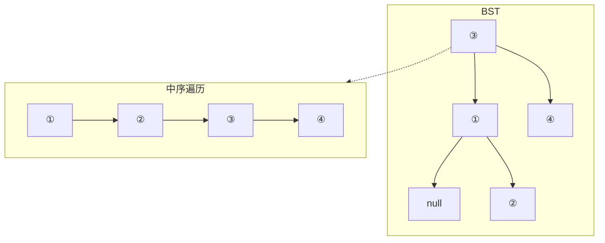
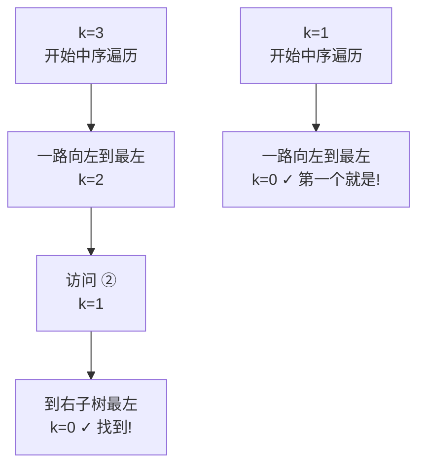

# 230. 二叉搜索树中第K小的元素（Kth Smallest Element in a BST）

> 难度：中等 | 主题：二叉树、BST、中序遍历

## 题目

给定一个二叉搜索树的根节点，找出其中第 k 小的元素（1 ≤ k ≤ 二叉树元素个数）。

**示例：**
```text
输入：root = [3,1,4,null,2], k = 1
输出：1
```

---

## 思路

### 先讲个故事：图书馆的书架

想象你去图书馆找**第 k 本按字母顺序排列的书**。这个图书馆的规矩很特别：

> 每本书左边的书架全是字母比它小的书，右边的书架全是字母比它大的书。
> 这恰好就是 BST 的性质——左子树 < 根 < 右子树。

你想找「第 3 小的书」，按什么顺序走？**先向左走到头，那是第一本**，然后往回数。

这个「先左→根→右」的顺序就是**中序遍历**——BST 的中序遍历就是升序序列。

---

### 引导式推导：从小规模到最优

**直观方案：中序遍历收集**

BST 最核心的性质：**中序遍历 = 升序序列**。



中序遍历节点顺序：① → ② → ③ → ④。第 k 个访问到的就是答案。

**问题**：如果 k=1，你还是要遍历完整棵树吗？不需要。找到答案就可以停。

**优化：提前终止**

中序遍历时带一个计数器，减到 0 就停。



**更进一步**：如果频繁查询不同 k 值呢？

预处理中序列表 O(n)，之后查询 O(1)。如果树会动态变化，那就在每个节点维护左子树大小——二分查找第 k 小，O(h) 时间。

---

### 优化递进

| 方案 | 时间 | 空间 | 场景 |
|------|------|------|------|
| 中序遍历收集 | O(n) | O(n) | 一次查询 |
| 提前终止遍历 | O(h + k) | O(h) | 早早找到就停 |
| 预处理列表 | O(n) 预处理 / O(1) 查询 | O(n) | 多次查询，树不变 |
| 维护子树大小 | O(h) | O(h) | 频繁插入删除 |

---

## 推荐写法

```python
def kthSmallest(self, root, k):
    self.count = k
    self.result = None

    def inorder(node):
        if not node or self.result is not None:
            return

        inorder(node.left)

        self.count -= 1
        if self.count == 0:
            self.result = node.val
            return

        inorder(node.right)

    inorder(root)
    return self.result
```

核心：**提前终止**。找到答案后不再递归剩余节点，`self.result is not None` 的检查充当短路开关。

---

## 复杂度

| 指标 | 值 | 解释 |
|------|----|------|
| 时间 | O(h + k) | h 步找到最左节点，再找 k 个 |
| 空间 | O(h) | 递归栈深度 |
| 最坏（链表树） | O(n) | h = n 时退化 |

---

## 实战考量

### 频率分析

> **出现在**：字节/阿里/美团 一面 BST 基础题。约 40% 的二叉树常会从这种"性质应用题"切入，考察你**会不会把 BST 特点和遍历结合**。

### 延伸思考

**Q：如果频繁查询不同 k 呢？**
A：预处理中序列表 O(n)，之后查询 O(1)。实践中可以说「空间换时间」。

**Q：如果树会动态插入删除呢？**
A：用平衡 BST（AVL/红黑树），每个节点维护左子树大小。查找第 k 小就是二分——看左子树节点数决定往哪走。

**Q：找第 k 大的呢？**
A：中序遍历倒序（右→根→左），或者 travers完取倒数第 k 个。

### 易错点

- k 是 1-indexed，不是 0-indexed（计数器从 k 开始减）
- 找到后要立即终止，不要继续遍历
- 空树或 k 超出范围的情况需要处理

---

## 生活类比

> **BST 找第 k 小 → 在字母表书架找第 k 本**
>
> 中序遍历就像从书架左端走到右端，每本都看一眼。
> 提前终止就是——数到第 k 本就停，后面的不看。
> 维护子树大小则是——每层书架上都贴了"左边还有几本"的标签，直接走最短路径过去。

---

## 相关题目

| 题目 | 关系 |
|------|------|
| 98验证二叉搜索树 | BST 中序性质基础题 |
| 94二叉树的中序遍历 | 中序遍历基本功 |
| 235二叉搜索树的最近公共祖先 | 另一道 BST 性质应用题 |
| 230二叉搜索树中第K小的元素 | 本题 |

---

→ 返回题单：[[LeetCode学习清单#五、二叉树]]
