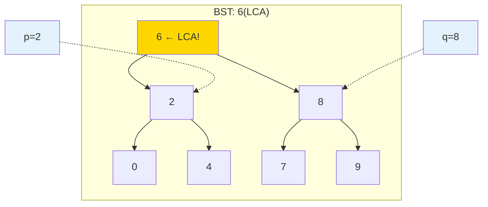
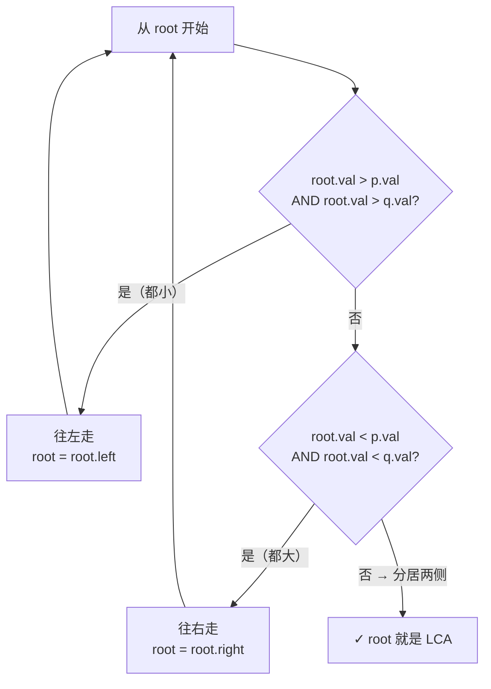

---

title: "二叉搜索树的最近公共祖先"

difficulty: 中等

category: 二叉树

tags:

  - leetcode

  - 二叉树

created: "2026-07-21"

---

# 235. 二叉搜索树的最近公共祖先（Lowest Common Ancestor of a Binary Search Tree）

> 难度：中等 | 主题：二叉树、BST

## 题目

给定一个二叉搜索树的根节点，找到树中两个指定节点的最近公共祖先。

**示例：**

```text

输入：root = [6,2,8,0,4,7,9,null,null,3,5], p=2, q=8

输出：6

```

---

## 思路
### 先讲个故事：岔路口的集合点

你和朋友在游乐园走散了。游乐园的路线很特殊：

> 每条岔路口都立着一个指示牌——**往左走的项目编号都小于这个路口，往右走的都大于这个路口**。

你朋友在项目 **2** 号，你在项目 **8** 号。你们要找最近的岔路口碰头。

- 你在 **6** 号路口：2 < 6 < 8 → **就是这儿了！** 一个在左一个在右，在这里碰头最方便。

- 如果你在 **10** 号路口：2 < 8 < 10，两个都小 → 往下走（往左）。

- 如果你在 **3** 号路口：3 < 2 < 3... 不对。3 > 2 但 3 < 8？2 < 3 < 8 → **也是这儿！** 分居两侧。

---

### 引导式推导：BST 省大事了

普通二叉树找 LCA 得后序 DFS 遍历整棵树（236二叉树的最近公共祖先）。但 BST 有个超级性质：

> **BST 的最近公共祖先就是值介于 p 和 q 之间的节点。**



**决策树：**



三种情况：

1. **root 比 p 和 q 都大** → LCA 在左子树

2. **root 比 p 和 q 都小** → LCA 在右子树

3. **root 在中间**（或等于其中一个）→ 就是 LCA

---

### 与 236 的对比

| 题目 | 思路 | 时间 | 空间 |

|------|------|------|------|

| 235（BST 版） | 利用大小关系，单路径 | O(h) | O(1) |

| 236（普通树版） | 后序 DFS，遍历全树 | O(n) | O(h) |

---

## 推荐写法

```python

def lowestCommonAncestor(self, root, p, q):

    # 确保 p.val <= q.val，方便判断

    if p.val > q.val:

        p, q = q, p

    curr = root

    while curr:

        if curr.val > q.val:

            curr = curr.left

        elif curr.val < p.val:

            curr = curr.right

        else:

            return curr

    return None

```

**为什么迭代比递归好？** BST 找 LCA 本质是**在一条路径上走**，没有分叉，不需要递归栈。迭代 O(1) 空间，递归 O(h) 空间。

---

## 复杂度

| 指标 | 值 | 解释 |

|------|----|------|

| 时间 | O(h) | 树高，每次排除一半子树 |

| 空间 | O(1) | 就一个指针 |

| 最坏（链表树） | O(n) | 退化为链表时 |

---

## 实战考量
### 频率分析

> **出现在**：一面实践中作为 236二叉树的最近公共祖先 的追问或前置。通常会先做 236，然后追问"如果是 BST 呢？"

### 延伸思考

**Q：BST 退化成了链表怎么办？**

A：时间退化为 O(n)，但空间仍为 O(1)。可以在插入时保持平衡（引出 AVL/红黑树）。

**Q：如果要求返回所有祖先节点呢？**

A：遍历过程中用数组记录路径，从根到当前节点的所有节点都是祖先。

**Q：BST 的 LCA 为什么不需要递归两边？**

A：因为 BST 的大小关系告诉我们目标在哪个方向，不需要搜索另一侧。

### 易错点

- 没交换 p、q 导致判断条件变复杂

- 递归写法虽然简单但空间是 O(h)，迭代更优

- 边界情况：p 或 q 本身就是 LCA

---

## 生活类比

> **BST 找 LCA → 找两道门之间的那层楼**

>

> 你在 2 楼，朋友在 8 楼。电梯从顶楼下来：

> - 停在 6 楼 → 2 < 6 < 8 → "你们一个在上一在在下，在这里碰头"

> - 停在 10 楼 → 两个数字都小 → 继续往下

> - 停在 3 楼 → 2 < 3 < 8 → "就在这里碰头"

>

> BST 就是这栋楼——你知道每个楼层的数字，也知道数字大往右、小往左。

---

## 相关题目

| 题目 | 关系 |

|------|------|

| 236二叉树的最近公共祖先 | 普通树版 LCA（后序 DFS） |

| 98验证二叉搜索树 | BST 性质基础 |

| 235二叉搜索树的最近公共祖先 | 本题 |

---

→ 返回题单：[[LeetCode学习路线图#五、二叉树]]

## 速记卡（面试闪卡）

**Q1：一句话讲清「235. 二叉搜索树的最近公共祖先（Lowest Common Ancestor of a Binary Search Tree）」到底是什么？**

A：利用二叉搜索树「左小右大」性质，从根往下走，第一个落在两个目标节点之间的就是最近公共祖先。

**Q2：题目本质 —— 怎么理解？**

A：想象游乐园岔路口立指示牌：往左项目编号都比路口小、往右的比路口大。你和朋友走散，要找「一个在左、一个在右」的碰头点——这就是 LCA（Lowest Common Ancestor，最近公共祖先）。

**Q3：思路：利用 BST 性质 —— 怎么理解？**

A：BST 的杀手锏是大小关系：root 比两目标都大就往左、都小就往右、分处两侧就是答案。普通树(236)得后序 DFS 遍历整棵 O(n)，BST 只需沿一条路径 O(h)——这就是「最近公共祖先」的判定法则。

**Q4：推荐写法：迭代优于递归 —— 怎么理解？**

A：BST 找 LCA 本质是单线路，没有分叉，不必用递归栈。像电梯从顶楼下来，每层比大小决定上或下，到「中间层」停。迭代 O(1) 空间、递归 O(h)；先统一两个目标的大小顺序，判断分支更省事。

**Q5：复杂度与对比 —— 怎么理解？**

A：时间 O(h)（树高，每次砍掉一半子树），空间 O(1)（就一个指针）。最坏退化成链表 O(n)，但空间仍 O(1)——引出 AVL/红黑树保平衡。与 236 对比：235 是单路径，236 是整树遍历。

**Q6：核心速记主线有哪些？**

- BST 的 LCA = 值介于两个目标节点之间的节点

- 三分支：都大往左、都小往右、居中即答案

- 迭代优于递归：单路径无需递归栈，空间 O(1)

- 退化成链表最坏 O(n)，但空间仍 O(1)

**口诀**

A：从根向中间走

LCA 就在你手

比大往左小往右

值夹中间不用愁

## 相关链接

- [[笔记/Leetcode笔记/05_二叉树/236二叉树的最近公共祖先|二叉树的最近公共祖先]]

- [[笔记/Leetcode笔记/05_二叉树/230二叉搜索树中第K小的元素|二叉搜索树中第K小的元素]]

- [[笔记/Leetcode笔记/05_二叉树/104二叉树的最大深度|二叉树的最大深度]]

- [[笔记/Leetcode笔记/05_二叉树/98验证二叉搜索树|验证二叉搜索树]]

- [[笔记/Leetcode笔记/05_二叉树/145二叉树的后序遍历|二叉树的后序遍历]]

